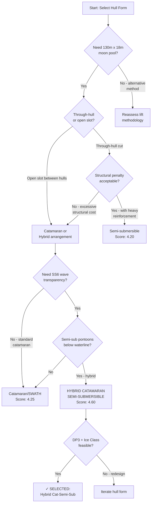

# 01 — Hull Form & Platform Type Trade Study

**Ocean Salvage Platform (OSP) — Pre-FEED Deliverable**
**Document:** 01-hull-form-selection.md
**Date:** 12 February 2026

---

## 1. Introduction

This document presents the hull form selection trade study for the Ocean Salvage Platform (OSP), a purpose-built vessel designed to recover sunken nuclear-powered submarines from depths of 33–2,000 m. The selection must satisfy all seven evaluation criteria defined in the design requirements, with nuclear safety as the paramount design driver.

**Design envelope (from `ocean-platform-design-prompt.md`):**
- Lift capacity: ≥ 10,000 t
- Operational depth: 33–2,000 m
- Max submarine dimensions: 120 m × 12 m
- Moon pool requirement: ≥ 130 m × 18 m clear opening (or equivalent through-hull arrangement)
- Operational sea state: up to SS6 (Hs = 4–6 m)
- Survival: 100-year return period storms
- Self-propelled transit ≥ 8 kn
- Ice-capable (DNV ICE-C minimum)

---

## 2. Candidate Hull Forms

Six candidate platform types are evaluated:

| ID | Candidate | Key Trait |
|----|-----------|-----------|
| A | Semi-submersible | Reduced waterplane area, wave transparency, excellent motion characteristics |
| B | SPAR-type | Deep-draft, excellent heave response, limited deck area |
| C | Barge / ship-shaped | Large deck area, high wave response, simple construction |
| D | Catamaran / SWATH | Small waterplane, structural complexity, large open deck between hulls |
| E | Jack-up (shallow only) | Zero motion on bottom, limited to ≤ 150 m water depth |
| F | Hybrid / novel | Custom-optimized combination of best features |

---

## 3. Evaluation Criteria & Weighting

Seven criteria are assigned weights reflecting the design priorities. Nuclear safety, which depends heavily on motion control and station-keeping, drives the weighting.

| # | Criterion | Weight | Rationale |
|---|----------|--------|-----------|
| C1 | Wave response (RAOs at SS6–7) | 0.20 | Motion directly affects lift safety, AHC demand, nuclear criticality prevention (K-27 ±1° tilt limit) |
| C2 | Station-keeping (DP/mooring) | 0.15 | Must maintain position during 10,000 t lift; wind/current/wave loads |
| C3 | Moon pool feasibility (≥ 130 m × 18 m) | 0.20 | The OSP's defining feature; structural and hydrodynamic impact |
| C4 | Deck area & payload capacity | 0.10 | Must accommodate shielding, containment, strand jacks, ROVs, accommodation |
| C5 | Transit speed & self-propulsion | 0.10 | Multiple distant sites (Kara Sea → N. Atlantic); ≥ 8 kn required |
| C6 | Cost & schedule | 0.10 | CAPEX constraint; benchmarked against comparable vessels |
| C7 | Depth adaptability (33–2,000 m) | 0.15 | Must operate at all target depths without major reconfiguration |

**Total weight = 1.00**

---

## 4. Scoring Methodology

Each candidate is scored 1–5 per criterion:

| Score | Meaning |
|-------|---------|
| 5 | Excellent — meets or exceeds requirement with margin |
| 4 | Good — meets requirement fully |
| 3 | Adequate — meets requirement with design effort |
| 2 | Marginal — partially meets requirement; significant compromise |
| 1 | Poor — fails to meet requirement or impractical |

---

## 5. Detailed Evaluation

### 5.1 C1 — Wave Response (RAOs at SS6–7)

**[ASSUMPTION]** RAO estimates are based on published data for comparable vessels and first-principles hydrodynamic reasoning. Detailed RAO calculations for the selected concept are in `03-hydrodynamic-analysis.md`.

**Heave RAO comparison (qualitative, at Tp = 10–15 s):**

```
Heave RAO (m/m) at Tp = 12 s
│
│  1.0 ┤ ████                                          ████
│      │ ████                                          ████
│  0.8 ┤ ████  ████                              ████  ████
│      │ ████  ████                              ████  ████
│  0.6 ┤ ████  ████                              ████  ████
│      │ ████  ████  ████                        ████  ████
│  0.4 ┤ ████  ████  ████                  ████  ████  ████
│      │ ████  ████  ████                  ████  ████  ████
│  0.2 ┤ ████  ████  ████  ████  ████      ████  ████  ████
│      │ ████  ████  ████  ████  ████      ████  ████  ████
│  0.0 ┤ ████  ████  ████  ████  ████      ████  ████  ████
│      └──────────────────────────────────────────────────────
│        Barge  Jack  Semi  SPAR  SWATH    Cat   Barge  Jack
│         (C)   (E)   (A)   (B)   (D)     (D)  roll   roll
│
│  Lower is better for lift operations
```

| Candidate | Heave | Pitch | Roll | Score |
|-----------|-------|-------|------|-------|
| A — Semi-sub | Low (Tn >> 20 s) | Low | Moderate (mitigated by bilge keels) | **5** |
| B — SPAR | Very low heave | Very low pitch | High roll (narrow waterplane) | **4** |
| C — Barge | High | High | Very high | **1** |
| D — Catamaran/SWATH | Very low (SWATH) | Moderate | Low | **4** |
| E — Jack-up | Zero (on bottom) | Zero | Zero | **5** (but depth-limited) |
| F — Hybrid | Custom-tuned | Custom | Custom | **5** |

### 5.2 C2 — Station-Keeping (DP/Mooring)

| Candidate | DP Feasibility | Wind/Current Area | Score |
|-----------|---------------|-------------------|-------|
| A — Semi-sub | Excellent; proven DP3 platforms exist (Sleipnir) | Moderate windage; low current drag on submerged pontoons | **5** |
| B — SPAR | Good; deep draft limits thruster effectiveness | Low windage; high underwater drag | **3** |
| C — Barge | Good for DP2; high wind/wave drift loads | Very high windage and wave drift | **2** |
| D — Cat/SWATH | Good for DP; twin-hull enables thruster distribution | Moderate windage | **4** |
| E — Jack-up | N/A (fixed to seabed) — excellent at ≤ 150 m, impossible deeper | No DP needed in shallow; useless beyond 150 m | **2** |
| F — Hybrid | DP3 designed-in from inception | Optimized hull for low wind/current loads | **5** |

### 5.3 C3 — Moon Pool Feasibility (≥ 130 m × 18 m)

This is the most demanding criterion. A 130 m × 18 m opening is unprecedented — approximately the size of the Hughes Glomar Explorer's hold, but longer.

| Candidate | Moon Pool Approach | Structural Impact | Score |
|-----------|--------------------|-------------------|-------|
| A — Semi-sub | Through pontoon deck between columns; large moon pool viable with heavy reinforcement | Severe — removes ≥ 50% of upper hull structure; requires massive transverse framing | **3** |
| B — SPAR | Impossible — hull diameter too small for 130 m opening | Cannot accommodate | **1** |
| C — Barge | Central moon pool through hull; feasible dimensionally | Very severe — barge loses longitudinal strength; requires box-girder reinforcement | **2** |
| D — Cat/SWATH | Open area between hulls is natural "moon pool"; no structural cut required | Excellent — hull structure intact; open slot between hulls 130+ m long | **5** |
| E — Jack-up | Cannot provide 130 m opening at depth | N/A | **1** |
| F — Hybrid (catamaran-semi-sub) | Catamaran arrangement with semi-submersible pontoons; open slot between hulls | Excellent — combines Cat/SWATH moon pool with semi-sub motion performance | **5** |

### 5.4 C4 — Deck Area & Payload Capacity

| Candidate | Deck Area (est.) | Payload (est.) | Score |
|-----------|-----------------|----------------|-------|
| A — Semi-sub | 8,000–12,000 m² | 15,000–25,000 t | **4** |
| B — SPAR | 2,000–4,000 m² | 5,000–10,000 t | **2** |
| C — Barge | 15,000–25,000 m² | 30,000–60,000 t | **5** |
| D — Cat/SWATH | 10,000–18,000 m² | 15,000–30,000 t | **4** |
| E — Jack-up | 5,000–8,000 m² | 10,000–15,000 t | **3** |
| F — Hybrid | 12,000–20,000 m² (connected deck over catamaran hulls) | 20,000–40,000 t | **5** |

### 5.5 C5 — Transit Speed & Self-Propulsion

| Candidate | Self-Propelled? | Speed (kn) | Score |
|-----------|-----------------|------------|-------|
| A — Semi-sub | Yes (Sleipnir: 8–10 kn) | 8–12 | **4** |
| B — SPAR | Towed or very slow self-propelled | 3–6 | **1** |
| C — Barge | Yes (ship-shaped: 10–14 kn) | 10–14 | **5** |
| D — Cat/SWATH | Yes (good hull form for speed) | 10–15 | **5** |
| E — Jack-up | Self-propelled Jack-ups exist but slow | 5–8 | **2** |
| F — Hybrid | Self-propelled catamaran form | 8–12 | **4** |

### 5.6 C6 — Cost & Schedule

| Candidate | CAPEX (est. USD) | Build Time (months) | Score |
|-----------|-----------------|---------------------|-------|
| A — Semi-sub | $2.0–3.0B | 48–60 | **3** |
| B — SPAR | $1.5–2.5B | 36–48 | **3** |
| C — Barge | $1.0–1.5B | 24–36 | **5** |
| D — Cat/SWATH | $2.5–4.0B | 48–72 | **2** |
| E — Jack-up | $0.5–1.0B | 18–30 | **5** |
| F — Hybrid (cat-semi-sub) | $2.5–3.5B | 48–66 | **2** |

**[ASSUMPTION]** Cost estimates are ±50% at this pre-FEED stage, benchmarked against Sleipnir ($1.6B, 2019), Pioneering Spirit ($3.0B, 2013), and typical MODU construction costs.

### 5.7 C7 — Depth Adaptability (33–2,000 m)

| Candidate | 33 m | 200 m | 1,680 m | 2,000+ m | Score |
|-----------|------|-------|---------|----------|-------|
| A — Semi-sub | Yes (DP) | Yes (DP) | Yes (DP) | Yes (DP) | **5** |
| B — SPAR | Yes | Yes | Yes | Yes | **5** |
| C — Barge | Yes | Yes | Yes | Yes | **4** |
| D — Cat/SWATH | Yes | Yes | Yes | Yes | **5** |
| E — Jack-up | Yes | Yes (marginal) | **NO** | **NO** | **1** |
| F — Hybrid | Yes | Yes | Yes | Yes | **5** |

---

## 6. Trade Study Scoring Matrix

| Criterion | Weight | A: Semi-Sub | B: SPAR | C: Barge | D: Cat/SWATH | E: Jack-up | F: Hybrid |
|-----------|--------|-------------|---------|----------|-------------|-----------|-----------|
| C1: Wave Response | 0.20 | 5 (1.00) | 4 (0.80) | 1 (0.20) | 4 (0.80) | 5 (1.00) | 5 (1.00) |
| C2: Station-Keeping | 0.15 | 5 (0.75) | 3 (0.45) | 2 (0.30) | 4 (0.60) | 2 (0.30) | 5 (0.75) |
| C3: Moon Pool | 0.20 | 3 (0.60) | 1 (0.20) | 2 (0.40) | 5 (1.00) | 1 (0.20) | 5 (1.00) |
| C4: Deck/Payload | 0.10 | 4 (0.40) | 2 (0.20) | 5 (0.50) | 4 (0.40) | 3 (0.30) | 5 (0.50) |
| C5: Speed/Transit | 0.10 | 4 (0.40) | 1 (0.10) | 5 (0.50) | 5 (0.50) | 2 (0.20) | 4 (0.40) |
| C6: Cost/Schedule | 0.10 | 3 (0.30) | 3 (0.30) | 5 (0.50) | 2 (0.20) | 5 (0.50) | 2 (0.20) |
| C7: Depth Adapt. | 0.15 | 5 (0.75) | 5 (0.75) | 4 (0.60) | 5 (0.75) | 1 (0.15) | 5 (0.75) |
| **Weighted Total** | **1.00** | **4.20** | **2.80** | **3.00** | **4.25** | **2.65** | **4.60** |
| **Rank** | | **3** | **5** | **4** | **2** | **6** | **1** |

---

## 7. Decision Tree



---

## 8. Selected Hull Form: Hybrid Catamaran Semi-Submersible

### 8.1 Concept Description

The OSP employs a **hybrid catamaran semi-submersible** configuration — two parallel semi-submersible hulls (each with lower pontoons and stabilizing columns) connected by a transverse deck structure, creating an open slot between the hulls that serves as the moon pool / lift channel.

**Key design principles:**
1. **Catamaran arrangement** provides natural open slot (130+ m × 20 m) between hulls without cutting through structural members — solving the fundamental moon pool challenge
2. **Semi-submersible lower pontoons** provide wave transparency: deep-draft pontoons below the wave action zone, connected to the upper deck by slender columns with minimal waterplane area
3. **Split-hull concept** is directly inspired by Allseas Pioneering Spirit (catamaran, 382 m LOA) and Hughes Glomar Explorer (centreline moon pool / hold)
4. **DP3 capability** enabled by thrusters distributed across both hulls (port/starboard redundancy inherent in the twin-hull arrangement)

### 8.2 Justification

| Advantage | Explanation |
|-----------|-------------|
| Moon pool without structural penalty | The 130 m × 20 m open channel is the space between the two hulls — no structural material is removed |
| Excellent motion characteristics | Semi-submersible pontoons tune natural periods well above the wave energy band (Tn,heave > 20 s) |
| Inherent DP3 redundancy | Port and starboard hulls each carry independent power/thruster systems |
| Large deck area | Connected upper deck spans 60–80 m beam; total deck area ~15,000 m² |
| Self-propelled | Twin-hull form is efficient at 8–12 kn; azimuth thrusters provide propulsion and DP |
| Depth-independent | All operations via DP; no bottom-founded elements required |
| Ice capable | Pontoon-level ice belt with ice-strengthened plating; columns can break sheet ice |

| Disadvantage | Mitigation |
|-------------|------------|
| High CAPEX ($2.5–3.5B) | Justified by unique capability; no alternative vessel exists |
| Long build time (48–66 months) | Fast-track schedule possible at Korean/Chinese yards with parallel hull construction |
| Complex structural design | Transverse deck structure well-understood from Pioneering Spirit precedent |
| Large total displacement (~95,000–120,000 t) | Required to achieve 10,000 t lift capacity with adequate stability |

### 8.3 Principal Dimensions

| Parameter | Value | Basis |
|-----------|-------|-------|
| Length overall (LOA) | 275 m | Accommodate 130 m moon pool + fore/aft structure + machinery |
| Beam overall (BOA) | 80 m | Two hulls (20 m each) + 20 m channel + 10 m margins each side |
| Depth (main deck) | 38 m | Adequate air gap + structural depth for global bending |
| Pontoon length | 245 m | Near-full length for buoyancy and stability |
| Pontoon beam | 18 m | Sized for displacement and internal tankage |
| Pontoon depth | 12 m | Volume for ballast tanks, fuel, machinery |
| Column dimensions | 18 m × 18 m (4 per hull, 8 total) | Minimized waterplane for wave transparency |
| Operating draft | 22 m | Pontoons fully submerged; columns pierce waterline |
| Survival draft | 26 m | Increased submergence for storm survival |
| Transit draft | 12 m | Pontoons partially surfaced for reduced resistance |
| Moon pool clear opening | 135 m × 20 m | Accommodates 120 m submarine + 15 m clearance L, 8 m clearance W |
| Air gap (operating) | 16 m | Per Forristall crest calculation (see `03-hydrodynamic-analysis.md`) |
| Displacement (operating) | ~98,000 t | **[ASSUMPTION]** Based on Pioneering Spirit scaling |
| Displacement (lightship) | ~72,000 t | **[ASSUMPTION]** Steel weight ~42,000 t + outfitting |
| Deadweight | ~26,000 t | Fuel, ballast, payload, consumables |

### 8.4 General Arrangement — Profile View (ASCII)

```
                                    HELIDECK
                                   ┌───────┐
                                   │ S-92  │
    ┌──────────────────────────────┬┴───────┴┬──────────────────────────────┐
    │   ACCOMMODATION              │ BRIDGE  │        CRANE           FWD  │ ← MAIN DECK (+38m)
    │   (150-200 POB)              │         │   ┌─┐  2×500t  ┌─┐         │
    ├──────────────┬───────────────┴─────────┴───┤ ├──────────┤ ├─────────┤
    │  REACTOR     │     STRAND JACK GANTRY      │ │          │ │  ROV    │ ← EQUIPMENT DECK (+32m)
    │  HANDLING    │     (28 units × 500t)        │ │          │ │  HANGAR │
    │  BAY         │                              │ │          │ │         │
    ├──────────────┴──────────────────────────────┴─┴──────────┴─┴─────────┤
    │  COL  │                                                    │  COL   │ ← COLUMNS (×8)
    │  □    │                                                    │   □    │
    │  □    │         OPEN MOON POOL / LIFT CHANNEL              │   □    │   Waterplane
~~~~│~~□~~~~│~~~~~135m × 20m clear opening~~~~~~~~~~~~~~~~~~~~~~~~│~~~□~~~~│~~~WL (+22m operating)
    │  □    │                                                    │   □    │
    │  □    │                                                    │   □    │
    ├───────┴────────────────────────────────────────────────────┴────────┤
    │                         PONTOON (PORT)                              │ ← PONTOON (+0 to +12m)
    │   FWD THRUSTER     MACHINERY      BALLAST TANKS     AFT THRUSTER   │
    │   ⊕              ┌──────────┐                        ⊕             │
    └────────────────────────────────────────────────────────────────────┘

    ◄──────────────────────── 275 m LOA ────────────────────────────────►
    
    NOTE: STARBOARD HULL (not shown) is mirror image below this profile.
          Both pontoons are connected by transverse box-girder structure
          at the main deck level and lower bracing at column mid-height.
```

### 8.5 General Arrangement — Plan View (ASCII)

```
╔══════════════════════════════════════════════════════════════════════════════╗
║                              MAIN DECK PLAN VIEW                           ║
║ ◄──────────────────────── 275 m ──────────────────────────►                ║
║                                                                            ║
║ ┌────────────────────────────────────────────────────────────────────────┐  ║
║ │ P  ┌────┐ ┌──────────────────────────────────────────┐ ┌────┐  ┌───┐│  ║
║ │ O  │HELI│ │         ACCOMMODATION BLOCK              │ │BRDG│  │ROV││  ║
║ │ R  │DECK│ │    150-200 POB, MESS, MEDICAL            │ │    │  │BAY││  ║
║ │ T  └────┘ └──────────────────────────────────────────┘ └────┘  └───┘│  ║
║ │    ┌────────────────────────────────────────────────────────────────┐│  ║
║ │ H  │ REACTOR  │  STRAND JACK GANTRY STRUCTURE (28 UNITS)   │CRANE ││  ║
║ │ U  │ HANDLING │  ═══════════════════════════════════════    │2×500t││  ║
║ │ L  │ BAY      │  ═══════════════════════════════════════    │      ││  ║
║ │ L  │ (RAD)    │                                             │      ││  ║
║ │    ├──────────┼─────────────────────────────────────────────┼──────┤│  ║
║ │    │  COL 1   │                                             │COL 4 ││  ║
║ │    │   ██     │        MOON POOL / LIFT CHANNEL             │  ██  ││  ║
║ │    │          │        135 m × 20 m CLEAR                   │      ││  ║
║ │    │  COL 2   │        ┌─────────────────────────────────┐  │COL 3 ││  ║
║ │    │   ██     │        │  SUBMARINE RECOVERY ZONE        │  │  ██  ││  ║
║ │    │          │        │  (shown in position)             │  │      ││  ║
║ │    │          │        └─────────────────────────────────┘  │      ││  ║
║ │    ├──────────┼─────────────────────────────────────────────┼──────┤│  ║
║ │ S  │ CRANE    │  STRAND JACK GANTRY STRUCTURE (28 UNITS)   │WINCH ││  ║
║ │ T  │ 2×500t  │  ═══════════════════════════════════════    │ROOM  ││  ║
║ │ B  │         │  ═══════════════════════════════════════    │      ││  ║
║ │ D  │         │                                             │      ││  ║
║ │    └─────────┴─────────────────────────────────────────────┴──────┘│  ║
║ │                                                                    │  ║
║ └────────────────────────────────────────────────────────────────────┘  ║
║                                                                         ║
║ ◄── 80 m BOA ──►                                                       ║
╚═════════════════════════════════════════════════════════════════════════════╝
```

### 8.6 General Arrangement — Midship Cross-Section (ASCII)

```
                            ◄────── 80 m BOA ──────►

                    ┌───────────────────────────────────────┐
                    │          MAIN DECK   (+38 m)          │  Air gap = 16 m
                    │  ┌─────┐                    ┌─────┐  │
                    │  │CRANE│                    │CRANE│  │
                    ├──┴─────┴──┐              ┌──┴─────┴──┤
                    │           │              │           │
                    │  PORT     │  MOON POOL   │  STBD     │  EQUIPMENT
                    │  HULL     │  20 m WIDE   │  HULL     │  DECK (+32 m)
                    │  UPPER    │              │  UPPER    │
                    ├───────────┤              ├───────────┤
                    │  COL 18×18│              │COL 18×18  │  COLUMNS
                    │  ┌──────┐ │              │ ┌──────┐  │
                    │  │      │ │              │ │      │  │
~~~~~~~~~~~~~~~~~~~~│~~│~~~~~~│~│~~~~~~~~~~~~~~│~│~~~~~~│~~│~~~~WL (+22 m)
                    │  │      │ │              │ │      │  │
                    │  │      │ │              │ │      │  │
                    │  └──────┘ │              │ └──────┘  │
                    ├───────────┤              ├───────────┤
                    │ PONTOON   │   10 m gap   │ PONTOON   │  PONTOONS
                    │ 18 m wide │  (keel-keel) │ 18 m wide │  (+0 to +12 m)
                    │┌────────┐│              │┌────────┐│
                    ││ BALLAST││              ││BALLAST ││
                    ││ TANKS  ││              ││ TANKS  ││
                    │├────────┤│              │├────────┤│
                    ││MACHINRY││              ││MACHINRY││
                    │└────────┘│              │└────────┘│
                    └──────────┘              └──────────┘
                    ◄─ 18 m ──►◄── 20 m ────►◄── 18 m ──►
                               ◄ moon pool ►
                               ◄ 10m gap  ►
                               ◄pontoon-to-pontoon►
```

---

## 9. Platform Zoning Layout

```mermaid
graph TB
    subgraph "MAIN DECK - Plan View Zones"
        direction LR
        subgraph AFT["AFT ZONE"]
            HELI[Helideck<br>S-92 Class]
            ACCOM[Accommodation<br>150-200 POB<br>GREEN Zone]
            MED[Medical Bay]
        end
        subgraph MID["MIDSHIPS ZONE"]
            REACT[Reactor Handling Bay<br>RED Zone<br>Shielded + HEPA]
            SJ[Strand Jack Gantry<br>28 units<br>ORANGE Zone]
            MP[Moon Pool<br>135m × 20m<br>RED Zone during ops]
        end
        subgraph FWD["FORWARD ZONE"]
            ROV[ROV Hangar<br>4× Work-Class ROV]
            CRANE[Cranes 2×500t]
            WINCH[Deep-Water<br>Winch Room]
            STORE[Storage &<br>Workshops]
        end
    end
    AFT ---|Blast/Rad Wall| MID
    MID --- FWD
    
    style REACT fill:#ff6666,stroke:#cc0000,color:#000
    style MP fill:#ff9999,stroke:#cc0000,color:#000
    style ACCOM fill:#66ff66,stroke:#00cc00,color:#000
    style HELI fill:#66ff66,stroke:#00cc00,color:#000
    style MED fill:#66ff66,stroke:#00cc00,color:#000
    style SJ fill:#ffaa44,stroke:#cc6600,color:#000
    style ROV fill:#6699ff,stroke:#0044cc,color:#000
    style CRANE fill:#6699ff,stroke:#0044cc,color:#000
    style WINCH fill:#6699ff,stroke:#0044cc,color:#000
    style STORE fill:#6699ff,stroke:#0044cc,color:#000
```



---

## 10. Comparison with Historical Precedents

| Parameter | OSP (Hybrid) | Pioneering Spirit | Sleipnir | Glomar Explorer |
|-----------|-------------|-------------------|----------|-----------------|
| Type | Cat semi-sub | Catamaran | Semi-sub | Ship-shaped |
| LOA (m) | 275 | 382 | 220 | 188 |
| BOA (m) | 80 | 124 | 102 | 35 |
| Lift capacity (t) | 10,000 (through moon pool) | 48,000 (topside) | 2 × 10,000 (cranes) | ~4,000 (claw) |
| Moon pool / slot | 135 m × 20 m open channel | 122 m × 59 m slot | None | 60 m × 23 m well |
| DP class | DP3 | DP2 | DP3 | DP (basic) |
| Transit speed (kn) | 8–12 | 8–14 | 5–8 | 10–12 |
| Ice class | ICE-C | None | None | None |
| Nuclear capability | Full containment suite | None | None | Basic rad monitoring |

**Key lessons incorporated:**
- From **Pioneering Spirit**: Catamaran hull with slot for through-hull lift; scale of operation; transit capability
- From **Sleipnir**: DP3 system design; semi-submersible wave response characteristics; heavy-lift crane integration
- From **Glomar Explorer**: Centreline well for submarine recovery; strand jack / grip system concept; cover story not required
- From **Kursk / Giant 4**: Strand jack technology (26 units, synchronized); barge-based lift methodology

See `14-historical-precedent-analysis.md` for detailed precedent analysis.

---

## 11. Design Risks for Selected Hull Form

| Risk | Likelihood | Consequence | Mitigation |
|------|-----------|-------------|------------|
| Structural fatigue at hull-to-deck connection | 3 | 4 | Extensive FEA; fatigue-critical detail design per DNV-RP-C203 (see `05-structural-design.md`) |
| Moon pool resonance in operating sea states | 3 | 3 | Perforated plate damping system; natural period tuning (see `06-moon-pool-design.md`) |
| Excessive cost overrun | 4 | 3 | Phase-gated construction; fixed-price yard contract; 30% contingency |
| Build time exceeds 66 months | 3 | 3 | Parallel hull construction at two docks; pre-fabrication of outfitting modules |
| Hydrodynamic interaction between hulls | 2 | 3 | Model testing; CFD validation; hull separation optimized (see `03-hydrodynamic-analysis.md`) |

---

## 12. Conclusion

The **Hybrid Catamaran Semi-Submersible** hull form (Candidate F) is selected for the OSP with a weighted score of **4.60/5.00**, outperforming all other candidates. This design:

1. Provides a 135 m × 20 m open-channel moon pool without structural penalty
2. Achieves semi-submersible wave response with natural periods above the wave energy band
3. Enables DP3 through inherent port/starboard redundancy
4. Offers 15,000+ m² deck area for all required systems
5. Is self-propelled at 8–12 kn for inter-site transit
6. Operates at all target depths (33–2,000 m) without reconfiguration
7. Can be ice-strengthened to DNV ICE-C

The concept builds upon proven elements from Pioneering Spirit (catamaran slot), Sleipnir (semi-sub DP3), and Glomar Explorer (through-hull submarine recovery), combining them into a novel but technically achievable design.

---

*Cross-references: `02-environmental-design-basis.md`, `03-hydrodynamic-analysis.md`, `05-structural-design.md`, `06-moon-pool-design.md`, `14-historical-precedent-analysis.md`*
