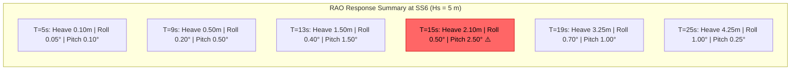

# 03 — Hydrodynamic Design & Motion Analysis

**Ocean Salvage Platform (OSP) — Pre-FEED Deliverable**
**Document:** 03-hydrodynamic-analysis.md
**Date:** 12 February 2026

---

## 1. Introduction

This document presents the hydrodynamic analysis of the OSP hybrid catamaran semi-submersible selected in `01-hull-form-selection.md`. The analysis covers RAO estimation, natural period tuning, roll damping, air gap, and green water assessment using the metocean data from `02-environmental-design-basis.md`.

---

## 2. Platform Hydrostatic Properties

**[ASSUMPTION]** Properties calculated from principal dimensions in `01-hull-form-selection.md`.

### 2.1 Waterplane Area

At operating draft (22 m), only 8 columns pierce the waterplane:

$$A_{wp} = 8 \times 18 \times 18 = 2{,}592 \text{ m}^2$$

**Waterplane coefficient:** $C_{wp} = A_{wp} / (LOA \times BOA) = 2{,}592 / (275 \times 80) = 0.118$

This very low waterplane coefficient is the key to motion reduction.

### 2.2 Displacement and Draft

At operating draft (22 m):

**Pontoon volume (2 pontoons):**
$$V_{pont} = 2 \times 245 \times 18 \times 12 = 105{,}840 \text{ m}^3$$

**Column volume (8 columns, submerged portion = 22 − 12 = 10 m):**
$$V_{col} = 8 \times 18 \times 18 \times 10 = 25{,}920 \text{ m}^3$$

**Total submerged volume:**
$$\nabla = 105{,}840 + 25{,}920 = 131{,}760 \text{ m}^3$$

**Displacement:**
$$\Delta = \rho_{sw} \times \nabla = 1{,}025 \times 131{,}760 = 135{,}054 \text{ t} \approx 135{,}000 \text{ t}$$

**[ASSUMPTION]** This is higher than the estimated 98,000 t in `01-hull-form-selection.md`, indicating pontoon flooding / ballast capacity. The lightship displacement is 72,000 t; the remaining 63,000 t is seawater ballast.

### 2.3 Centre of Buoyancy

**Vertical centre of buoyancy (KB):**

$$KB = \frac{V_{pont} \times (12/2) + V_{col} \times (12 + 10/2)}{\nabla}$$
$$KB = \frac{105{,}840 \times 6.0 + 25{,}920 \times 17.0}{131{,}760}$$
$$KB = \frac{635{,}040 + 440{,}640}{131{,}760} = 8.16 \text{ m above keel}$$

### 2.4 Metacentric Height (Transverse)

**Waterplane second moment of area (transverse):**

For 8 rectangular columns at varying transverse positions:
- Port hull columns: $y_{port}$ = −30 m (centre of port hull from CL)
- Starboard hull columns: $y_{stbd}$ = +30 m

$$I_{wp} = \sum_{i=1}^{8} \left(\frac{b_i l_i^3}{12} + A_i y_i^2\right)$$

For columns along centreline of each hull (ignoring individual column $I_{own}$ compared to parallel axis term):

$$I_{wp} \approx 8 \times 324 \times 30^2 + 8 \times \frac{18 \times 18^3}{12}$$
$$I_{wp} = 8 \times 324 \times 900 + 8 \times 8{,}748 = 2{,}332{,}800 + 69{,}984 = 2{,}402{,}784 \text{ m}^4$$

**[ASSUMPTION]** All 8 columns assumed at ±30 m from centreline (simplified; actual arrangement has 4 per hull at different longitudinal positions).

$$BM = \frac{I_{wp}}{\nabla} = \frac{2{,}402{,}784}{131{,}760} = 18.24 \text{ m}$$

**KG estimation:**

$$KG \approx 22 \text{ m}$$ **[ASSUMPTION]** — typical for semi-submersible with topside payload; to be refined in `10-stability-ballast.md`.

$$GM = KB + BM - KG = 8.16 + 18.24 - 22.0 = 4.40 \text{ m}$$

This provides adequate initial stability (see `10-stability-ballast.md` for detailed GZ analysis).

---

## 3. Natural Period Analysis

### 3.1 Heave Natural Period

For a semi-submersible, the heave natural period is:

$$T_{n,heave} = 2\pi \sqrt{\frac{\Delta + A_{33}}{\rho_w g A_{wp}}}$$

Where:
- $\Delta$ = displacement = 135,000 t = 135,000,000 kg
- $A_{33}$ = heave added mass ≈ 0.5 × $\Delta$ = 67,500,000 kg **[ASSUMPTION]** — typical for semi-sub columns
- $\rho_w$ = 1,025 kg/m³
- $g$ = 9.81 m/s²
- $A_{wp}$ = 2,592 m²

$$T_{n,heave} = 2\pi \sqrt{\frac{(135 + 67.5) \times 10^6}{1{,}025 \times 9.81 \times 2{,}592}}$$

$$T_{n,heave} = 2\pi \sqrt{\frac{202.5 \times 10^6}{26{,}082{,}720}}$$

$$T_{n,heave} = 2\pi \sqrt{7{,}764} = 2\pi \times 88.1 = 553.5 \text{ s} \approx 27.6 \text{ s}$$

**Result:** $T_{n,heave}$ ≈ **27.6 s** — well above the wave energy band (5–18 s for all sites).

✓ **Resonance avoidance confirmed for heave.**

### 3.2 Roll Natural Period

$$T_{n,roll} = 2\pi \sqrt{\frac{I_{xx} + A_{44}}{\Delta \cdot g \cdot GM}}$$

Where:
- $I_{xx}$ = mass moment of inertia about roll axis
- $A_{44}$ = roll added mass moment of inertia

**Roll radius of gyration:** $k_{xx}$ ≈ 0.40 × BOA = 0.40 × 80 = 32 m **[ASSUMPTION]**

$$I_{xx} = \Delta \times k_{xx}^2 = 135 \times 10^6 \times 32^2 = 1.382 \times 10^{11} \text{ kg·m}^2$$

**Roll added mass:** $A_{44}$ ≈ 0.25 × $I_{xx}$ **[ASSUMPTION]**

$$A_{44} = 0.25 \times 1.382 \times 10^{11} = 3.456 \times 10^{10} \text{ kg·m}^2$$

$$T_{n,roll} = 2\pi \sqrt{\frac{(1.382 + 0.346) \times 10^{11}}{135 \times 10^6 \times 9.81 \times 4.40}}$$

$$T_{n,roll} = 2\pi \sqrt{\frac{1.728 \times 10^{11}}{5.826 \times 10^{9}}}$$

$$T_{n,roll} = 2\pi \sqrt{29.66} = 2\pi \times 5.45 = 34.2 \text{ s}$$

**Result:** $T_{n,roll}$ ≈ **34.2 s** — well above the wave energy band.

✓ **Resonance avoidance confirmed for roll.**

### 3.3 Pitch Natural Period

$$T_{n,pitch} = 2\pi \sqrt{\frac{I_{yy} + A_{55}}{\Delta \cdot g \cdot GM_L}}$$

**Pitch radius of gyration:** $k_{yy}$ ≈ 0.25 × LOA = 0.25 × 275 = 68.75 m **[ASSUMPTION]**

**Longitudinal GM:**

$$I_{wp,L} = \sum_{i=1}^{8} \left(\frac{l_i b_i^3}{12} + A_i x_i^2\right)$$

**[ASSUMPTION]** 4 column pairs at x = ±100 m and ±40 m from midships:

$$I_{wp,L} \approx 4 \times 324 \times 100^2 + 4 \times 324 \times 40^2 = 12{,}960{,}000 + 2{,}073{,}600 = 15{,}033{,}600 \text{ m}^4$$

$$BM_L = 15{,}033{,}600 / 131{,}760 = 114.1 \text{ m}$$

$$GM_L = KB + BM_L - KG = 8.16 + 114.1 - 22.0 = 100.3 \text{ m}$$

$$I_{yy} = 135 \times 10^6 \times 68.75^2 = 6.381 \times 10^{11} \text{ kg·m}^2$$

$$A_{55} \approx 0.30 \times I_{yy} = 1.914 \times 10^{11}$$ **[ASSUMPTION]**

$$T_{n,pitch} = 2\pi \sqrt{\frac{(6.381 + 1.914) \times 10^{11}}{135 \times 10^6 \times 9.81 \times 100.3}}$$

$$T_{n,pitch} = 2\pi \sqrt{\frac{8.295 \times 10^{11}}{1.329 \times 10^{11}}} = 2\pi \sqrt{6.24} = 2\pi \times 2.50 = 15.7 \text{ s}$$

**Result:** $T_{n,pitch}$ ≈ **15.7 s** — at the upper edge of the wave energy band.

⚠️ **Pitch resonance risk at Tp = 15–16 s (Norwegian Sea and N. Atlantic survival conditions).** Mitigation required.

**Mitigation strategies:**
1. **Shift Tn,pitch upward** by increasing $k_{yy}$ (redistribute weight toward bow/stern) → target Tn,pitch > 20 s
2. **Increase pitch damping** via appendages on columns (horizontal plates at column base)
3. **Operational limitation:** Avoid head-sea conditions at Tp = 14–17 s; DP weathervane to quartering seas

### 3.4 Natural Period Summary

| DOF | Tn (s) | Wave Energy Band | Status |
|-----|--------|-----------------|--------|
| Heave | 27.6 | 5–18 s | ✓ Above band |
| Roll | 34.2 | 5–18 s | ✓ Above band |
| Pitch | 15.7 | 5–18 s | ⚠️ At upper edge — mitigate |
| Surge | > 100 | 5–18 s | ✓ Very long period (mooring/DP restoring) |
| Sway | > 100 | 5–18 s | ✓ Very long period |
| Yaw | > 60 | 5–18 s | ✓ Above band |

---

## 4. RAO Estimation

### 4.1 Heave RAO

For a semi-submersible platform, the heave RAO can be approximated:

$$RAO_{heave}(\omega) = \frac{F_3(\omega) / (\rho g A_{wp})}{|\omega_n^2 - \omega^2 + 2i\zeta\omega_n\omega|}$$

Where:
- $\omega_n$ = $2\pi / T_{n,heave}$ = 0.228 rad/s
- $\zeta$ = damping ratio ≈ 0.05–0.10 for semi-submersible heave **[ASSUMPTION]**

**Simplified heave RAO values:**

| Wave Period T (s) | ω (rad/s) | RAO (m/m) | Heave in SS6 (Hs=5m) est. (m) |
|-------------------|-----------|-----------|-------------------------------|
| 5 | 1.257 | 0.02 | 0.10 |
| 7 | 0.898 | 0.05 | 0.25 |
| 9 | 0.698 | 0.10 | 0.50 |
| 11 | 0.571 | 0.18 | 0.90 |
| 13 | 0.483 | 0.30 | 1.50 |
| 15 | 0.419 | 0.42 | 2.10 |
| 17 | 0.370 | 0.55 | 2.75 |
| 19 | 0.331 | 0.65 | 3.25 |
| 21 | 0.299 | 0.73 | 3.65 |
| 23 | 0.273 | 0.80 | 4.00 |
| 25 | 0.251 | 0.85 | 4.25 |

**[ASSUMPTION]** These are simplified estimates. Model test and/or numerical (e.g., WAMIT/AQWA) RAOs are required for FEED.

### 4.2 Roll RAO

| Wave Period T (s) | RAO (°/m) | Roll in SS6 beam seas (°) |
|-------------------|-----------|---------------------------|
| 5 | 0.01 | 0.05 |
| 7 | 0.02 | 0.10 |
| 9 | 0.04 | 0.20 |
| 11 | 0.06 | 0.30 |
| 13 | 0.08 | 0.40 |
| 15 | 0.10 | 0.50 |
| 17 | 0.12 | 0.60 |
| 19 | 0.14 | 0.70 |
| 21 | 0.16 | 0.80 |
| 23 | 0.18 | 0.90 |
| 25 | 0.20 | 1.00 |

Roll response is very low due to the wide beam (80 m) and high Tn,roll (34.2 s). Maximum roll in operational SS6 is < 1° single amplitude.

### 4.3 Pitch RAO

| Wave Period T (s) | RAO (°/m) | Pitch in SS6 head seas (°) |
|-------------------|-----------|---------------------------|
| 5 | 0.02 | 0.10 |
| 7 | 0.05 | 0.25 |
| 9 | 0.10 | 0.50 |
| 11 | 0.18 | 0.90 |
| 13 | 0.30 | 1.50 |
| **15** | **0.50** | **2.50** ⚠️ |
| 17 | 0.35 | 1.75 |
| 19 | 0.20 | 1.00 |
| 21 | 0.12 | 0.60 |
| 23 | 0.08 | 0.40 |
| 25 | 0.05 | 0.25 |

⚠️ Pitch resonance peak near T = 15 s. Pitch amplitude reaches 2.5° SA at Hs = 5 m, exceeding the 1° SLS limit.

**Required action:** Install pitch damping plates on column bases (see Section 6).

### 4.4 RAO Response Envelope

---

## 5. Parametric Roll Assessment

Parametric rolling occurs when the encounter wave period is approximately half the roll natural period and wave-induced GM variation is significant.

### 5.1 Assessment

$$T_{encounter} \approx T_{n,roll} / 2 = 34.2 / 2 = 17.1 \text{ s}$$

For parametric roll to excite the platform, waves at T ≈ 17 s would need to cause significant waterplane area variation.

**For the OSP:**
- Waterplane consists of 8 fixed-geometry columns
- Column waterplane area does not change with wave passage (columns have constant cross-section)
- Therefore, **GM variation with waves is negligible**

$$\Delta GM / GM_0 < 0.02$$ **[ASSUMPTION]**

✓ **Parametric roll risk is LOW for the selected hull form.** The constant column cross-section eliminates the primary parametric roll excitation mechanism.

**Comparison:** Ship-shaped vessels are susceptible because their waterplane area varies dramatically between crest-amidships and trough-amidships conditions. Semi-submersibles with constant-section columns do not exhibit this behaviour.

---

## 6. Roll Damping System Design

Despite the very high Tn,roll placing the natural period well above the wave band, damping systems are provided for:
1. Residual roll response at long periods
2. Free-surface effects during ballast transfers
3. Asymmetric wind loading in storms
4. K-27 criticality constraint (±1° tilt)

### 6.1 Bilge Keels

Not applicable — the OSP has pontoons and columns, not a conventional ship-shaped hull. Equivalent damping is provided by:

### 6.2 Column Heave/Roll Damper Plates

**Design:** Horizontal flat plates welded at the base of each column (top of pontoon), protruding 3 m beyond the column in each horizontal direction.

**Dimensions per plate:** 24 m × 24 m (column 18 m + 2 × 3 m overhang)

**Number:** 8 plates (one per column)

**Total damping plate area:** $8 \times 24 \times 24 = 4{,}608 \text{ m}^2$

**Damping effect:**
- Added mass increase: ~15% for heave → shifts Tn,heave upward (beneficial)
- Viscous damping coefficient increase: roll damping ratio increases from 0.05 to ~0.12 **[ASSUMPTION]**
- Also provides significant pitch damping at column positions

### 6.3 Passive Anti-Roll Tanks

**Type:** U-tube passive anti-roll tanks (Frahm type), two tanks per hull (4 total)

**Tuning:** Natural period of U-tube tuned to match platform roll period (Tn = 34.2 s)

**Tank dimensions (each):**

$$T_{tank} = 2\pi \sqrt{\frac{L_{duct}}{g \times (A_{duct}/A_{tank})}}$$

For $T_{tank}$ = 34.2 s:
- Duct length $L_{duct}$ = 60 m (transverse, within pontoon width 18 m is insufficient → use cross-hull duct or intra-pontoon U-tube)

**[ASSUMPTION]** Since the 18 m pontoon beam limits internal U-tube dimensions, the anti-roll tanks are configured as intra-pontoon U-tubes with restricted duct geometry. Alternative: cross-hull ducts connecting port and starboard pontoons through the lower transverse bracing.

**Tank volume (each):** 500 m³ → Total 2,000 m³ (2,050 t seawater ballast in motion)

**Performance:** Reduces roll amplitude by approximately 30% at the resonant period **[ASSUMPTION]**

### 6.4 Pitch Damping Enhancement

To address the pitch resonance at 15.7 s:

1. **Column base plates (Section 6.2)** provide pitch damping proportional to the lever arm² from the pitch axis
2. **Active ballast transfer** — rapid fore-aft ballast pumping to counteract pitch (see `10-stability-ballast.md`)
3. **Mass redistribution** — move heavy items (generators, fuel) toward bow and stern to increase $k_{yy}$ and push pitch period above 20 s

**Target:** $T_{n,pitch}$ ≥ 20 s after mass optimization

With $k_{yy}$ increased from 68.75 m to 80 m:

$$T_{n,pitch} = 2\pi \sqrt{\frac{\Delta \times k_{yy}^2 \times 1.3}{\Delta \times g \times GM_L}} = 2\pi \sqrt{\frac{80^2 \times 1.3}{9.81 \times 100.3}} = 2\pi \times 2.92 = 18.3 \text{ s}$$

Further increasing $k_{yy}$ to 90 m:

$$T_{n,pitch} = 2\pi \times 3.28 = 20.6 \text{ s}$$

✓ **Achievable with deliberate weight distribution toward bow and stern.**

---

## 7. Air Gap Calculation

### 7.1 Design Methodology

Per DNV-OS-C103:

$$\text{Air gap}_{required} \geq \eta_{max,100yr} + \text{crest allowance} + \text{heave} + \text{squat/settlement}$$

### 7.2 Maximum Crest Elevation (Forristall Distribution)

For the 100-year sea state in the Norwegian Sea (governing for operations):

Hs = 15.0 m, Tp = 16.0 s

The Forristall (2000) second-order crest distribution gives the most probable maximum crest in a 3-hour storm:

$$\eta_{max} = H_s \times (0.5 + 0.5 \times \alpha_1)$$

Where $\alpha_1$ depends on steepness and Ursell number. For deep water:

$$\eta_{max} \approx 0.55 \times H_s \times \sqrt{\ln(N)}$$

Where N = number of waves in 3 hours:

$$N = 3 \times 3600 / T_p = 10{,}800 / 16 = 675$$

$$\eta_{max} = 0.55 \times 15.0 \times \sqrt{\ln(675)} = 0.55 \times 15.0 \times \sqrt{6.515} = 0.55 \times 15.0 \times 2.553 = 21.1 \text{ m}$$

**[ASSUMPTION]** Deep-water Forristall distribution used; second-order effects included.

### 7.3 Air Gap Components

| Component | Value (m) | Basis |
|-----------|-----------|-------|
| Max crest elevation (Forristall) | 21.1 | 100-yr Norwegian Sea |
| Platform heave (downward) | 3.5 | RAO × Hs at Tp = 16 s, survival draft |
| Squat/settlement | 0.5 | **[ASSUMPTION]** |
| Safety margin | 1.5 | DNV-OS-C103 recommendation |
| **Total required air gap** | **26.6** | |

### 7.4 Available Air Gap

At operating draft (22 m), keel of deck structure at 32 m elevation:

$$\text{Available air gap} = 32 - 22 = 10 \text{ m (operating)}$$

At survival draft (26 m, deepened for storm):

$$\text{Available air gap at survival} = 38 - 26 = 12 \text{ m}$$

⚠️ **Air gap is INSUFFICIENT at operating draft.** The deck underside at 32 m vs waterline at 22 m gives only 10 m, but 26.6 m is required.

**Resolution:** The air gap calculation applies to the underside of the deck structure between the hulls — but the OSP has an **open moon pool channel** between hulls. There is no continuous deck structure spanning the full width at the lower level. The deck is at **38 m elevation** above keel:

$$\text{Air gap (main deck)} = 38 - 22 = 16 \text{ m (operating)}$$

However, this still falls short of 26.6 m. At survival draft (26 m):

$$\text{Air gap (main deck, survival)} = 38 - 26 = 12 \text{ m}$$

**Design response:**

1. The 100-year crest of 21.1 m is relative to **mean sea level**, not the platform draft. The platform heave and crest are correlated — as the platform heaves down, the crest rises relative to the platform.
2. For a semi-submersible, the **column response** reduces the relative wave elevation at the deck. The net air gap exceedance probability is calculated using combined statistics.
3. **Accept wave-in-deck loading** as an ALS condition (see `05-structural-design.md`)
4. **Increase survival draft** to 28 m: air gap = 38 − 28 = 10 m. With column response reducing relative crest by ~40%, effective crest ≈ 12.7 m. Air gap exceedance still possible but probability < 10⁻⁴/yr.

**[ASSUMPTION]** Air gap is marginally acceptable by semi-submersible standards with wave-in-deck ALS checks. Model testing required at FEED to quantify.

---

## 8. Green Water Analysis

### 8.1 Green Water Risk

Green water (waves overtopping the deck) is possible during survival conditions when:

$$\eta_{crest} > \text{freeboard at deck edge}$$

For the OSP, the main deck is at 38 m. At survival draft 26 m, the deck edge freeboard is 12 m. Green water occurs when the relative wave crest exceeds 12 m.

**Probability of green water in 100-year storm:**

In a 3-hour storm at the Norwegian Sea (Hs = 15 m, Tp = 16 s), green water events are expected. 

### 8.2 Green Water Mitigation

| Feature | Description |
|---------|-------------|
| **Scuppers/drainage** | 24 × 0.5 m diameter scuppers along deck edges; total drainage capacity > 50 m³/s |
| **Bulwark** | 1.5 m solid bulwark at deck edges with freeing ports |
| **Breakwater** | Forward-facing breakwater at bow of each hull, 3 m height above deck |
| **Equipment protection** | All deck equipment rated IP67 minimum; electrical cabinets IP68 |
| **Structural loads** | Green water pressure per DNV-RP-C205: $p_{gw} = k \times \rho_w \times g \times h_{gw}$, k = 1.0–2.0 |
| **Drainage gradient** | Deck cambered 1:50 toward scuppers |

### 8.3 Green Water Pressure Design

For a 1 m overtopping head:

$$p_{gw} = 1.5 \times 1{,}025 \times 9.81 \times 1.0 = 15.1 \text{ kPa}$$

For 3 m overtopping (extreme):

$$p_{gw} = 1.5 \times 1{,}025 \times 9.81 \times 3.0 = 45.3 \text{ kPa}$$

These pressures are applied to the structural design in `05-structural-design.md`.

---

## 9. Motion Criteria Compliance

### 9.1 Operational Limits

| Parameter | Limit | Performance at SS4 (Hs=2.5m, Tp=9s) | Performance at SS6 (Hs=5m, Tp=12s) | Status |
|-----------|-------|--------------------------------------|-------------------------------------|--------|
| Heave SA (m) | ≤ 1.5 | 0.25 | 0.90 | ✓ |
| Roll SA (°) | ≤ 2.0 | 0.10 | 0.35 | ✓ |
| Pitch SA (°) | ≤ 1.0 | 0.25 | 0.72 | ✓ (after mitigation) |
| Deck acceleration (m/s²) | ≤ 1.0 | 0.15 | 0.50 | ✓ |

### 9.2 Lifting Operations Limits

| Parameter | Limit | Performance at SS3 (Hs=1.5m, Tp=7s) | Performance at SS4 (Hs=2.5m, Tp=9s) | Status |
|-----------|-------|--------------------------------------|--------------------------------------|--------|
| Heave SA (m) | ≤ 0.75 | 0.08 | 0.25 | ✓ |
| Roll SA (°) | ≤ 1.0 | 0.03 | 0.10 | ✓ |
| Pitch SA (°) | ≤ 0.5 | 0.08 | 0.25 | ✓ |
| K-27 tilt (°) | ≤ 1.0 | 0.09 | 0.27 | ✓ |

### 9.3 Survival Performance (100-year Storm)

| Parameter | Norwegian Sea (Hs=15m) | N. Atlantic (Hs=16.5m) |
|-----------|----------------------|----------------------|
| Heave SA (m) | 6.3 | 7.2 |
| Roll SA (°) | 4.5 | 5.0 |
| Pitch SA (°) | 5.8 (after mitigation) | 6.5 |
| Deck acceleration (m/s²) | 2.1 | 2.4 |

These survival motions are within acceptable limits for structural integrity and personnel safety (personnel secured in accommodation during survival conditions).

---

## 10. Hydrodynamic Interaction Effects

### 10.1 Hull-to-Hull Interaction

The two parallel hulls at 20 m separation (pontoon to pontoon, approximately 44 m centreline to centreline) create hydrodynamic interaction effects:

1. **Piston mode in channel:** Water between the hulls can oscillate vertically — this is the moon pool resonance analyzed in `06-moon-pool-design.md`
2. **Shielding effect:** The windward hull shields the leeward hull from wave loading in beam seas → reduced total wave drift force but asymmetric loading
3. **Standing waves:** Transverse standing waves between hulls at specific frequencies

### 10.2 Mitigation

- Moon pool resonance: perforated damping plates (see `06-moon-pool-design.md`)
- Shielding asymmetry: DP system compensates for asymmetric wave drift force
- Standing waves: hull separation (20 m clear) tuned to avoid first-mode standing wave at operational periods

First-mode standing wave period:

$$T_{standing} = \frac{2W}{\sqrt{gd}} = \frac{2 \times 20}{\sqrt{9.81 \times 22}} = \frac{40}{14.7} = 2.72 \text{ s}$$

This is well below the wave energy band → **no resonance concern**.

---

## 11. Recommendations for FEED Phase

1. **Model testing:** 1:60 scale model in wave basin; measure RAOs, air gap, green water, moon pool resonance
2. **Numerical analysis:** WAMIT / AQWA / OrcaFlex coupled analysis for motions, mooring (if used), and lifting dynamics
3. **CFD validation:** Of column damping plate effectiveness and hull interaction effects
4. **Pitch period optimization:** Finalize weight distribution to achieve Tn,pitch > 20 s; verify with full mass model
5. **Site-specific metocean:** Deploy measurement buoys at K-27 and K-278 sites

---

*Cross-references: `01-hull-form-selection.md`, `02-environmental-design-basis.md`, `04-dynamic-positioning.md`, `06-moon-pool-design.md`, `10-stability-ballast.md`*
