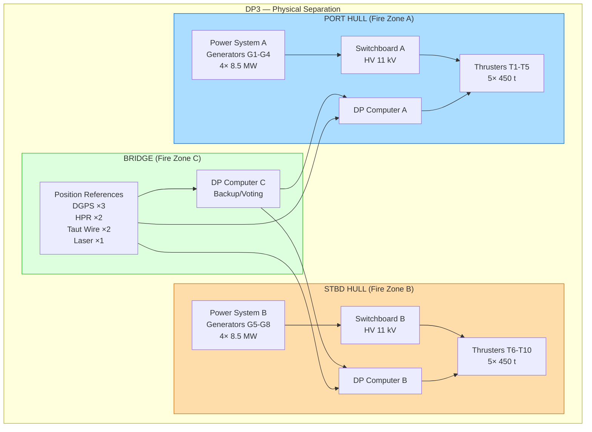

# 04 — Dynamic Positioning & Station-Keeping System

**Ocean Salvage Platform (OSP) — Pre-FEED Deliverable**
**Document:** 04-dynamic-positioning.md
**Date:** 12 February 2026

---

## 1. Introduction

This document defines the DP system design for the OSP. The platform must maintain position during submarine recovery operations in up to SS6, with survival capability in 100-year storms. Nuclear safety and the 10,000 t through-moon-pool lift impose stringent station-keeping requirements.

---

## 2. DP Class Selection

### 2.1 Class Comparison

| Feature | DP2 (IMO Equipment Class 2) | DP3 (IMO Equipment Class 3) |
|---------|---------------------------|---------------------------|
| Redundancy | Single fault tolerance | Single fault tolerance + physical separation |
| Power | 2 independent power systems | 2+ independent power systems in separate compartments |
| Control | 2 independent control systems | 3 independent reference systems, 2 independent control computers |
| Thrusters | Loss of one group → maintain position | Total separation — fire/flood in any one compartment does not disable DP |
| Fire/flood | Single failure tolerance | Physical segregation by A-60 fire-rated divisions |

### 2.2 Selection: DP3

**DP3 is REQUIRED** for the following reasons:

1. **Nuclear safety:** Loss of position during submarine recovery could cause catastrophic load on the submarine, rigging failure, and potential nuclear containment breach. Nuclear safety is the paramount design driver (Constraint #1).

2. **Lift criticality:** A 10,000 t load suspended through the moon pool creates enormous risk if position is lost — dynamic snap loads, rigging failure, and uncontrolled submarine descent.

3. **Precedent:** Heerema Sleipnir (DP3) for heavy lift operations; all modern heavy-lift/drilling semi-submersibles use DP3 for critical operations.

4. **Classification:** DNV DYNPOS-3 (AUTRO) notation — the highest DP class, with automatic restart capability.

5. **Inherent advantage:** The catamaran hull form naturally provides DP3-compatible physical separation — port hull and starboard hull are separate watertight envelopes connected only by the upper deck structure (which can be divided by A-60 fire walls).

---

## 3. Thruster Arrangement

### 3.1 Thruster Selection

| Parameter | Specification |
|-----------|--------------|
| **Type** | Azimuth thrusters (360° rotating) |
| **Drive** | Electric motor, frequency controlled (VFD) |
| **Propulsor** | Fixed-pitch propeller in nozzle (Becker/Rolls-Royce type) |
| **Number** | 10 total (5 per hull) |
| **Thrust per unit** | 450 t bollard pull per thruster **[ASSUMPTION]** |
| **Total installed thrust** | 4,500 t bollard pull |
| **Available thrust (DP)** | 3,600 t (80% efficiency/utilization factor) |
| **Ice class** | Optional ice-class propeller blades (DNV ICE-C) |
| **Nozzle** | 19A nozzle profile for high bollard pull |

### 3.2 Arrangement

```
                PLAN VIEW — THRUSTER POSITIONS
    ◄───────────────── 275 m ──────────────────►
    ┌──────────────────────────────────────────────────┐
    │ PORT HULL                                        │
    │  ⊕T1          ⊕T2                    ⊕T3        │
    │  (FWD)        (FWD-MID)              (AFT-MID)   │
    │                                         ⊕T4  ⊕T5│
    │                                        (AFT) (AFT│
    ├──────────────────────────────────────────────────┤
    │              MOON POOL (20 m gap)                │
    ├──────────────────────────────────────────────────┤
    │ STARBOARD HULL                                   │
    │  ⊕T6          ⊕T7                    ⊕T8        │
    │  (FWD)        (FWD-MID)              (AFT-MID)   │
    │                                         ⊕T9  ⊕T10│
    │                                        (AFT) (AFT│
    └──────────────────────────────────────────────────┘
    
    ⊕ = Azimuth thruster (450 t each), 360° rotation
    Thrusters in pontoon bottom, protruding ~3 m below keel
```

### 3.3 DP3 Redundancy Architecture



### 3.4 Thruster Separation Summary

| Group | Thrusters | Power Source | Control | Fire Zone |
|-------|-----------|-------------|---------|-----------|
| Group A (Port) | T1, T2, T3, T4, T5 | Generators G1–G4 (SB-A) | DP Computer A | Zone A |
| Group B (Stbd) | T6, T7, T8, T9, T10 | Generators G5–G8 (SB-B) | DP Computer B | Zone B |
| Backup control | All (via bus-tie in emergency) | Cross-connect via bus-tie | DP Computer C | Zone C |

**Worst-case single failure:** Loss of entire port hull power (fire/flood) → 5 thrusters (2,250 t) remain → sufficient for station-keeping in operational conditions.

---

## 4. Station-Keeping Capability Analysis

### 4.1 Environmental Forces

From `02-environmental-design-basis.md`:

| Force Component | Operational (SS6) | Survival (100-yr, Norwegian Sea) |
|-----------------|-------------------|----------------------------------|
| Mean wave drift force | 350 t | 1,200 t |
| Wind force | 200 t | 560 t |
| Current force | 80 t | 187 t |
| **Total static force** | **630 t** | **1,947 t** |
| Dynamic variations (±) | 200 t | 600 t |
| **Max instantaneous** | **830 t** | **2,547 t** |

### 4.2 Thrust Requirement

| Condition | Required Thrust | Available (10 thrusters) | Available (5 thrusters — worst failure) | Margin |
|-----------|----------------|-------------------------|----------------------------------------|--------|
| Operational SS6 | 830 t | 3,600 t | 1,800 t | 4.3× / 2.2× |
| Operational lifting (SS4) | 450 t | 3,600 t | 1,800 t | 8.0× / 4.0× |
| Survival 100-yr | 2,547 t | 3,600 t | 1,800 t | 1.4× / 0.71× ⚠️ |

⚠️ In the worst-case failure during a 100-year storm, single-hull thrusters (1,800 t) are insufficient to maintain position against the full environmental load (2,547 t). 

**Mitigation:**
1. **Operations are suspended before storm conditions** — the platform is not lifting during 100-year storms
2. **Heading optimization** — DP weathervanes to minimize projected area → reduces wind force by ~40%
3. **Survival draft** — increased to 26 m, reducing column windage
4. **Drift-off is acceptable** during survival (no lift in progress) — the DP maintains heading and slow drift recovery

### 4.3 Watch Circle Radius

The watch circle defines the maximum permissible horizontal offset from the target position.

**During lifting operations:**

| Depth | Max Offset (m) | Basis |
|-------|----------------|-------|
| 0–50 m (strand jack) | ±5 m | Strand jack cable inclination limit (0.1°) |
| 50–200 m | ±10 m | Cable angle and dynamic coupling |
| 200–1,000 m | ±20 m | Catenary and snap load limits |
| 1,000–2,000 m | ±30 m | Deep-water umbilical flexibility |

**[ASSUMPTION]** Watch circles are preliminary; OrcaFlex coupled analysis required at FEED.

### 4.4 DP Capability Plot

Simplified capability envelope (% of available thrust vs. environmental direction):

```
              N (0°)
              │
         ╭────┴────╮
        ╱  100%     ╲        Full thrust: 3,600 t (all thrusters)
       ╱     ██      ╲       Half thrust: 1,800 t (worst failure)
      │    ██████     │
 W────│  ████████████ │────E
      │    ██████     │
       ╲     ██      ╱
        ╲   100%    ╱
         ╰────┬────╯
              │
              S (180°)
              
    ███ = Operating envelope at SS6 (fully redundant)
    Outer boundary = 100% thrust utilization
    
    At worst-case failure (5 thrusters):
    - Head/stern: 1,800 t available vs 630 t required → OK
    - Beam: 1,800 t available vs 830 t required → OK  
    - DP capacity lost only in >100-yr survival conditions
```

---

## 5. DP Power Budget

### 5.1 Power Demand by Mode

| Mode | DP Thrust Required (t) | Power per Thruster (MW) | Active Thrusters | DP Power (MW) |
|------|----------------------|------------------------|-----------------|--------------|
| Transit (8 kn) | N/A (propulsion mode) | 5.5 | 6 (propulsion) | 33.0 |
| Station-keeping (calm) | 150 | 1.0 | 4 | 4.0 |
| Station-keeping (SS4) | 450 | 3.0 | 6 | 18.0 |
| Station-keeping (SS6) | 830 | 4.5 | 8 | 36.0 |
| Lifting (SS4) | 450 | 3.0 | 8 | 24.0 |
| Survival (100-yr) | 2,547 | 6.5 | 10 | 65.0 |

**[ASSUMPTION]** Power per thruster is proportional to thrust³/², based on propeller theory: $P \propto T^{3/2}$.

### 5.2 Thruster Specifications

| Parameter | Value |
|-----------|-------|
| Type | Azimuth, retractable (for transit) or fixed |
| Propeller diameter | 5.5 m |
| Motor power | 7.0 MW (continuous rated) |
| Bollard pull (100% MCR) | 450 t |
| RPM | 0–150 variable speed |
| Drive | ABB ACS 6000 or equivalent VFD |
| Voltage | 6.6 kV or 11 kV |
| Nozzle | 19A, ice-strengthened lip |
| Weight (each) | ~120 t installed |

---

## 6. Thruster Ventilation Analysis

### 6.1 Problem Description

In large waves, the semi-submersible heave can cause thruster propellers (mounted in the pontoon bottom) to approach the free surface. If the blade tips enter the air-water interface, thrust loss (ventilation) occurs.

### 6.2 Analysis

**Thruster submergence at operating draft:**

Pontoon bottom is at 0 m (keel level). Thrusters protrude 3 m below, so thruster centre is at −1.5 m (1.5 m below keel).

Operating waterline is at 22 m above keel, so thruster submergence = 22 + 1.5 = 23.5 m below calm waterline.

**Maximum heave in survival (100-yr):**

Heave SA ≈ 7 m (from `03-hydrodynamic-analysis.md`).

Minimum thruster submergence = 23.5 − 7.0 = 16.5 m

**Trough depth (wave trough below calm WL):**

Approximately $0.5 \times H_s$ = 7.5 m

Combined minimum submergence = 16.5 − 7.5 = 9.0 m

✓ **Minimum 9 m submergence maintained even in 100-year conditions.** No ventilation expected.

At survival draft (26 m), submergence increases to 27.5 m → margin increases further.

### 6.3 Additional Ventilation Mitigation

- Thrusters are in nozzles (reduces ventilation inception by ~30%)
- Propellers are at pontoon bottom (shielded by pontoon hull from wave action)
- VFD drives detect torque drop and automatically reduce RPM to prevent racing

---

## 7. Mooring System for Shallow Operations (≤ 200 m)

### 7.1 Rationale

For K-27 (33 m) and potentially K-159 (200 m), a temporary mooring system supplements DP to:
- Reduce DP power consumption during extended station-keeping
- Provide additional position restoring force
- Allow partial thruster maintenance while on station

### 7.2 Configuration

| Parameter | Specification |
|-----------|--------------|
| Type | Taut-leg mooring with pre-tensioned polyester ropes |
| Number of lines | 8 (2 per quadrant, 45° spread) |
| Anchor type | Drag-embedded (Vryhof Stevpris or equivalent) |
| Anchor holding capacity | 200 t per anchor (in clay/silt) |
| Line composition | Top chain (20 m, R4 grade, 84 mm) → Polyester rope (200–400 m) → Bottom chain (50 m, R4S grade, 84 mm) |
| Pretension | 100 t per line |
| MBL per line | 800 t (R4S 84 mm chain: MBL = 760 t; polyester rope: MBL > 800 t) |
| Safety factor (intact) | ≥ 1.67 per DNV-OS-E301 |
| Safety factor (damaged, 1 line broken) | ≥ 1.25 per DNV-OS-E301 |

### 7.3 Mooring Analysis (K-27 Site, 33 m)

**[ASSUMPTION]** Simplified quasi-static analysis per DNV-OS-E301.

Environmental forces (100-year, Kara Sea):
- Wave drift: 120 t
- Wind: 130 t  
- Current: 25 t
- **Total: 275 t**

Line load distribution (collinear with one mooring line direction):

Most loaded line (45° from load direction): 

$$T_{max} = T_0 + \frac{F_{env}}{n_{eff}} \times k_{dynamic}$$

Where:
- $T_0$ = pretension = 100 t
- $F_{env}$ = 275 t
- $n_{eff}$ = effective number of lines resisting = 3.5 **[ASSUMPTION]**
- $k_{dynamic}$ = dynamic amplification = 1.5

$$T_{max} = 100 + \frac{275}{3.5} \times 1.5 = 100 + 117.9 = 218 \text{ t}$$

**Safety factor (intact):** $MBL / T_{max}$ = 800 / 218 = **3.67** > 1.67 ✓

**Damaged case (1 line broken):**

$$T_{max,dam} = 100 + \frac{275}{2.8} \times 1.5 = 100 + 147 = 247 \text{ t}$$

Safety factor: 800 / 247 = **3.24** > 1.25 ✓

### 7.4 Mooring for K-159 (200 m)

At 200 m depth, the mooring spread radius increases significantly. The taut-leg configuration with polyester ropes is well-suited.

| Parameter | K-27 (33 m) | K-159 (200 m) |
|-----------|-------------|---------------|
| Line length | ~120 m | ~500 m |
| Anchor radius | ~80 m | ~400 m |
| Polyester rope length | 60 m | 350 m |
| Estimated cost per line | $500K | $1.5M |
| Installation time | 1 day per line | 2 days per line |

### 7.5 Mooring for Deep Water (> 200 m)

At depths > 200 m (K-278 at 1,680 m), mooring is **impractical** due to:
- Line lengths > 3,500 m
- Anchor installation complexity at 1,680 m
- Line weight and catenary effects

**DP-only operations** for K-278 and deeper targets.

---

## 8. Position Reference Systems

### 8.1 Reference System Selection

Per DNV DYNPOS-3, minimum 3 independent position reference systems required, from at least 2 different principles.

| System | Type | Principle | Redundancy | Notes |
|--------|------|-----------|------------|-------|
| DGPS #1 | Fugro Starfix G4+ | Satellite | Primary | Dual-frequency, PPP correction |
| DGPS #2 | Veripos Apex² | Satellite | Primary | Independent provider |
| DGPS #3 | Hexagon/NovAtel | Satellite | Backup | Independent receiver |
| HPR #1 | Kongsberg HiPAP 502 | Acoustic | Primary (deep) | Transponder on seabed |
| HPR #2 | Sonardyne Ranger 2 | Acoustic | Backup | Independent system |
| Taut Wire #1 | Kongsberg | Mechanical | Primary (shallow) | K-27 site only (33 m) |
| Taut Wire #2 | — | Mechanical | Backup | K-27 site only |
| Laser/RADius | Fanbeam Mk5 | Optical/microwave | Relative ref | To attendant vessel |
| MRU | Kongsberg Seatex MRU 5+ | Inertial | Motion | 3 units, one per DP computer |

### 8.2 Reference System Weighting

The DP computers use a weighted median algorithm to reject outliers:

| Condition | Primary Ref | Secondary | Tertiary |
|-----------|-------------|-----------|----------|
| Deep water (DP only) | DGPS (2 of 3) | HPR | — |
| Shallow (DP + mooring) | Taut wire | DGPS | HPR |
| Near surface lift | HPR (tracking submarine) | DGPS | Laser to DSV |

---

## 9. DP Control Philosophy

### 9.1 Operating Modes

| Mode | Description | Thrust Authority |
|------|-------------|-----------------|
| **Auto DP** | Full automatic station-keeping | 100% — all thrusters under DP control |
| **Joystick** | Manual heading/position control | Thrusters respond to operator joystick |
| **Auto-sail** | Automatic track-following for transit | Azimuth thrusters as propulsion |
| **Weathervane** | Bow into dominant environment | Auto heading adjustment; position held |
| **Follow target** | Track moving reference (e.g., ascending submarine) | Auto position follows HPR target |

### 9.2 Alert / Alarm Levels

| Level | Condition | Action |
|-------|-----------|--------|
| **Advisory** | Drift > 2 m from target | Operator notification |
| **Yellow** | Drift > 5 m OR thrust > 50% capacity | Prepare for degradation |
| **Red** | Drift > 10 m OR thrust > 80% OR position ref loss | Initiate drive-off prevention; prepare lift abort |
| **DP blackout** | Total power loss | EDG auto-start within 45 s; UPS bridges gap |

### 9.3 Drive-Off Prevention

| Feature | Description |
|---------|-------------|
| Independent DP consequence analysis | Continuously monitors consequences of each thruster failure |
| Auto-heading assist | Priorities heading retention over position in degraded mode |
| Thrust allocation optimization | Real-time optimization of azimuth angles to minimize power |
| Forbidden zones | Thruster angles that would direct wash into moon pool ±15° excluded |

---

## 10. DP Trials and Commissioning

| Test | Standard | Acceptance Criterion |
|------|----------|---------------------|
| Power failure test | DNV DYNPOS-3 | Position maintained within watch circle after worst-case failure |
| Blackout recovery | DNV DYNPOS-3 | DP regains control within 60 s of EDG start |
| Thruster failure | IMCA M 190 | Position maintained with one thruster group isolated |
| Drift-off/drive-off | IMCA M 190 | Automatic detection within 10 s; corrective action within 30 s |
| Model test validation | — | Compare measured capability to design calculation |

---

## 11. Summary of DP System Key Parameters

| Parameter | Value |
|-----------|-------|
| DP class | DP3 (DNV DYNPOS-3 AUTRO) |
| Total thrusters | 10 × azimuth |
| Thrust per unit | 450 t bollard pull |
| Total bollard pull | 4,500 t |
| Available for DP | 3,600 t (80% factor) |
| Power demand (lifting, SS4) | 24 MW |
| Power demand (survival, 100-yr) | 65 MW |
| Position references | DGPS ×3, HPR ×2, Taut Wire ×2, Laser ×1, MRU ×3 |
| Watch circle (lifting) | ±5 to ±30 m (depth-dependent) |
| Redundancy | Port/starboard physical separation |
| Mooring (shallow) | 8-line taut-leg polyester (K-27/K-159 only) |

---

*Cross-references: `01-hull-form-selection.md`, `02-environmental-design-basis.md`, `03-hydrodynamic-analysis.md`, `09-power-generation.md`*
