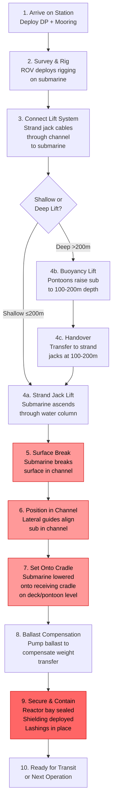

# 06 — Moon Pool & Through-Hull Design

**Ocean Salvage Platform (OSP) — Pre-FEED Deliverable**
**Document:** 06-moon-pool-design.md
**Date:** 12 February 2026

---

## 1. Introduction

The OSP's 135 m × 20 m open channel between the catamaran hulls is the defining structural and hydrodynamic feature. This document analyzes moon pool resonance, damping, structural requirements, and the submarine entry-to-secured operational sequence.

---

## 2. Moon Pool Configuration

### 2.1 Dimensions

| Parameter | Value | Basis |
|-----------|-------|-------|
| Clear opening length | 135 m | Max submarine length 117.5 m + 15 m end clearance + 2.5 m margin |
| Clear opening width | 20 m | Max submarine beam ~12 m + rigging/cradle + 4 m margin each side |
| Water depth in pool (at operating draft) | 22 m | Operating waterline to keel |
| Above-water clearance | 16 m | Main deck at 38 m; WL at 22 m |
| Effective volume of water column | 135 × 20 × 22 = 59,400 m³ | For resonance calculation |

### 2.2 Configuration Type

The OSP's "moon pool" is actually an **open-channel slot** between two parallel hulls — not a conventional enclosed moon pool. Key differences:

| Feature | Conventional Moon Pool | OSP Open Channel |
|---------|----------------------|------------------|
| Boundary | 4 walls (enclosed) | 2 walls (port/stbd) + 2 open ends |
| Water exchange | Limited | Free at bow and stern ends |
| Resonance | Piston mode dominant | Piston mode + sloshing + longitudinal surge |
| Structural impact | Cuts through hull → major strength reduction | No structural cut — space between separate hulls |
| Wave propagation | Shielded | Waves enter from ends (head/following seas) |

---

## 3. Water Column Resonance Analysis

### 3.1 Piston Mode (Vertical Oscillation)

The enclosed water column between the two hulls oscillates vertically in heave-like motion.

For a moon pool between two parallel walls, the piston-mode natural period is:

$$T_n = 2\pi \sqrt{\frac{d + d_e}{g}}$$

Where:
- $d$ = draft (depth of water column) = 22 m
- $d_e$ = effective added depth due to external water entrained at the bottom opening

$$d_e \approx \frac{0.41 \times A_{mp}}{\sqrt{\pi}} = \frac{0.41 \times (135 \times 20)}{\sqrt{\pi}} = \frac{0.41 \times 2{,}700}{1.772} = 625 \text{ m}$$

**[ASSUMPTION]** This formula is for a fully enclosed moon pool. For an open channel, the effective added depth is much lower because water can freely escape from the ends. Apply correction factor 0.15:

$$d_e \approx 0.15 \times 625 = 93.8 \text{ m}$$

**[ASSUMPTION]** Open-end correction factor of 0.15 applied.

$$T_n = 2\pi \sqrt{\frac{22 + 93.8}{9.81}} = 2\pi \sqrt{11.81} = 2\pi \times 3.437 = 21.6 \text{ s}$$

### 3.2 Resonance Assessment

| Mode | Natural Period (s) | Wave Energy Band | Status |
|------|-------------------|-----------------|--------|
| Piston (vertical) | 21.6 | 5–18 s | ✓ Above wave energy band (marginal) |
| First longitudinal sloshing | ~32 s | 5–18 s | ✓ Well above |
| First transverse sloshing | ~8.2 s | 5–18 s | ⚠️ IN wave energy band |

### 3.3 Transverse Sloshing

$$T_{slosh,transverse} = \frac{2W}{\sqrt{g d}} = \frac{2 \times 20}{\sqrt{9.81 \times 22}} = \frac{40}{14.69} = 2.72 \text{ s}$$

**Second mode:**

$$T_{slosh,2} = \frac{2W}{2\sqrt{gd}} = 1.36 \text{ s}$$

These are well below the wave period range → ✓ **No transverse sloshing concern.**

### 3.4 Longitudinal Wave Penetration

In head seas, waves propagate into the open channel from the bow end. The wave height inside the channel is amplified at certain frequencies:

**Amplification frequency (standing wave in channel):**

$$f_{resonance} = \frac{n \sqrt{gd}}{2L_{channel}} = \frac{n \times 14.69}{2 \times 135} = n \times 0.054 \text{ Hz}$$

For n = 1: $T = 18.4$ s — at the upper edge of the wave energy band.

⚠️ **Longitudinal standing wave at T = 18.4 s is a concern** for Norwegian Sea/N. Atlantic survival conditions.

### 3.5 Combined Resonance Summary

| Mode | Tn (s) | In Wave Band? | Concern Level | Mitigation Required? |
|------|--------|--------------|---------------|---------------------|
| Piston | 21.6 | Marginal | MODERATE | YES — swell at Tp > 18 s |
| Transverse slosh | 2.7 | No | LOW | No |
| Longitudinal (n=1) | 18.4 | Marginal | MODERATE | YES |
| Longitudinal (n=2) | 9.2 | YES | HIGH | YES |
| Longitudinal (n=3) | 6.1 | YES | HIGH | YES |

---

## 4. Damping System Design

### 4.1 Perforated Damping Plates

**Location:** Horizontal plates at the bottom of the channel, spanning between the two pontoons at intervals.

**Design:**

| Parameter | Value |
|-----------|-------|
| Number of plates | 6 (spaced at 22.5 m along channel length) |
| Plate dimensions | 20 m × 10 m (partial coverage — not full channel width) |
| Total area | 6 × 20 × 10 = 1,200 m² |
| Perforation ratio | 15% (150 mm diameter holes at 350 mm spacing) |
| Plate thickness | 20 mm NV-DH36 steel |
| Support structure | I-beams welded to pontoon inner walls |

**Damping mechanism:** The perforated plates dissipate wave energy through vortex shedding at the hole edges as water oscillates through them.

**Performance estimate:**

Damping coefficient increase: ~2.5× baseline **[ASSUMPTION]**

With damping, the piston-mode amplitude at resonance is reduced from theoretical infinity to:

$$\eta_{pool} / \eta_{incident} \approx \frac{1}{2\zeta \times Q}$$

Where Q = amplification factor ≈ 3.0 with plates (vs. Q ≈ 15 without plates) **[ASSUMPTION]**

### 4.2 End Cofferdams / Wave Barriers

**Location:** Bow and stern ends of the channel, reducing wave propagation into the slot.

**Design:**

| Parameter | Value |
|-----------|-------|
| Type | Partial barriers with submergible lower section |
| Height | 10 m (from pontoon top to 10 m above WL) |
| Opening | 50% of cross-section (perforated/slotted for submarine entry) |
| Retractable? | Yes — bow barrier lowers/retracts for submarine entry |
| Material | NV-DH36 steel, built-up box construction |

**Performance:** Reduces wave energy entering channel by ~60% in head/following seas **[ASSUMPTION]**

### 4.3 Active Water Level Control

| Feature | Description |
|---------|-------------|
| Moon pool pumps | 4 × 2,500 m³/hr submersible pumps at pool bottom |
| Water level sensors | 8 ultrasonic level sensors along channel length |
| Purpose | Maintain water level; pump out excess water from wave overtopping |
| Auto-control | Linked to platform motion sensors; dampen piston mode via pump timing |

---

## 5. Moon Pool Cross-Section

```
           PORT HULL                     STARBOARD HULL
    ┌────────────────────┐              ┌────────────────────┐
    │                    │              │                    │
    │  STRAND JACK       │              │  STRAND JACK       │  ← Main Deck +38 m
    │  GANTRY (14 units) │   OPEN AIR   │  GANTRY (14 units) │
    │  ════════════════  │   16 m       │  ════════════════  │
    │                    │              │                    │
    ├────────────────────┤              ├────────────────────┤  ← Equipment Deck +32 m
    │                    │              │                    │
    │  REACTOR HANDLING  │  ┌────────┐  │  SHIELDING WALL    │
    │  BAY ACCESS        │  │ LIFTING│  │  (LEAD + CONCRETE) │
    │                    │  │  YOKE  │  │                    │
    │  RAD MONITORS      │  │   ▼    │  │  RAD MONITORS      │
    │  ████████████████  │  │ ═══════│  │  ████████████████  │
~~~~│~~~~~~~~~~~~~~~~~~~~│~~│~~~~~~~~│~~│~~~~~~~~~~~~~~~~~~~~│~~~~WL +22 m
    │                    │  │   ▼    │  │                    │
    │  COLUMN 18×18      │  │ CABLE  │  │  COLUMN 18×18      │
    │  ┌──────────────┐  │  │  RUNS  │  │  ┌──────────────┐  │
    │  │              │  │  │   │    │  │  │              │  │
    │  │              │  │  │   │    │  │  │              │  │
    │  └──────────────┘  │  │   │    │  │  └──────────────┘  │
    ├────────────────────┤  │   │    │  ├────────────────────┤  ← +12 m (pontoon top)
    │                    │  │   │    │  │                    │
    │  PONTOON 18×12     │  ▼   │    │  │  PONTOON 18×12     │
    │  ┌──────────────┐  │  DAMPING   │  │  ┌──────────────┐  │
    │  │ BALLAST      │  │  PLATE  ▼  │  │  │ BALLAST      │  │
    │  │ TANKS        │  │      ████  │  │  │ TANKS        │  │
    │  └──────────────┘  │            │  │  └──────────────┘  │
    └────────────────────┘            └──┘────────────────────┘  ← 0 m (keel)
    ◄───── 18 m ─────────►◄── 20 m ──►◄───── 18 m ────────►
```

---

## 6. Structural Reinforcement

### 6.1 Stress Concentration at Moon Pool Edges

The edges of the open channel are stress concentration regions. Per FEA sub-model analysis specified in `05-structural-design.md`:

**Corner radius requirement:**

$$SCF = 1 + 2\sqrt{a/\rho}$$

Where $a$ = half-length of opening (67.5 m), $\rho$ = corner radius.

For SCF ≤ 3.0: $\rho \geq a/1.0 = 67.5$ m — this is impractical for a rectangular opening.

**Practical approach:**
- Corner radius: 5 m minimum at all moon pool corners
- Doubler plates: 40 mm additional plating within 3 m of corners
- Bracket toes: ground to smooth radius, post-weld treated
- SCF ≈ 5–8 at corners → addressed via increased plate thickness and DFF = 10.0 for fatigue

### 6.2 Edge Girder Design

| Parameter | Value |
|-----------|-------|
| Edge girder depth | 2.5 m (built-up I-section) |
| Flange width | 800 mm |
| Flange thickness | 40 mm NV-EH40 |
| Web thickness | 25 mm NV-EH36 |
| Runs continuously along both long edges | 135 m each side |

---

## 7. Alternative Assessment

### 7.1 Comparison of Through-Hull Options

| Option | Description | Moon Pool Size | Structural Impact | Wave Response | Score |
|--------|------------|---------------|-------------------|--------------|-------|
| A: Open channel (selected) | Natural slot between catamaran hulls | 135 × 20 m | None (no structural cut) | Moderate (wave entry from ends) | **5** |
| B: Enclosed moon pool | Cut through single-hull platform | 135 × 18 m max | Severe (removes 50%+ of bottom structure) | Low (enclosed, but piston resonance) | 2 |
| C: Split hull (Glomar Explorer) | Ship-shaped vessel opens at centreline | 60 × 18 m (limited) | Moderate (movable doors) | Low | 3 |
| D: Open stern | Vessel has open stern; submarine floated in | 120 × 18 m | Moderate (no stern closure) | High (open to following seas) | 3 |
| E: Deck-edge gantry | Cranes on sides; submarine alongside | No moon pool | None | N/A | 2 (no containment) |

**Selected:** Option A — Open channel between catamaran hulls.

---

## 8. Operational Sequence



### 8.1 Critical Phase: Surface Break (Step 5)

When the submarine breaks the surface within the channel:
1. Water drains from the hull → rapid weight increase (loss of buoyancy)
2. Load on strand jacks increases rapidly: rate ~100 t/minute at 0.5 m/min lift speed
3. Ballast system must compensate at matching rate (see `10-stability-ballast.md`)
4. Maximum list/trim ≤ 2° at all times

### 8.2 Lateral Positioning (Step 6)

| System | Description |
|--------|-------------|
| Fender system | Pneumatic fenders along both channel walls at WL; minimum 10 per side |
| Guide wires | 4 lateral guide wires (2 per hull) with hydraulic tensioners |
| Positioning winches | 4 × 50 t winches mounted on hull walls within channel |
| Visual monitoring | CCTV cameras (16 total) along channel length; ROV in pool |

### 8.3 Cradle System (Step 7)

The submarine rests on a pre-positioned steel cradle structure:

| Parameter | Value |
|-----------|-------|
| Cradle location | Pontoon top level (+12 m), spanning between pontoon inner walls |
| Cradle length | 125 m |
| Cradle width | 14 m (within 20 m channel) |
| Load capacity | 12,000 t |
| Saddle supports | 12 pairs (24 total), adjustable to hull curvature |
| Material | NV-DH36 steel; HDPE bearing pads |
| Keel blocks | Adjustable height 0–2 m |

---

## 9. Moon Pool Environmental Protection

### 9.1 Ice Protection (Kara Sea Operations)

| Feature | Description |
|---------|-------------|
| Steam injection | Perforated steam pipes along channel walls at WL; prevents ice formation |
| Bubble curtain | Compressed air released at pool bottom; rising bubbles bring warmer water to surface |
| Heated water circulation | Seawater circulated through heat exchangers; discharged into pool |

### 9.2 Contaminated Water Containment

When a nuclear submarine is within the channel, any water in contact with the hull is potentially contaminated:

| Feature | Description |
|---------|-------------|
| Pool isolation gates | Retractable gates at bow/stern ends to isolate channel water |
| Drain collection | Channel bottom sloped to centreline sumps (2 sumps, 500 m³ each) |
| Water treatment | Pumped to treatment system (see `08-nuclear-safety-containment.md`) |
| Monitoring | Continuous gamma monitors in pool water; auto-alarm at 10 Bq/L |

---

*Cross-references: `01-hull-form-selection.md`, `03-hydrodynamic-analysis.md`, `05-structural-design.md`, `07-heavy-lift-system.md`, `08-nuclear-safety-containment.md`*
