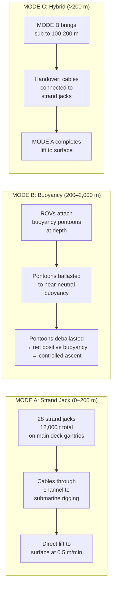
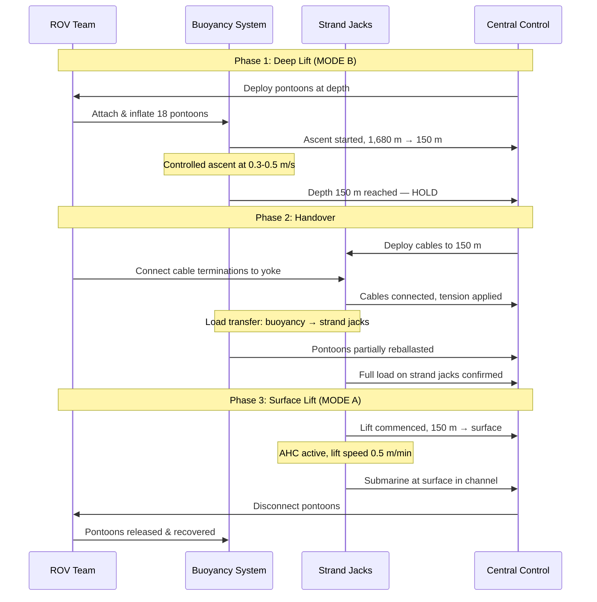

# 07 — Heavy Lift System

**Ocean Salvage Platform (OSP) — Pre-FEED Deliverable**
**Document:** 07-heavy-lift-system.md
**Date:** 12 February 2026

---

## 1. Mission Requirements

| Parameter | Requirement | Basis |
|-----------|-------------|-------|
| Maximum lift capacity | 12,000 t | 10,000 t submarine + 2,000 t rigging/ballast water |
| Maximum depth | 2,000 m | K-278 Komsomolets at 1,680 m + margin |
| Lift through ice | Yes, ≤1.0 m first-year ice | Kara Sea (K-27) |
| Nuclear submarine handling | Yes — all targets contain reactors | Shielded reactor bay required |
| Active heave compensation (AHC) | Required for all strand jack operations | Wave-induced vessel motion decoupling |

---

## 2. Lift System Architecture

### 2.1 Three Operating Modes



---

## 3. Mode A — Strand Jack System

### 3.1 Equipment Specification

| Parameter | Value |
|-----------|-------|
| Number of strand jacks | 28 (14 per hull side) |
| Individual capacity | 500 t SWL |
| Combined SWL | 14,000 t (28 × 500 t) |
| Design factor | 14,000 / 12,000 = 1.17 → after single failure: (28-2)×500 = 13,000 t / 12,000 = 1.08 |
| Strand type | 15.2 mm (0.6") 7-wire strand, 1860 MPa |
| Strands per jack | 55 |
| Stroke length | 250 mm |
| Cycle time | ~30 seconds |
| Lift speed | 250 mm / 30 s ≈ 0.5 m/min |
| Cable length | 250 m maximum per drum |
| Power per jack | 200 kW hydraulic |
| Mounting | Steel gantry beams spanning channel at 10 m spacing |

**[ASSUMPTION]** Strand jack SWL of 500 t per unit based on Enerpac/Mammoet large strand jack specifications.

### 3.2 Strand Jack Layout

```
PLAN VIEW — MAIN DECK (+38 m)
═══════════════════════════════════════════════════════════
PORT HULL                                    STARBOARD HULL

SJ01 SJ02 SJ03 SJ04 SJ05 SJ06 SJ07   SJ15 SJ16 SJ17 SJ18 SJ19 SJ20 SJ21
 ●    ●    ●    ●    ●    ●    ●         ●    ●    ●    ●    ●    ●    ●
 │    │    │    │    │    │    │         │    │    │    │    │    │    │
 │    │    │    │    │    │    │  ← 20m →│    │    │    │    │    │    │
 │    │    │    │    │    │    │ CHANNEL  │    │    │    │    │    │    │
 │    │    │    │    │    │    │         │    │    │    │    │    │    │
SJ08 SJ09 SJ10 SJ11 SJ12 SJ13 SJ14   SJ22 SJ23 SJ24 SJ25 SJ26 SJ27 SJ28
 ●    ●    ●    ●    ●    ●    ●         ●    ●    ●    ●    ●    ●    ●

═══════════════════════════════════════════════════════════
←── 10m spacing ──►

Total: 28 strand jacks in 4 rows of 7
Port outer row:  SJ01–SJ07
Port inner row:  SJ08–SJ14
Stbd inner row:  SJ15–SJ21
Stbd outer row:  SJ22–SJ28
```

### 3.3 Load Distribution

The submarine is connected to the strand jacks via a **lifting yoke** — a steel frame that distributes the load evenly:

| Component | Value |
|-----------|-------|
| Yoke length | 120 m |
| Yoke width | 18 m |
| Yoke structural weight | 800 t **[ASSUMPTION]** |
| Suspension points | 28 (one per strand jack) |
| Sling attachment points | 24 (12 per side of submarine) |
| Sling material | High-strength wire rope, 6×36 IWRC, 76 mm dia |
| Individual sling SWL | 600 t |

### 3.4 Rigging Configuration

For submarine recovery, nylon or wire slings are passed under the hull at 12 equally spaced stations:

$$F_{sling} = \frac{W_{sub} + W_{water}}{n_{slings} \times \cos\theta}$$

For a 10,000 t submarine with 12 sling pairs at θ = 15° from vertical:

$$F_{sling} = \frac{10{,}000 \times 9.81}{24 \times \cos 15°} = \frac{98{,}100}{24 \times 0.966} = 4{,}231 \text{ kN} = 431 \text{ t}$$

Sling SWL = 600 t → Safety factor = 600/431 = 1.39

**[ASSUMPTION]** Sling angle 15° from vertical.

Minimum safety factor per DNV-OS-H205: 1.30 for wire slings → **PASS** ✓

---

## 4. Active Heave Compensation (AHC)

### 4.1 Design Basis

Platform heave at the strand jack locations (from `03-hydrodynamic-analysis.md`):

| Condition | Significant Heave Amplitude (m) | Maximum Heave (m) |
|-----------|--------------------------------|-------------------|
| Operating (Hs ≤ 3.0 m) | 0.24 | 0.46 |
| Design (Hs = 5.0 m) | 0.65 | 1.24 |
| Survival (Hs = 15.0 m) | 1.95 | 3.71 |

**AHC design point:** Must compensate ±2.0 m heave amplitude at periods 8–25 s.

### 4.2 AHC System Architecture

| Parameter | Value |
|-----------|-------|
| Type | Hydraulic cylinder-based AHC integrated with strand jack hydraulics |
| Compensation stroke | ±2.5 m (allows ±2.0 m operational + margin) |
| Maximum velocity | 2.0 m/s (to track heave at T = 8 s) |
| Maximum acceleration | 1.6 m/s² |
| Compensation accuracy | ≥ 95% at T ≥ 10 s; ≥ 85% at T = 8 s |
| Sensors | MRU (Motion Reference Unit) on each hull; 3× accelerometers per strand jack cluster |
| Control | Feed-forward (MRU prediction) + feedback (load cell) |
| Failure mode | On AHC failure, strand jacks lock → load transferred to passive heave compensation (springs) |

### 4.3 AHC Performance Calculation

Required cylinder velocity to compensate sinusoidal heave:

$$v_{max} = \frac{2\pi \times \eta_0}{T}$$

For $\eta_0$ = 2.0 m, T = 8 s:

$$v_{max} = \frac{2\pi \times 2.0}{8} = 1.57 \text{ m/s}$$

Design velocity = 2.0 m/s → margin factor = 2.0/1.57 = 1.27 ✓

Required flow rate per cylinder (bore = 400 mm):

$$Q = v \times A = 2.0 \times \frac{\pi \times 0.4^2}{4} = 0.251 \text{ m³/s} = 251 \text{ L/s} = 15{,}060 \text{ L/min}$$

**[ASSUMPTION]** AHC cylinder bore = 400 mm.

For 28 units operating simultaneously: 28 × 251 = 7,028 L/s total → distributed across 4 independent hydraulic power units (HPU).

---

## 5. Mode B — Buoyancy Lift System

### 5.1 Concept

For depths exceeding 200 m (K-278 at 1,680 m), cable-based strand jack lift is impractical due to cable weight and dynamic amplification. Instead, controlled buoyancy pontoons are used.

### 5.2 Buoyancy Pontoon Specification

| Parameter | Value |
|-----------|-------|
| Number of pontoons | 12 (6 per side of submarine) |
| Pontoon dimensions | 15 m L × 6 m W × 6 m H |
| Volume per pontoon | 540 m³ |
| Buoyancy per pontoon (fully deballasted) | 540 t gross; ~460 t net (after pontoon self-weight ~80 t) |
| Total net buoyancy | 12 × 460 = 5,520 t |
| Submarine weight in water | ~8,000 t for K-278 (submerged weight) **[ASSUMPTION]** |
| Shortfall | 8,000 – 5,520 = 2,480 t |
| Solution | Pre-flood submarine to reduce structural weight; add 6 supplementary pontoons |

**Revised configuration for K-278:**

| Parameter | Value |
|-----------|-------|
| Primary pontoons | 12 × 460 t = 5,520 t |
| Supplementary pontoons | 6 × 460 t = 2,760 t |
| Total net buoyancy | 8,280 t |
| Submarine submerged weight | ~8,000 t **[ASSUMPTION]** |
| Net positive buoyancy | 280 t → ascent rate ~0.1 m/s |

### 5.3 Depth Control

The ascent is controlled by regulating ballast water in each pontoon:

$$\dot{W}_{ballast} = \frac{d}{dt}(\rho g V_{ballast})$$

Rate of deballasting controls net buoyancy and hence ascent rate:

$$v_{ascent} = \frac{F_{net}}{C_D \times A_{ref} \times \frac{1}{2}\rho}$$

Where:
- $F_{net}$ = net upward force (buoyancy – weight)
- $C_D$ = drag coefficient of submarine + pontoon assembly ≈ 1.2 **[ASSUMPTION]**
- $A_{ref}$ = reference area ≈ 150 m² (frontal area)

For F_net = 280 × 9.81 ≈ 2,747 kN:

$$v_{ascent} = \sqrt{\frac{2 \times 2{,}747{,}000}{1.2 \times 150 \times 1{,}025}} = \sqrt{\frac{5{,}494{,}000}{184{,}500}} = \sqrt{29.8} = 5.46 \text{ m/s}$$

This is too fast. Maximum allowable: 0.5 m/s **[ASSUMPTION]**

**Controlled ascent:** Maintain only 2–5% excess buoyancy at any time by partial deballasting. 

For v = 0.5 m/s:

$$F_{net} = C_D \times A_{ref} \times \frac{1}{2}\rho \times v^2 = 1.2 \times 150 \times 0.5 \times 1{,}025 \times 0.25 = 23{,}063 \text{ N} ≈ 2.35 \text{ t}$$

Net buoyancy controlled to ~2.4 t → extremely precise ballast control required.

### 5.4 ROV Support

| Parameter | Value |
|-----------|-------|
| Work-class ROVs | 4 (2 primary, 2 backup) |
| ROV depth rating | 3,000 m minimum |
| ROV intervention tasks | Attach pontoons, connect deballasting controls, monitor ascent |
| LARS (Launch & Recovery System) | 2 × over-side LARS (port and starboard) |

---

## 6. Mode C — Hybrid Operations

### 6.1 Handover Procedure



### 6.2 Handover Depth Selection

| Factor | Consideration |
|--------|--------------|
| Minimum depth | 50 m — allows sufficient cable scope for AHC |
| Maximum depth | 250 m — strand jack cable weight limit |
| Wave influence | Below 100 m, wave particle motion < 0.1% of surface |
| Optimal handover depth | **150 m** — below wave influence, within cable capacity |

---

## 7. Gantry Structure

### 7.1 Gantry Beam Design

The strand jacks are mounted on transverse gantry beams spanning the channel:

| Parameter | Value |
|-----------|-------|
| Number of gantry beams | 7 (at 10 m spacing along 70 m of channel centreline) |
| Beam span | 20 m (channel width) + 8 m (4 m cantilever each side into hull) = 28 m |
| Beam depth | 4.0 m (built-up box girder) |
| Beam width | 3.0 m |
| Flange thickness | 50 mm NV-EH40 |
| Web thickness | 30 mm NV-EH36 |
| Load per beam | 12,000 / 7 = 1,714 t (28 strand jacks / 7 beams = 4 jacks per beam) |

**Beam bending check:**

$$M_{max} = \frac{F \times L}{8} = \frac{1{,}714 \times 9.81 \times 28}{8} = \frac{470{,}782}{8} = 58{,}848 \text{ kN·m}$$

**[ASSUMPTION]** Simplified as UDL for preliminary check.

Section modulus required:

$$Z_{req} = \frac{M_{max}}{f_y / \gamma_m} = \frac{58{,}848}{390 / 1.15} = \frac{58{,}848}{339} = 173.6 \times 10^3 \text{ cm³}$$

Box section (3.0 m × 4.0 m, 50 mm flanges, 30 mm webs):

$$I = \frac{3.0 \times 4.0^3}{12} - \frac{2.94 \times 3.9^3}{12} = 16.0 - 14.55 = 1.45 \text{ m}^4$$

$$Z = \frac{I}{y_{max}} = \frac{1.45}{2.0} = 0.725 \text{ m}^3 = 725{,}000 \text{ cm}^3$$

Utilization = 173,600 / 725,000 = 0.24 → **PASS** ✓ (gantry stiffness-governed, not strength)

---

## 8. Failure Modes and Redundancy

### 8.1 Failure Mode Analysis

| Failure Mode | Probability | Consequence | Mitigation |
|-------------|------------|-------------|------------|
| Single strand jack failure | Moderate | Load redistributed to 27 remaining jacks; 3.7% overload each | Two spare jacks (hot standby); auto-load redistribution |
| Two strand jack failure (same side) | Low | Asymmetric loading → list; emergency ballast | Maximum 2-jack failure design case; ballast compensation in 60 s |
| AHC failure | Moderate | Dynamic loads on cables increase by factor 1.5–2.0 | Passive spring backup; auto-lock; abort lift protocol |
| Cable failure | Low | 1 of 28 cables lost → load redistribution | Cable inspection every 200 hours; 5.0 safety factor on cable |
| Hydraulic power failure | Low | Loss of lift capability | 4 independent HPUs; any 2 can support full load (load sharing) |
| Sling failure | Very Low | Submarine shifts; potential loss | 1.39 SF on slings; NDE inspection before each lift |
| Control system failure | Low | AHC loss; manual override | Triple-redundant PLC; manual hydraulic override |

### 8.2 Emergency Procedures

| Scenario | Action |
|----------|--------|
| Submarine starts swinging | Engage guide wires; reduce lift speed to 0.1 m/min |
| Load exceeds 110% of target | Automatic lift stop; alarm; assess cause |
| AHC offline during lift | Pause lift at current depth; lock strand jacks; wait for repair or weather window |
| Two+ strand jack failure | Controlled lowering to seabed or hold at depth; do not continue lift |
| Cable birdcaging | Immediate stop; do not reverse direction; cut and replace cable |

---

## 9. Weight and Power Summary

| Item | Weight (t) | Power (kW) |
|------|-----------|-----------|
| 28 × strand jacks | 560 | 5,600 |
| 7 × gantry beams | 1,050 | — |
| AHC hydraulic cylinders | 280 | 2,800 |
| 4 × HPU | 320 | — |
| Cables/drums/sheaves | 480 | — |
| Lifting yoke | 800 | — |
| Buoyancy pontoons (18) | 1,440 | — |
| ROV systems (4) | 120 | 800 |
| LARS (2) | 80 | 400 |
| Control systems | 20 | 200 |
| **TOTAL** | **5,150** | **9,800** |

---

*Cross-references: `03-hydrodynamic-analysis.md`, `05-structural-design.md`, `06-moon-pool-design.md`, `08-nuclear-safety-containment.md`, `10-stability-ballast.md`, `12-operational-modes.md`*
