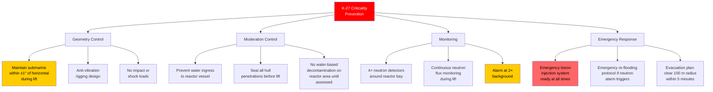
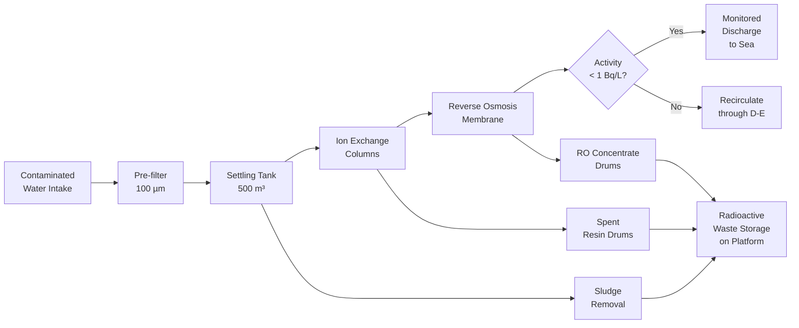

# 08 — Nuclear Safety & Containment

**Ocean Salvage Platform (OSP) — Pre-FEED Deliverable**
**Document:** 08-nuclear-safety-containment.md
**Date:** 12 February 2026

---

## 1. Radiological Hazard Summary

### 1.1 Target Submarine Nuclear Inventories

| Submarine | Reactor Type | Power (MWt) | Status | Estimated Activity (TBq) | Primary Hazards |
|-----------|-------------|-------------|--------|--------------------------|-----------------|
| K-27 | VT-1 (liquid metal Pb-Bi) | 73 | Dumped, intact | ~3,700 **[ASSUMPTION]** | Polonium-210, Cs-137, solidified Pb-Bi coolant, criticality risk |
| K-159 | VM-A (PWR) | 2 × 70 | Sunk, flooded | ~1,200 **[ASSUMPTION]** | Cs-137, Sr-90, fuel rod fragments |
| K-278 Komsomolets | OK-650B-3 (PWR) | 190 | Sunk at 1,680 m | ~5,500 **[ASSUMPTION]** | Cs-137, Sr-90, 2× nuclear torpedoes (Pu-239) |
| USS Thresher | S5W (PWR) | 78 | Imploded, scattered | ~800 **[ASSUMPTION]** | Activated steel, fuel fragments, dispersed |
| USS Scorpion | S5W (PWR) | 78 | Imploded, scattered | ~750 **[ASSUMPTION]** | Similar to Thresher |

**[ASSUMPTION]** Activity estimates based on decay from original fission product inventory at shutdown to 2026, assuming 30% fuel damage release fraction for sunk/flooded reactors.

### 1.2 Applicable Standards

| Standard | Application |
|----------|-------------|
| IAEA GSR Part 3 | Radiation Protection and Safety of Radiation Sources |
| IAEA SSR-5 | Disposal of Radioactive Waste |
| IAEA SSG-47 | Decommissioning of Nuclear Installations |
| ICRP Publication 103 | Dose limits: 20 mSv/yr workers; 1 mSv/yr public |
| 10 CFR 20 (US) | Standards for Protection Against Radiation |
| NRB-99/2009 (Russia) | Radiation Safety Norms (for K-27, K-159, K-278) |
| DNV-OS-A101 | Safety Principles and Arrangements (MODU) |
| IMO Convention on Nuclear Ships (1962) | Nuclear vessel operating requirements |

---

## 2. Dose Rate Analysis

### 2.1 Source Term Model

The dominant source for dose rate calculations is the reactor compartment of an intact submarine after raising:

**Unshielded dose rate at 1 m from reactor (K-278, worst case):**

$$\dot{D}_{unshielded} = \frac{A \times E_\gamma \times \mu_{air}}{4\pi r^2} \times C$$

Where:
- A = 5,500 TBq = 5.5 × 10¹⁵ Bq
- $E_\gamma$ = average gamma energy ≈ 0.65 MeV (Cs-137 dominated)
- $\mu_{air}$ = mass absorption coefficient for air
- C = conversion constant

**Simplified estimate using dose rate constant:**

For Cs-137: Γ = 0.082 mSv·m²/(GBq·hr)

At 1 m, unshielded:

$$\dot{D} = \Gamma \times A = 0.082 \times 5.5 \times 10^6 = 451{,}000 \text{ mSv/hr} = 451 \text{ Sv/hr}$$

This is an instantly lethal dose rate → **shielding is absolutely critical.**

### 2.2 Tenth-Value Layer (TVL) Calculations

The TVL is the thickness of material that reduces dose rate by a factor of 10.

| Material | TVL for Cs-137 (662 keV) | Density (kg/m³) |
|----------|--------------------------|-----------------|
| Lead | 43 mm | 11,340 |
| Steel | 65 mm | 7,850 |
| Concrete (ordinary) | 170 mm | 2,350 |
| Concrete (barite) | 120 mm | 3,500 |
| Water | 270 mm | 1,000 |
| Submarine hull steel | ~45–60 mm (existing shielding) | 7,850 |

### 2.3 Required Shielding

**Design dose rate target:** ≤ 0.025 mSv/hr on accessible deck areas (results in ≤ 20 mSv/yr at 800 hr/yr occupancy)

Required attenuation:

$$n_{TVL} = \log_{10}\left(\frac{\dot{D}_{source}}{\dot{D}_{target}}\right) = \log_{10}\left(\frac{451{,}000}{0.025}\right) = \log_{10}(1.804 \times 10^{10}) = 10.26$$

Number of TVLs required: **10.3**

**Existing shielding credits:**
- Submarine hull: ~45 mm steel ≈ 0.7 TVL
- Submarine reactor shield: ~200 mm steel + 100 mm lead ≈ 3.1 + 2.3 = 5.4 TVL **[ASSUMPTION]**
- Sea water remaining in reactor compartment: ~2 m depth ≈ 7.4 TVL **[ASSUMPTION]**

Total existing: 0.7 + 5.4 + 7.4 = **13.5 TVL** → ≫ 10.3 required

**BUT:** Once submarine is raised and drained, water shielding is lost:

Existing without water = 0.7 + 5.4 = **6.1 TVL**

Additional TVL needed = 10.3 – 6.1 = **4.2 TVL**

### 2.4 OSP Shielding Design

| Zone | Additional Shielding | TVL Provided | Purpose |
|------|---------------------|-------------|---------|
| Reactor Handling Bay walls | 250 mm lead + 500 mm barite concrete | 5.8 + 4.2 = 10.0 TVL | Primary radiation barrier |
| Reactor Handling Bay floor | 300 mm steel plate | 4.6 TVL | Downward scatter protection |
| Adjacent compartment walls | 100 mm lead | 2.3 TVL | Secondary barrier |
| Control room walls | 150 mm lead + 300 mm concrete | 3.5 + 1.8 = 5.3 TVL | Operator protection |
| Main deck above reactor bay | 200 mm lead + 400 mm barite concrete | 4.7 + 3.3 = 8.0 TVL | Walk-over area protection |

---

## 3. Reactor Handling Bay

### 3.1 General Arrangement

```
CROSS-SECTION THROUGH REACTOR HANDLING BAY
(Looking forward; located amidships, port side of channel)

                    250 mm lead wall
                    + 500 mm concrete
                         │
    ┌────────────────────┤                    ┌───────────────┐
    │  CLEAN AREA        │  REACTOR           │               │
    │  (offices,         │  HANDLING          │   CHANNEL     │
    │   controls,        │  BAY               │   (open to    │
    │   monitoring       │                    │    sky)        │
    │   room)            │  ┌──────────┐      │               │
    │                    │  │SUBMARINE │      │               │
    │  < 0.025 mSv/hr   │  │ REACTOR  │      │               │
    │                    │  │ COMPART- │      │               │
    │                    │  │ MENT     │      │               │
    │                    │  └──────────┘      │               │
    │  200 mm lead roof  │                    │               │
    │  ██████████████████│████████████████████│               │
    ├────────────────────┤────────────────────┤               │
    │  HULL STRUCTURE    │  BALLAST TANKS     │  PONTOON      │
    └────────────────────┴────────────────────┴───────────────┘
    ◄──── 18 m ────────►◄───── 20 m ────────►◄──── 18 m ────►
         PORT HULL            CHANNEL            STBD HULL
```

### 3.2 Bay Dimensions

| Parameter | Value |
|-----------|-------|
| Length | 30 m (covers reactor compartment of any target submarine) |
| Width | 18 m (full hull width) |
| Height | 20 m (from pontoon top +12 m to +32 m deck) |
| Wall thickness (lead + concrete) | 750 mm |
| Roof thickness (lead + concrete) | 600 mm |
| Floor | 300 mm steel plate on structural deck |
| Gross weight of shielding | ~6,500 t **[ASSUMPTION]** |

### 3.3 Bay Equipment

| Equipment | Purpose |
|-----------|---------|
| 50 t overhead crane | Handling fuel assemblies, equipment |
| Remote manipulators (2) | Fuel handling, sampling |
| Decontamination spray system | Wash-down of reactor area |
| Ventilation (HEPA + charcoal) | Containment of airborne contamination |
| Sump collection | Contaminated water collected to treatment |
| CCTV (8 radiation-hardened cameras) | Remote monitoring |
| Continuous air monitors (CAMs) (4) | Alpha, beta, gamma airborne monitoring |
| Area gamma monitors (12) | Fixed dose rate monitoring |
| Neutron detectors (4) | Criticality monitoring (essential for K-27) |

---

## 4. K-27 Criticality Prevention

### 4.1 Criticality Risk

K-27 is unique among the targets: its VT-1 reactor used liquid lead-bismuth (Pb-Bi) cooled, enriched uranium fuel. The reactor was deliberately poisoned before dumping, but:

- If solidified Pb-Bi moderator cracks or shifts during lifting → geometry change
- Water ingress into reactor vessel could act as moderator → criticality risk
- Tilting submarine > 5° could redistribute fuel mass

### 4.2 Criticality Prevention Measures



### 4.3 Gimbal Cradle for K-27

| Parameter | Value |
|-----------|-------|
| Type | 2-axis gimbal cradle (roll and pitch) |
| Range | ±5° each axis |
| Active control | Hydraulic actuators maintain level within ±1° |
| Sensors | 2× inertial measurement units (IMU) |
| Weight | ~200 t |
| Response time | < 2 seconds for 1° correction |

---

## 5. Radiation Monitoring Network

### 5.1 Fixed Monitoring System

| Location | Detector Type | Quantity | Range | Alarm Level |
|----------|--------------|----------|-------|-------------|
| Reactor handling bay | Gamma area monitor | 12 | 0.1 µSv/hr – 10 Sv/hr | 25 µSv/hr |
| Reactor handling bay | Neutron detector | 4 | 0.01 – 10⁶ n/cm²/s | 2× background |
| Channel (pool water) | Submersible gamma | 8 | 0.1 – 10⁵ Bq/L | 10 Bq/L |
| Main deck above bay | Gamma area monitor | 4 | 0.1 µSv/hr – 100 mSv/hr | 25 µSv/hr |
| Accommodation block | Gamma area monitor | 4 | 0.01 – 10 µSv/hr | 2.5 µSv/hr |
| Stack exhaust | Beta/gamma particulate | 2 | 0.01 – 10⁴ Bq/m³ | 10 Bq/m³ |
| Stack exhaust | Iodine-131 charcoal | 2 | — | 1 Bq/m³ |
| Platform perimeter | Gamma fence monitors | 8 | 0.01 – 100 µSv/hr | 5 µSv/hr |

### 5.2 Personal Monitoring

| Device | Issuing | Quantity |
|--------|---------|----------|
| Electronic personal dosimeter (EPD) | All personnel in controlled areas | 80 |
| TLD badge (backup) | All personnel | 150 |
| Finger ring dosimeter | Fuel handling personnel | 20 |
| Internal contamination (whole body counter) | Quarterly for rad workers | 1 unit (medical bay) |

### 5.3 Environmental Monitoring

| Medium | Method | Frequency |
|--------|--------|-----------|
| Seawater (around platform) | Gamma spectroscopy, tritium | Daily during operations |
| Air (downwind) | Particulate and iodine samplers | Continuous |
| Seafloor sediment | Grab samples analysed ashore | Before/after each operation |

---

## 6. Contaminated Water Management

### 6.1 Sources of Contaminated Water

| Source | Volume Estimate | Activity |
|--------|----------------|----------|
| Moon pool water during submarine surfacing | 59,400 m³ (full pool) | Low: 1–100 Bq/L **[ASSUMPTION]** |
| Submarine internal flooding water | 3,000–8,000 m³ per submarine | High: 10³–10⁶ Bq/L **[ASSUMPTION]** |
| Reactor bay wash-down water | 50 m³ per wash cycle | High: 10⁴–10⁵ Bq/L |
| Decontamination water | 200 m³ per campaign | Medium: 10²–10⁴ Bq/L |

### 6.2 Water Treatment System



### 6.3 Treatment System Capacity

| Parameter | Value |
|-----------|-------|
| Treatment rate | 200 m³/hr |
| Ion exchange columns | 4 (2 in series, 2 standby) |
| Resin type | Cs-selective zeolite + mixed-bed IX resin |
| RO system | 2 × 100 m³/hr modules |
| Decontamination factor | >10⁴ (inlet to outlet) **[ASSUMPTION]** |
| Treated water discharge limit | < 1 Bq/L total gamma (per IAEA authorization) |
| Radioactive waste storage | 100 drums (200 L each) = 20 m³ solid waste capacity |
| Waste classification | LILW-SL (Low and Intermediate Level Waste, Short-Lived) **[ASSUMPTION]** |

---

## 7. Ventilation and Airborne Containment

### 7.1 Reactor Handling Bay Ventilation

| Parameter | Value |
|-----------|-------|
| Air changes per hour | 10 |
| Bay volume | 30 × 18 × 20 = 10,800 m³ |
| Air flow rate | 108,000 m³/hr |
| Pressure | Negative (-50 Pa) relative to surrounding spaces |
| HEPA filter stages | 2 in series |
| HEPA efficiency | ≥ 99.97% for 0.3 µm particles | 
| Charcoal filter | Impregnated activated charcoal for I-131 |
| Stack height | 15 m above main deck (+53 m above WL) |
| Discharge limit | < 1 Bq/m³ (alpha); < 10 Bq/m³ (beta/gamma) |
| Emergency shutdown | Automatic on high activity alarm; recirculation mode |

### 7.2 Containment Hierarchy

| Barrier | Description |
|---------|-------------|
| Primary | Submarine reactor vessel (existing) |
| Secondary | Reactor handling bay structure (walls/roof/floor) |
| Tertiary | Platform hull/deck (watertight subdivision) |
| Quaternary | Surrounding ocean (dilution) |

---

## 8. Emergency Preparedness

### 8.1 Design Basis Accidents (DBA)

| DBA | Description | Consequence | Mitigation |
|-----|------------|-------------|------------|
| DBA-1 | Reactor coolant leak during lift | Cs-137 release to moon pool | Pool isolation gates close; treatment system processes water |
| DBA-2 | Drop of submarine during lift | Impact on seabed; potential fuel damage | Controlled lowering protocol; rigging redundancy |
| DBA-3 | K-27 criticality event | Neutron/gamma burst | Geometry control; boron injection; neutron monitoring |
| DBA-4 | Fire in reactor handling bay | Potential airborne release | Bay sprinkler system; ventilation emergency shutdown; HEPA filtered exhaust |
| DBA-5 | Loss of shielding (wall damage) | Elevated dose rates | Evacuate affected area; deploy mobile shielding |
| DBA-6 | K-278 torpedo warhead leak | Plutonium contamination | Alpha monitoring; glove box handling; HEPA containment |

### 8.2 Emergency Zones

| Zone | Radius | Access Control |
|------|--------|---------------|
| Exclusion Zone | 0–25 m from reactor bay | Authorized rad workers only; full PPE + respirator |
| Supervised Area | 25–100 m from reactor bay | Rad workers; dosimetry required |
| Public Area | >100 m from reactor bay | Accommodation, helideck, bridge |
| Emergency Evacuation Zone | Entire platform | Triggered by DBA-3 (criticality) |

---

## 9. Weight and Space Summary

| Item | Weight (t) | Location |
|------|-----------|----------|
| Lead shielding (walls/roof/floor) | 3,200 | Reactor bay structure |
| Barite concrete | 2,800 | Reactor bay walls |
| Steel reinforcement | 500 | Reactor bay structure |
| Ventilation system | 180 | Reactor bay + fan room |
| Water treatment system | 250 | Treatment room (lower deck) |
| Monitoring equipment | 30 | Throughout platform |
| Rad waste storage | 60 (containers) + 20 (waste) | Dedicated hold |
| 50 t overhead crane | 120 | Reactor bay roof |
| Remote manipulators | 10 | Reactor bay |
| Gimbal cradle (K-27 only) | 200 | Channel/reactor bay |
| **TOTAL** | **~7,370** | — |

---

*Cross-references: `06-moon-pool-design.md`, `07-heavy-lift-system.md`, `11-accommodation-systems.md`, `12-operational-modes.md`, `15-risk-register.csv`*
