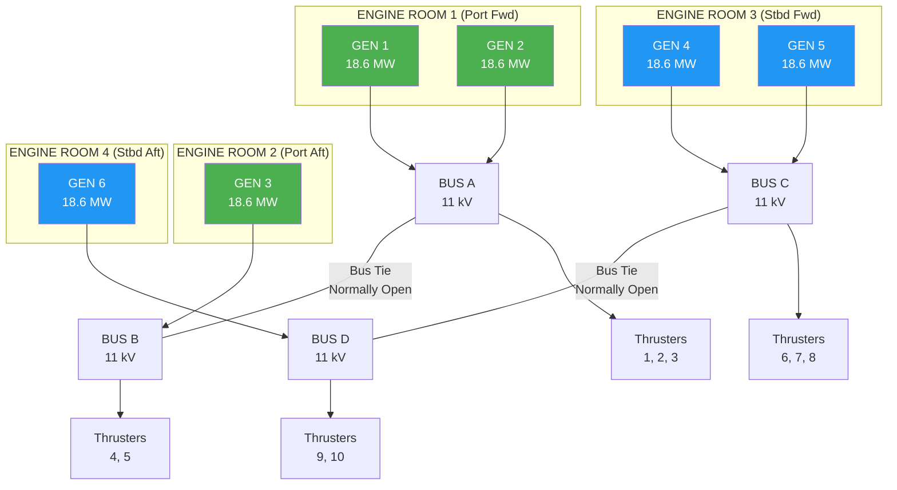

# 09 — Power Generation & Distribution

**Ocean Salvage Platform (OSP) — Pre-FEED Deliverable**
**Document:** 09-power-generation.md
**Date:** 12 February 2026

---

## 1. Power Demand Summary

### 1.1 Load Estimation by Mode

| Consumer | Transit (MW) | Station-Keeping (MW) | Lift Operations (MW) | Survival (MW) |
|----------|-------------|---------------------|---------------------|---------------|
| Propulsion / DP Thrusters | 25.0 | 45.0 | 45.0 | 60.0 |
| Heavy Lift System (strand jacks + AHC) | — | — | 9.8 | — |
| Moon Pool Systems (pumps, barriers) | — | 0.5 | 1.0 | 0.5 |
| Ballast System | 0.3 | 0.5 | 2.0 | 1.0 |
| HVAC (accommodation + reactor bay) | 3.0 | 3.0 | 4.0 | 3.0 |
| Hotel Load (lighting, galley, laundry) | 2.0 | 2.0 | 2.0 | 2.0 |
| Navigation & Communications | 0.5 | 0.5 | 0.5 | 0.5 |
| ROV Operations | — | 0.4 | 0.8 | — |
| Reactor Bay Systems | — | — | 2.0 | — |
| Water Treatment Plant | — | — | 0.5 | — |
| Crane & Deck Machinery | 0.2 | 0.5 | 1.5 | 0.2 |
| Switchgear, UPS, Lighting | 1.0 | 1.0 | 1.0 | 1.0 |
| **Subtotal Connected** | **32.0** | **53.4** | **70.1** | **68.2** |
| Diversity Factor | 0.75 | 0.80 | 0.85 | 0.90 |
| **Demand** | **24.0** | **42.7** | **59.6** | **61.4** |
| 15% Design Margin | 3.6 | 6.4 | 8.9 | 9.2 |
| **Total Design Load** | **27.6** | **49.1** | **68.5** | **70.6** |

### 1.2 Peak Power Requirement

**Design peak = 70.6 MW** (survival condition with all DP thrusters at maximum thrust)

**Operational peak = 68.5 MW** (lift operations with full DP)

---

## 2. Generator Selection

### 2.1 Configuration

| Parameter | Value |
|-----------|-------|
| Generator type | Medium-speed diesel generators |
| Engine type | Wärtsilä 16V46F or equivalent |
| Rating per unit | 18.6 MW (at MCR, ISO conditions) |
| Number installed | 6 |
| Total installed capacity | 6 × 18.6 = 111.6 MW |
| Fuel type | Marine Gas Oil (MGO) — required in Arctic/environmental sensitive areas |
| Alternator voltage | 11 kV, 60 Hz, 3-phase |
| Engine speed | 514 rpm |
| SFOC | 185 g/kWh at 85% MCR **[ASSUMPTION]** |

### 2.2 Redundancy and DP3 Compliance

Per DNV DYNPOS-3 AUTRO requirements, no single failure shall cause loss of position. The power system must survive any single fault including fire/flood in any one compartment:

### 2.3 Worst-Case Single Failure

| Failure | Generators Lost | Remaining Capacity | Demand Met? |
|---------|----------------|-------------------|-------------|
| Fire in ER1 | G1, G2 | 4 × 18.6 = 74.4 MW | ✓ (70.6 MW peak) |
| Fire in ER3 | G4, G5 | 4 × 18.6 = 74.4 MW | ✓ |
| Fire in ER2 | G3 | 5 × 18.6 = 93.0 MW | ✓ |
| Fire in ER4 | G6 | 5 × 18.6 = 93.0 MW | ✓ |
| Bus A + Bus C blackout | G1, G2, G4, G5 | 2 × 18.6 = 37.2 MW | ⚠️ DP reduced mode |

**Design check:** Loss of any ONE engine room leaves ≥74.4 MW → exceeds 70.6 MW peak → **PASS** ✓

---

## 3. Electrical Distribution

### 3.1 Single Line Diagram Overview

| Level | Voltage | Purpose |
|-------|---------|---------|
| HV Main | 11 kV, 60 Hz | Generator output; thruster drives; large motors |
| HV Distribution | 6.6 kV, 60Hz | Ballast pumps; large cranes; compressors |
| LV Main | 690 V, 60 Hz | Strand jack HPUs; deck machinery; HVAC |
| LV Distribution | 440 V, 60 Hz | General distribution; small motors |
| Essential | 230 V, 60 Hz | Lighting; control systems; instrumentation |
| Emergency | 230 V, 60 Hz (UPS backed) | Navigation; DP; fire/gas; PA; radio |
| DC | 24 VDC (UPS/battery) | DP computers; safety systems; SCADA |

### 3.2 Emergency Generator

| Parameter | Value |
|-----------|-------|
| Number | 2 |
| Type | High-speed diesel generator |
| Rating | 2 × 1,500 kW |
| Fuel autonomy | 72 hours at full load |
| Auto-start | Within 45 seconds of blackout |
| Supplies | Emergency lighting; DP (reduced); fire pumps; navigation; bilge pumps |
| Location | Dedicated emergency generator rooms (1 per hull), above damage waterline |

---

## 4. Fuel System

### 4.1 Fuel Storage

| Parameter | Value |
|-----------|-------|
| Fuel type | MGO (DMA grade per ISO 8217) |
| Total storage capacity | 8,000 m³ |
| Consumption at 68.5 MW (85% MCR) | 185 g/kWh × 68,500 kW = 12,673 kg/hr = 14.9 m³/hr **[ASSUMPTION]** MGO density 850 kg/m³ |
| Endurance at full power | 8,000 / 14.9 = 537 hours = 22.4 days |
| Endurance at transit mode (27.6 MW) | 8,000 / 6.0 = 1,333 hours = 55.5 days |
| Tank locations | Double-bottom tanks in both hulls; cofferdams between fuel and sea |
| Transfer pumps | 4 × 50 m³/hr (2 per hull) |
| Purifier/separator | 2 × centrifugal separators + 2 × pre-filters |

### 4.2 Fuel Consumption Summary

| Mode | Load (MW) | SFOC (g/kWh) | Consumption (t/day) |
|------|-----------|-------------|-------------------| 
| Transit (10 knots) | 27.6 | 190 | 125.8 |
| Station-keeping | 49.1 | 185 | 218.0 |
| Lift operations | 68.5 | 185 | 304.2 |
| Survival (no lift) | 70.6 | 188 | 318.7 |
| Harbour/idle | 5.0 | 210 | 25.2 |

---

## 5. Thruster Drives

### 5.1 Variable Frequency Drive (VFD) Specification

| Parameter | Value |
|-----------|-------|
| Number | 10 (one per thruster) |
| Type | Active front-end (AFE) VFD |
| Rating | 6,000 kW each |
| Input voltage | 11 kV |
| Output voltage | 6.6 kV |
| Harmonic compliance | IEEE 519 THD < 5% |
| Cooling | Liquid-cooled (freshwater glycol loop) |

### 5.2 Total Thruster Power

$$P_{thrusters} = 10 \times 6{,}000 = 60{,}000 \text{ kW} = 60 \text{ MW}$$

At maximum DP demand (survival): 60 MW thrust + 10.6 MW auxiliary = 70.6 MW → matches generator capacity analysis.

---

## 6. Battery / UPS System

| Parameter | Value |
|-----------|-------|
| UPS capacity | 4 × 250 kVA (online double-conversion) |
| Battery type | Lithium iron phosphate (LiFePO₄) |
| Battery capacity | 4 × 500 kWh = 2,000 kWh total |
| Backup duration | 30 minutes for essential loads (DP, navigation, safety) |
| Location | UPS rooms in each hull quadrant (DP3 separation) |
| Charging | From essential switchboard; float charge |

---

## 7. Waste Heat Recovery

### 7.1 Heat Sources

| Source | Thermal Output (kW) per Engine | Available from 4 Engines |
|--------|-------------------------------|--------------------------|
| Exhaust gas (320°C) | 4,500 | 18,000 |
| Jacket water (90°C) | 3,200 | 12,800 |
| Charge air cooler | 2,100 | 8,400 |
| Lube oil cooler | 800 | 3,200 |
| **Total** | **10,600** | **42,400** |

### 7.2 Recovery Systems

| System | Heat Recovered (kW) | Application |
|--------|---------------------|-------------|
| Exhaust gas economiser | 8,000 | Steam production for heating; moon pool ice prevention |
| Jacket water heat exchanger | 6,000 | Accommodation heating; HVAC preheating |
| Fresh water generator | 2,000 | Potable water production (60 m³/day) |
| **Total recovered** | **16,000** | — |

Recovery efficiency = 16,000 / 42,400 = **37.7%**

---

## 8. Arctic Winterisation

### 8.1 Cold Weather Provisions

| Feature | Description |
|---------|-------------|
| Engine room heating | Maintained > 15°C; supplemented by WHR |
| Fuel heating | Steam trace heating on all MGO lines and tanks; viscosity maintained < 6 cSt |
| Intake air heating | Engine combustion air preheated to > 0°C via steam coils |
| Cooling water | Freshwater glycol (50%) loop; sea chest heating to prevent ice |
| LO preheating | Electric immersion heaters in all lube oil sumps |
| Starting | Compressed air start; air receivers heated to prevent moisture freezing |
| Operating temperature range | –35°C to +45°C ambient air |

---

*Cross-references: `04-dynamic-positioning.md`, `07-heavy-lift-system.md`, `08-nuclear-safety-containment.md`, `10-stability-ballast.md`, `16-bill-of-materials.csv`*
