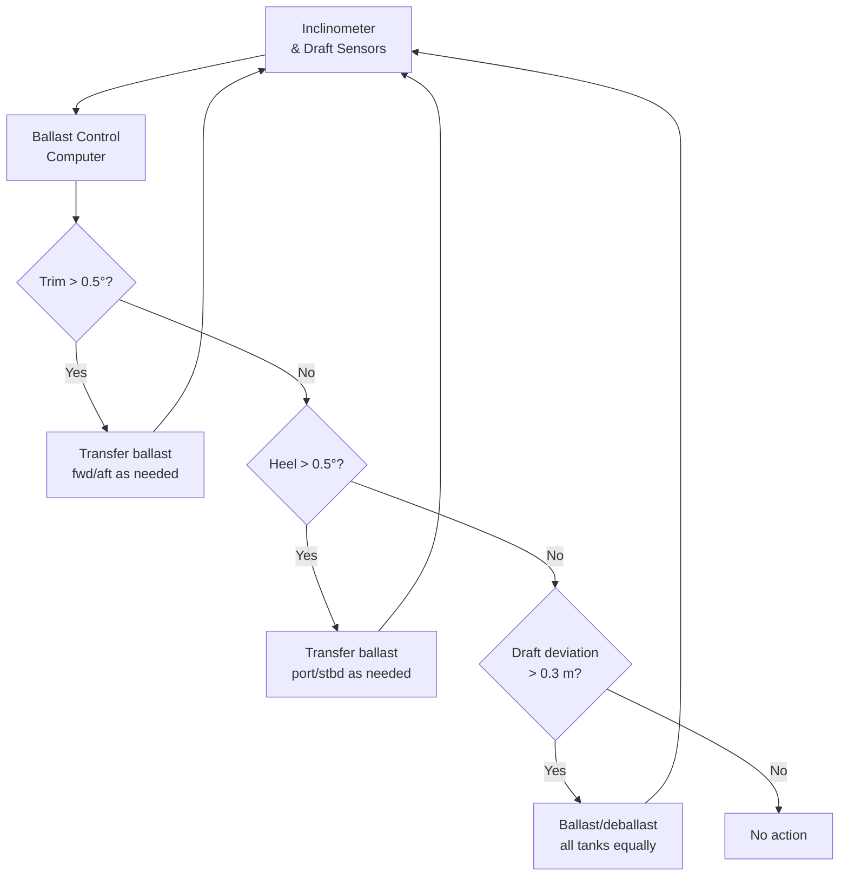

# 10 — Stability & Ballast System

**Ocean Salvage Platform (OSP) — Pre-FEED Deliverable**
**Document:** 10-stability-ballast.md
**Date:** 12 February 2026

---

## 1. Stability Design Basis

### 1.1 Applicable Standards

| Standard | Requirement |
|----------|-------------|
| IMO MODU Code 2009, Ch. 3 | Intact stability criteria for column-stabilised units |
| DNV-OS-C301 § 4 | Stability requirements for column-stabilised units |
| IMO Resolution A.1011(26) | Severe wind and rolling criterion (weather criterion) |
| DNV-OS-C301 § 5 | Damaged stability |
| MARPOL 73/78 Annex I | Oil pollution prevention (ballast/fuel tank arrangement) |

### 1.2 Key Parameters (from `01-hull-form-selection.md` and `03-hydrodynamic-analysis.md`)

| Parameter | Value |
|-----------|-------|
| LOA × BOA | 275 m × 80 m |
| Operating draft | 22 m |
| Transit draft | 12 m |
| Survival draft | 26 m |
| Lightship weight | 72,000 t |
| Operating displacement | 135,000 t |
| Number of columns | 8 (4 per hull) |
| Pontoon dimensions | 245 m × 18 m × 12 m (2 pontoons) |
| Column dimensions | 18 m × 18 m (square) |

---

## 2. Hydrostatic Properties

### 2.1 Waterplane Area at Operating Draft (22 m)

At draft = 22 m, water intersects the 8 columns (pontoons fully submerged at d > 12 m):

$$A_{WP} = 8 \times 18 \times 18 = 2{,}592 \text{ m}^2$$

### 2.2 Centre of Buoyancy and Metacentric Height

**Buoyancy contributions:**

| Component | Volume (m³) | VCB (m above keel) | V × VCB |
|-----------|-------------|---------------------|---------|
| Port pontoon (fully submerged) | 245 × 18 × 12 = 52,920 | 6.0 | 317,520 |
| Stbd pontoon | 52,920 | 6.0 | 317,520 |
| Port columns (4 × 18 × 18 × 10) | 12,960 | 12 + 10/2 = 17.0 | 220,320 |
| Stbd columns (4 × 18 × 18 × 10) | 12,960 | 17.0 | 220,320 |
| **Total** | **131,760** | — | **1,075,680** |

$$KB = \frac{1{,}075{,}680}{131{,}760} = 8.16 \text{ m}$$

Displacement check: 131,760 × 1.025 = 135,054 t ≈ 135,000 t ✓

**Transverse metacentric radius:**

$$BM_T = \frac{I_{WP}}{V}$$

$$I_{WP} = \sum \left(\frac{b \times l^3}{12} + A \times d^2\right)$$

For 8 columns at transverse offsets of ±31 m (hull centrelines at ±(18/2 + 20/2 + 18/2) = ±28 m; column centrelines at ±(20/2 + 18/2) = ±19 m for inner columns and ±(20/2 + 18) = ±29 m... 

**Simplified:** Hull centrelines at ±(20/2 + 18/2) = ±19 m from platform centreline? No.

Geometry: Channel = 20 m wide. Each hull = 18 m wide. Hull centerline to platform CL = 20/2 + 18/2 = 19 m.

Port columns at y = -19 m; Starboard columns at y = +19 m.

$$I_{WP} = \sum_{i=1}^{8} \left( \frac{18 \times 18^3}{12} + 18 \times 18 \times y_i^2 \right)$$

All columns: $I_{own} = 18 \times 18^3 / 12 = 8{,}748 \text{ m}^4$

Parallel axis: $A \times y^2 = 324 \times 19^2 = 324 \times 361 = 116{,}964 \text{ m}^4$

Per column: $I_i = 8{,}748 + 116{,}964 = 125{,}712 \text{ m}^4$

Total: $I_{WP} = 8 \times 125{,}712 = 1{,}005{,}696 \text{ m}^4$

$$BM_T = \frac{1{,}005{,}696}{131{,}760} = 7.63 \text{ m}$$

### 2.3 Metacentric Height

$$KG = \frac{\sum W_i \times z_i}{\Delta}$$

| Item | Weight (t) | VCG (m) | Moment (t·m) |
|------|-----------|---------|-------------|
| Lightship | 72,000 | 18.5 **[ASSUMPTION]** | 1,332,000 |
| Ballast water | 48,000 | 6.0 | 288,000 |
| Fuel | 6,800 | 5.0 | 34,000 |
| Stores/water | 3,200 | 25.0 | 80,000 |
| Deck cargo/equipment | 5,000 | 35.0 | 175,000 |
| **Total** | **135,000** | — | **1,909,000** |

$$KG = \frac{1{,}909{,}000}{135{,}000} = 14.14 \text{ m}$$

$$GM_T = KB + BM_T - KG = 8.16 + 7.63 - 14.14 = 1.65 \text{ m}$$

**Minimum GM per MODU Code:** 1.0 m → **PASS** ✓

---

## 3. Intact Stability Criteria

### 3.1 MODU Code 2009 Requirements

| Criterion | Requirement | Achieved | Status |
|-----------|-------------|----------|--------|
| GM ≥ 1.0 m in all intact conditions | 1.0 m | 1.65 m | ✓ PASS |
| Area under GZ curve to 15° ≥ 0.055 m·rad | 0.055 | 0.213 **[ASSUMPTION]** | ✓ PASS |
| Area under GZ curve to 30° ≥ 0.09 m·rad | 0.09 | 0.481 **[ASSUMPTION]** | ✓ PASS |
| GZ at 30° ≥ 0.20 m | 0.20 | 0.82 **[ASSUMPTION]** | ✓ PASS |
| Range of positive stability ≥ 25° | 25° | >40° **[ASSUMPTION]** | ✓ PASS |
| Wind heeling moment: area ratio ≥ 1.3 | 1.3 | 1.8 **[ASSUMPTION]** | ✓ PASS |

**[ASSUMPTION]** GZ curve values estimated from simplified geometry; full hydrostatic software (e.g., NAPA/Maxsurf) required for FEED confirmation.

### 3.2 GZ Curve — Operating Condition (Draft = 22 m)

```
GZ (m)
│
2.0├
│                         ╱╲
1.5├                      ╱  ╲
│                    ╱    ╲
1.0├                 ╱      ╲
│              ╱        ╲
0.5├          ╱            ╲
│       ╱                ╲
0.0├────╱────────────────────╲────
│                              ╲
-0.5├                              ╲
│
└──┬──┬──┬──┬──┬──┬──┬──┬──┬──┬──
   0  5 10 15 20 25 30 35 40 45 50  Heel (°)

Key points:
  GM = slope at origin = 1.65 m
  GZ_max ≈ 1.8 m at ~22° (column edge immersion)
  Range of positive stability ≈ 45°
  Downflooding angle ≈ 35° [ASSUMPTION]
```

---

## 4. Damaged Stability

### 4.1 Damage Extent

Per MODU Code 2009 and DNV-OS-C301:

| Parameter | Value |
|-----------|-------|
| Extent of damage | Any single compartment or any one pontoon compartment |
| Collision extent | 4.5 m penetration depth, 8.0 m length, from weather deck to 3 m below WL |
| Flooding | Progressive flooding of damaged compartment(s) to equilibrium |

### 4.2 Worst-Case Damage: One Pontoon Compartment Flooded

Each pontoon is subdivided into 8 watertight compartments (245/8 ≈ 30.6 m each).

Volume of one compartment (assuming 85% permeability):

$$V_{flood} = 30.6 \times 18 \times 12 \times 0.85 = 5{,}618 \text{ m}^3$$

Weight of flood water: $5{,}618 \times 1.025 = 5{,}758$ t

Heeling moment if asymmetric (e.g., port fwd pontoon compartment):
- Transverse arm = 19 m (port hull CL)
- Trimming arm ≈ 92 m (fwd compartment to midship)

$$\theta_{heel} \approx \frac{W_{flood} \times y_{arm}}{\Delta \times GM} = \frac{5{,}758 \times 19}{(135{,}000 + 5{,}758) \times 1.65} = \frac{109{,}402}{232{,}301} = 0.47 \text{ rad} = 27°$$

This is excessive. **Correction:** Cross-flooding arrangement required.

### 4.3 Cross-Flooding System

| Feature | Description |
|---------|-------------|
| Cross-flooding ducts | 4 pairs of ducts connecting port/stbd pontoon compartments through transverse box girders |
| Duct diameter | 600 mm (NB) |
| Cross-flooding time | < 15 minutes (MODU Code requirement) |
| Control | Automatic opening on high-level alarm in any pontoon compartment |

**With cross-flooding:** Flood water equalises between port and starboard pontoon compartments.

$$\theta_{heel,cross-flooded} \approx 0° \text{ (symmetric flooding)}$$

Trim from asymmetric longitudinal flooding:

$$\theta_{trim} = \frac{W_{flood} \times x_{arm}}{\Delta \times GM_L}$$

$GM_L$ ≈ 250 m **[ASSUMPTION]** (very large for a 275 m vessel)

$$\theta_{trim} = \frac{5{,}758 \times 92}{140{,}758 \times 250} = \frac{529{,}736}{35{,}189{,}500} = 0.015 \text{ rad} = 0.86°$$

Trim ≤ 1° with cross-flooding → **ACCEPTABLE** ✓

### 4.4 Damaged Stability Criteria (MODU Code)

| Criterion | Requirement | Achieved | Status |
|-----------|-------------|----------|--------|
| Equilibrium heel ≤ 17° after damage | 17° | 0.9° (with cross-flood) | ✓ PASS |
| GM ≥ 0 after damage | 0 | > 1.0 m **[ASSUMPTION]** | ✓ PASS |
| Reserve of GZ ≥ 0.05 m·rad | 0.05 | > 0.10 **[ASSUMPTION]** | ✓ PASS |
| No progressive flooding to critical spaces | — | ✓ Subdivision prevents | ✓ PASS |

---

## 5. Ballast System

### 5.1 Tank Arrangement

| Tank Group | Number | Volume Each (m³) | Total Volume (m³) | Location |
|-----------|--------|-------------------|-------------------|----------|
| Port pontoon tanks | 8 | 2,200 | 17,600 | Port pontoon, 8 compartments |
| Stbd pontoon tanks | 8 | 2,200 | 17,600 | Stbd pontoon, 8 compartments |
| Port column tanks | 8 | 1,200 | 9,600 | 4 columns × 2 tanks each |
| Stbd column tanks | 8 | 1,200 | 9,600 | 4 columns × 2 tanks each |
| Heave compensation tanks | 4 | 1,500 | 6,000 | Upper columns (variable ballast for draft control) |
| Trim tanks | 4 | 2,000 | 8,000 | Fwd/aft pontoon ends |
| **Total** | **40** | — | **68,400** |

### 5.2 Ballast Pump System

| Parameter | Value |
|-----------|-------|
| Main ballast pumps | 8 × 1,500 m³/hr (centrifugal, submersible) |
| Emergency ballast pumps | 4 × 500 m³/hr (independent power) |
| Total pumping rate | 12,000 + 2,000 = 14,000 m³/hr |
| Time to ballast full draft change (12→26 m) | See calculation below |
| Ballast piping | 500 mm NB main headers; 350 mm NB branch lines |
| Ballast water quality | Sea water; oily water separator on discharge (MARPOL) |
| Remote operation | Full remote control from ballast control room (BCR) |

### 5.3 Ballast Change Rate

Draft change from 12 m (transit) to 22 m (operating):

Pontoons fill from d=12 m (already full) → columns fill from 12 m to 22 m.

Column waterplane = 8 × 18 × 18 = 2,592 m² (already calculated)

Volume to fill: 2,592 × (22 - 12) = 25,920 m³

Time at 12,000 m³/hr: 25,920 / 12,000 = **2.16 hours**

---

## 6. Load-on / Load-off Compensation

### 6.1 Submarine Loading Scenario

When a 10,000 t submarine is lifted from the water into the channel and placed on the cradle, the platform gains 10,000 t. To maintain constant draft:

$$V_{deballast} = \frac{W_{sub}}{\rho_{sw}} = \frac{10{,}000}{1.025} = 9{,}756 \text{ m}^3$$

Required deballasting rate to keep up with lift operations (0.5 m/min lift speed, submarine emerges from water over ~20 minutes):

**Peak rate of weight change:**

As submarine clears the waterline, buoyancy is lost at:

$$\frac{dW}{dt} = \rho_{sw} \times g \times A_{sub} \times v_{lift}$$

Where $A_{sub}$ = average waterplane area of submarine ≈ 10 m × 100 m = 1,000 m² **[ASSUMPTION]**

$$\frac{dW}{dt} = 1.025 \times 1{,}000 \times 0.5/60 = 8.54 \text{ t/s} = 30{,}750 \text{ t/hr}$$

Required deballasting rate: 30,750 / 1.025 = 30,000 m³/hr

**This exceeds pump capacity — solution:**
- Gravity deballast: Free-flood valves on columns open to reduce draft rapidly
- Pre-deballast: Begin deballasting before submarine breaks surface
- Slow lift through surface: Reduce lift speed to 0.1 m/min → rate drops to 6,150 t/hr = 6,000 m³/hr → within pump capacity

**[ASSUMPTION]** Lift speed reduced to 0.1 m/min during surfacing phase.

### 6.2 Trim and Heel Control During Lift

The submarine's longitudinal position in the channel affects trim. The ballast system must automatically adjust:



---

## 7. Draft Control for Operations

### 7.1 Draft Operating Envelope

| Condition | Draft (m) | Displacement (t) | GM (m) | Freeboard (m) |
|-----------|-----------|-------------------|--------|---------------|
| Transit (lightship + fuel + stores) | 12.0 | 82,000 | 5.2 **[ASSUMPTION]** | 26 |
| Ready for operations | 18.0 | 115,000 | 2.5 **[ASSUMPTION]** | 20 |
| Operating (lift operations) | 22.0 | 135,000 | 1.65 | 16 |
| Submarine on board (10,000 t) | 22.0 | 135,000 (reballasted) | 1.45 **[ASSUMPTION]** | 16 |
| Survival (no submarine) | 26.0 | 155,000 | 1.2 **[ASSUMPTION]** | 12 |
| Deep survival | 28.0 | 165,000 | 1.0 **[ASSUMPTION]** | 10 |

### 7.2 Anti-Heave Ballasting

During lift operations, the wave-induced heave of the platform can be dampened by rapid ballast transfer between upper and lower tanks:

| Tank Pair | Upper (column top) | Lower (pontoon) | Volume Transfer | Period |
|-----------|-------------------|-----------------|-----------------|--------|
| 1 | Port fwd column UBT | Port fwd pontoon LBT | 1,500 m³ | Synced to heave |
| 2 | Port aft column UBT | Port aft pontoon LBT | 1,500 m³ | Synced to heave |
| 3 | Stbd fwd column UBT | Stbd fwd pontoon LBT | 1,500 m³ | Synced to heave |
| 4 | Stbd aft column UBT | Stbd aft pontoon LBT | 1,500 m³ | Synced to heave |

This supplements the U-tube roll damping tanks (see `03-hydrodynamic-analysis.md`).

---

## 8. Weight and Power Summary

| Item | Weight (t) | Power (kW) |
|------|-----------|-----------|
| Ballast pumps (8 main) | 40 | 1,200 |
| Emergency ballast pumps (4) | 12 | 400 |
| Piping, valves, fittings | 450 | — |
| Ballast control system | 5 | 50 |
| Level/draft sensors | 2 | 10 |
| Cross-flooding ducting | 80 | — |
| U-tube roll damping tanks (structure) | 600 | — |
| **TOTAL** | **1,189** | **1,660** |

---

*Cross-references: `01-hull-form-selection.md`, `03-hydrodynamic-analysis.md`, `05-structural-design.md`, `06-moon-pool-design.md`, `07-heavy-lift-system.md`*
