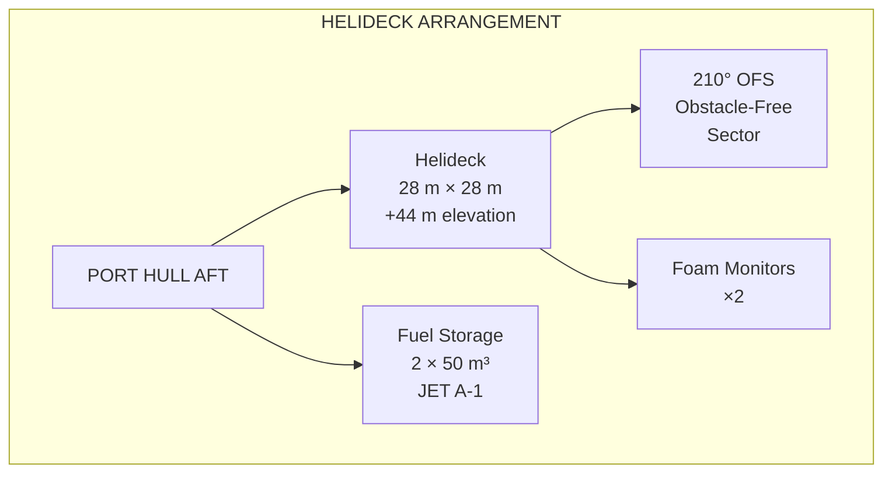

# 11 — Accommodation & Life-Support Systems

**Ocean Salvage Platform (OSP) — Pre-FEED Deliverable**
**Document:** 11-accommodation-systems.md
**Date:** 12 February 2026

---

## 1. Personnel Complement

| Category | Number | Shift Pattern |
|----------|--------|---------------|
| Marine crew (Master, officers, ratings) | 25 | 12 hr rotating |
| DP operators | 6 | 8 hr × 3 shifts |
| Heavy lift / deck crew | 30 | 12 hr rotating |
| ROV pilots & technicians | 12 | 12 hr rotating |
| Nuclear/radiation protection officers | 8 | 12 hr rotating |
| Engineers (mechanical, electrical) | 12 | 12 hr rotating |
| Construction / welding team | 10 | 12 hr rotating |
| Medical staff | 4 | On-call |
| Catering / housekeeping | 12 | 12 hr rotating |
| Client / project management | 10 | Day shift |
| Spare berths (visitors, rotation overlap) | 21 | — |
| **Total POB** | **150** | — |

---

## 2. Accommodation Block Layout

### 2.1 Location

The accommodation block is located on the **starboard hull, forward**, as far as practicable from the reactor handling bay (amidships, port) and the helideck (port aft):

- Distance from reactor bay: **≥ 100 m** → dose rate at accommodation < 0.001 mSv/hr (see `08-nuclear-safety-containment.md`)
- Separated from engine rooms by A-60 fire boundaries
- Above the waterline at all drafts (accommodation base at +32 m)

### 2.2 Block Dimensions

| Parameter | Value |
|-----------|-------|
| Length | 50 m |
| Width | 18 m (full hull width) |
| Decks | 5 (D1 = +32 m to D5 = +47 m) |
| Deck height | 3.0 m (floor to floor) |
| Gross floor area | 50 × 18 × 5 = 4,500 m² |
| Construction | Steel superstructure; insulated panels; A-60 boundaries at base |
| Weight | ~2,500 t (including outfit) **[ASSUMPTION]** |

### 2.3 Deck Allocation

| Deck | Level (m) | Function |
|------|-----------|----------|
| D1 (+32 m) | Main entry | Galley, mess hall (80 seats), laundry, stores, recreation room |
| D2 (+35 m) | Cabins | 40 × 2-person cabins (ratings/technicians) = 80 berths |
| D3 (+38 m) | Cabins | 25 × 2-person cabins + 10 × 1-person cabins = 60 berths |
| D4 (+41 m) | Cabins/Office | 10 × 1-person cabins + offices + conference room + sick bay |
| D5 (+44 m) | Bridge | Main bridge, DP control room, radio room, chartroom |

### 2.4 Cross-Section

```
                    ┌──────────────────────────────────────────┐
                    │  D5: BRIDGE / DP CONTROL       +47 m    │
                    │       ┌────────┐  ┌──────┐              │
                    │       │BRIDGE  │  │DP CTL│              │
                    ├───────┴────────┴──┴──────┴──────────────┤
                    │  D4: CABINS / OFFICES           +44 m   │
                    │  ┌──┐┌──┐┌──┐┌──┐ │OFFICE│ │SICK BAY│  │
                    ├──┴──┴┴──┴┴──┴┴──┴─┴──────┴─┴────────┴──┤
                    │  D3: 2-PERSON + 1-PERSON CABINS +41 m   │
                    │  ┌──┐┌──┐┌──┐┌──┐┌──┐┌──┐┌──┐┌──┐┌──┐ │
                    ├──┴──┴┴──┴┴──┴┴──┴┴──┴┴──┴┴──┴┴──┴┴──┴──┤
                    │  D2: 2-PERSON CABINS            +38 m   │
                    │  ┌──┐┌──┐┌──┐┌──┐┌──┐┌──┐┌──┐┌──┐┌──┐ │
                    ├──┴──┴┴──┴┴──┴┴──┴┴──┴┴──┴┴──┴┴──┴┴──┴──┤
                    │  D1: GALLEY / MESS / RECREATION +35 m   │
                    │  ┌──────────┐ ┌──────┐ ┌──────────────┐ │
                    │  │ GALLEY   │ │LAUND │ │ MESS HALL    │ │
                    │  │          │ │  RY  │ │  (80 seats)  │ │
                    └──┴──────────┴─┴──────┴─┴──────────────┴─┘ +32 m
                    ═══════════════════════════════════════════
                    ◄────────────── 50 m ──────────────────────►
```

---

## 3. HVAC System

### 3.1 Design Conditions

| Parameter | External Design | Internal Design |
|-----------|----------------|-----------------|
| Summer (N. Atlantic) | 35°C, 70% RH | 22°C, 50% RH |
| Winter (Kara Sea) | –35°C | 22°C, 40% RH |
| Ventilation rate | — | 30 m³/hr per person (ASHRAE 62.1) |

### 3.2 HVAC Equipment

| Component | Specification |
|-----------|---------------|
| AHUs (Air Handling Units) | 4 × 30,000 m³/hr |
| Heating coils | Steam (from waste heat recovery, see `09-power-generation.md`) |
| Cooling compressors | 2 × 500 kW refrigeration (R-410A) |
| Fresh air intake | Located upwind of engine exhaust; gas detection at intake |
| Nuclear emergency | HVAC can switch to full recirculation with HEPA if airborne radioactivity detected |

---

## 4. Potable Water System

| Parameter | Value |
|-----------|-------|
| Daily consumption | 150 persons × 200 L/day = 30 m³/day |
| Production | 2 × reverse osmosis desalination units, 30 m³/day each |
| Alternative | Waste heat flash evaporator, 30 m³/day (see `09-power-generation.md`) |
| Storage | 200 m³ (6.7 days reserve) |
| Hot water | 2 × steam calorifiers (500 kW each) |
| Water quality | WHO drinking water standards; UV + chlorination treatment |

---

## 5. Sewage & Grey Water

| Parameter | Value |
|-----------|-------|
| Sewage generation | ~30 m³/day |
| Treatment | Membrane bioreactor (MBR) system |
| Discharge | Treated effluent to MARPOL Annex IV standards |
| Grey water | Collected, filtered, discharged |
| Holding tank | 50 m³ (1.7 days when discharge prohibited) |

---

## 6. Life-Saving Equipment

### 6.1 Evacuation Capacity

| Equipment | Quantity | Capacity Each | Total Capacity |
|-----------|----------|---------------|----------------|
| Totally enclosed lifeboats (TELB) | 4 | 50 persons | 200 |
| Davit-launched life rafts | 8 | 25 persons | 200 |
| Throw-overboard life rafts | 8 | 25 persons | 200 |
| Rescue boat (fast rescue craft) | 2 | 6 persons | 12 |
| Life jackets | 200 (incl. spares) | 1 | 200 |
| Immersion suits | 200 | 1 | 200 |

Total evacuation capacity: 200% of POB → **COMPLIANT** with MODU Code

### 6.2 Lifeboat Locations

- 2 × TELB on port hull (fwd and aft)
- 2 × TELB on starboard hull (fwd and aft)
- Physical separation ensures at least 2 lifeboats accessible from any single-failure scenario

---

## 7. Helideck

| Parameter | Value |
|-----------|-------|
| Location | Port hull, aft (away from accommodation) |
| Size | D-value 25 m (Sikorsky S-92 or equivalent) |
| Deck dimensions | 28 m × 28 m minimum (1.25 × D-value) |
| Elevation | +44 m (on dedicated helideck structure above main deck) |
| Load rating | 12.8 t (S-92 MTOW) |
| Obstacle-free sector | 210° (per CAP 437 / ICAO Annex 14) |
| Lighting | Helideck perimeter lights; flood lights; status lights; windsock illuminated |
| Fire protection | 2 × foam monitors (15,400 L/min); foam stock for 3 × discharge duration |
| Refuelling | Jet A-1 fuel; 2 × 50 m³ fuel tanks; 1 × refuelling pump |



---

## 8. Fire Protection

### 8.1 Fire Detection

| System | Coverage |
|--------|----------|
| Smoke detectors (optical) | All accommodation spaces, corridors, stores |
| Heat detectors | Galley, laundry, engine rooms |
| Flame detectors (IR/UV) | Engine rooms, pump rooms, hazardous areas |
| Manual call points | All escape routes, at max 20 m spacing |
| VESDA (Very Early Smoke Detection) | DP control room, UPS rooms, server room |

### 8.2 Fire Suppression

| Area | System |
|------|--------|
| Accommodation | Sprinkler (wet pipe) |
| Engine rooms (4) | High-expansion foam + CO₂ total flooding |
| Pump rooms | Water mist |
| Reactor handling bay | Sprinkler + foam (special; no water jets to prevent criticality concern) |
| Helideck | Foam monitors + sprinkler under deck |
| Switchgear rooms | FM-200 gaseous suppression |

### 8.3 Fire Main

| Parameter | Value |
|-----------|-------|
| Fire pumps | 3 × 250 m³/hr (2 main + 1 emergency) |
| Fire main pressure | 7 bar minimum at most remote hydrant |
| Hydrants | Minimum 40, covering all areas |
| Fire hoses | 45 mm diameter, 20 m length |
| Emergency fire pump | Diesel-driven, independent of main power |

---

## 9. Medical Facilities

| Facility | Description |
|----------|-------------|
| Sick bay | 4-bed ward + 1 treatment room + 1 consultation room |
| Equipment | X-ray (portable), defibrillator, ventilator, emergency surgical kit |
| Radiation medicine | Whole body counter (for internal contamination monitoring) |
| Decontamination shower | Adjacent to reactor bay access – removes external contamination |
| Morgue | 2 body capacity (refrigerated) |
| Medevac | Helicopter evacuation to shore hospital within 4 hours |

---

## 10. Communications

| System | Description |
|--------|-------------|
| VSAT | 2 × C-band + 2 × Ku-band terminals; minimum 20 Mbps |
| MF/HF radio | GMDSS A3; DSC-equipped |
| VHF | 3 × VHF DSC (bridge + 2 portable) |
| Inmarsat | Fleet Broadband (backup) |
| Internal PA | Zone-addressable public address; 2-way loud hailer on deck |
| UHF radio | 50 handheld radios for deck/ROV/engineering crews |
| Telephone | PABX system, 80 extensions |

---

## 11. Weight Summary

| Item | Weight (t) |
|------|-----------|
| Accommodation structure | 1,800 |
| Outfit and furniture | 350 |
| HVAC system | 120 |
| Life-saving equipment | 80 |
| Helideck structure | 200 |
| Fire protection systems | 60 |
| Communications equipment | 15 |
| Medical bay equipment | 5 |
| Provisions (30 days) | 70 |
| **TOTAL** | **2,700** |

---

*Cross-references: `01-hull-form-selection.md`, `08-nuclear-safety-containment.md`, `09-power-generation.md`, `19-general-arrangement.md`*
