# 12 — Operational Modes & Procedures

**Ocean Salvage Platform (OSP) — Pre-FEED Deliverable**
**Document:** 12-operational-modes.md
**Date:** 12 February 2026

---

## 1. Operational Modes Overview

---

## 2. Mode 1 — Harbour / Port

| Parameter | Value |
|-----------|-------|
| Draft | 12 m (transit draft) |
| Generators online | 2 (hotel load only) |
| POB | 50 (skeleton crew for maintenance) |
| Duration | Typically 30–90 days between campaigns |
| Activities | Maintenance, crew change, stores/fuel loading, equipment calibration |

---

## 3. Mode 2 — Transit

| Parameter | Value |
|-----------|-------|
| Draft | 12 m |
| Speed | 10 knots (sustained); 12 knots (maximum) **[ASSUMPTION]** |
| Generators online | 4 (propulsion + hotel) |
| Power demand | 27.6 MW |
| Heading | Maintained by 2 azimuth thrusters (aft, 1 per hull) for steering; 2 thrusters fwd for propulsion |
| Motion criteria | Per DNV transit criteria; operations cease in Hs > 5.0 m |
| Special considerations | Submarine on board: draft remains 22 m; speed reduced to 6 knots; reinforced lashings |

### 3.1 Transit Distances

| Route | Distance (nm) | Time at 10 kn | Fuel (t) |
|-------|---------------|---------------|----------|
| Murmansk → K-27 (Kara Sea, Novaya Zemlya) | 450 | 45 hrs | 236 |
| Murmansk → K-159 (Barents Sea) | 200 | 20 hrs | 105 |
| Norway → K-278 (Norwegian Sea) | 350 | 35 hrs | 184 |
| Norfolk VA → USS Thresher (N. Atlantic) | 350 | 35 hrs | 184 |
| Norfolk VA → USS Scorpion (N. Atlantic, Azores) | 2,400 | 240 hrs (10 days) | 1,259 |

---

## 4. Mode 3 — Station-Keeping

### 4.1 DP Operations (Deep Sites: K-278, Thresher, Scorpion)

| Parameter | Value |
|-----------|-------|
| Draft | 22 m (operating) |
| Generators online | 4 (DP + hotel) |
| Power demand | 49.1 MW |
| DP mode | DP3 (auto position and heading) |
| Watch circle (green) | ±10 m at 1,680 m depth; ±5 m at 200 m |
| Position reference | 3× DGPS + 2× HPR + 1× taut wire |
| Heading control | ±2° |
| Weather limit (Hs) | 5.0 m (operations); 3.0 m (lift operations) |

### 4.2 Moored Operations (Shallow Sites: K-27, K-159)

| Parameter | Value |
|-----------|-------|
| Draft | 22 m |
| Water depth | 33 m (K-27); 200 m (K-159) |
| Mooring | 8-line taut-leg mooring (see `04-dynamic-positioning.md`) |
| DP | DP-assist over mooring (reduced thruster use) |
| Anchor handling | Dedicated AHV (not OSP; contracted vessel) |
| Deployment time | 24–48 hours for full mooring pattern |

---

## 5. Mode 4 — Survey & Rigging

### 5.1 ROV Survey

| Task | Duration | Equipment |
|------|----------|-----------|
| Initial survey of submarine condition | 12–48 hrs | 2 × work-class ROV |
| Sediment removal (if buried) | 48–120 hrs | ROV jet trencher / suction |
| Hull integrity assessment | 24 hrs | ROV with UT thickness gauge |
| Reactor compartment external survey | 12 hrs | ROV with radiation sensor |
| Rigging point identification | 8 hrs | ROV with multi-beam sonar |

### 5.2 Rigging Installation

| Task | Duration | Equipment |
|------|----------|-----------|
| Pass slings under hull (12 locations) | 48–96 hrs | ROV with rigging tools |
| Connect slings to lifting yoke/cables | 24 hrs | ROV |
| Attach buoyancy pontoons (if Mode B/C) | 72–120 hrs | ROV + crane |
| Install monitoring sensors on submarine | 12 hrs | ROV |
| Verify all connections | 8 hrs | ROV visual + load test to 10% |

**Total rigging duration: 7–15 days** **[ASSUMPTION]**

---

## 6. Mode 5 — Heavy Lift

### 6.1 Mode A (Shallow: 0–200 m)

```mermaid
gantt
    title Mode A Lift Operations — K-159 (200 m depth)
    dateFormat HH:mm
    axisFormat %H:%M
    
    section Preparations
    Pre-lift checks & briefing     :a1, 00:00, 2h
    Tension cables to 10% load     :a2, after a1, 1h
    
    section Lift Phase
    Breakout from seabed           :a3, after a2, 2h
    Steady lift (0.5 m/min)        :a4, after a3, 6h40m
    
    section Surface Phase
    Reduce speed at 50 m depth     :a5, after a4, 1h
    Surface break (0.1 m/min)      :a6, after a5, 3h
    
    section Securing
    Position in channel            :a7, after a6, 2h
    Lower onto cradle              :a8, after a7, 1h
    Secure & contain               :a9, after a8, 4h
```

**Total lift duration (Mode A): ~23 hours** for 200 m depth.

### 6.2 Mode C (Deep: K-278 at 1,680 m)

| Phase | Depth Range | Duration | Notes |
|-------|-------------|----------|-------|
| 1: Buoyancy pontoon deployment | 1,680 m (on seabed) | 5–7 days | 18 pontoons attached by ROV |
| 2: Seabed breakout | 1,680 m | 6–12 hours | Controlled deballasting |
| 3: Buoyancy ascent | 1,680 → 150 m | 8–12 hours | 0.3–0.5 m/s controlled |
| 4: Handover to strand jacks | 150 m | 6–12 hours | Cable connection; load transfer |
| 5: Strand jack lift | 150 → 0 m | 5 hours | 0.5 m/min |
| 6: Surface break | 0 m (waterline) | 3 hours | 0.1 m/min; ballast compensation |
| 7: Secure on cradle | Surface | 4 hours | Guide wires; lashings |
| **Total** | | **9–11 days** | |

---

## 7. Mode 6 — Nuclear Operations

### 7.1 Reactor Containment Sequence

Once the submarine is secured on the cradle:

| Step | Action | Duration | Personnel |
|------|--------|----------|-----------|
| 1 | Radiation survey of exposed hull | 4 hrs | Health physics team (4 persons) |
| 2 | Deploy temporary shielding panels around reactor section | 8 hrs | Rad workers (8 persons) |
| 3 | Close reactor bay doors/barriers | 2 hrs | Remote operation |
| 4 | Begin draining reactor compartment water → treatment plant | 24 hrs | Automated; rad monitoring |
| 5 | Continuous air monitoring for airborne contamination | Ongoing | Automated CAMs |
| 6 | External decontamination wash (non-reactor areas) | 12 hrs | Deck crew with PPE |
| 7 | Assess reactor condition (remote cameras, sensors) | 8 hrs | Nuclear engineers; remote |
| 8 | For K-27: verify criticality status; deploy neutron absorbers | 8 hrs | Nuclear criticality safety officer |
| 9 | Prepare for transit: seal all openings; install weather covers | 12 hrs | Deck crew |

**Total nuclear operations: 3–5 days**

### 7.2 Radiation Zones During Operations

| Zone | Boundary | Max Dose Rate | Access |
|------|----------|---------------|--------|
| Red (Exclusion) | Within reactor bay | 25 mSv/hr (may be higher) | Remote only; no human entry |
| Orange (High Radiation) | 0–10 m from reactor bay wall | 0.1–25 mSv/hr | Authorised rad workers; max 30 min/entry |
| Yellow (Controlled) | 10–50 m from reactor bay | 0.005–0.1 mSv/hr | Rad workers; dosimetry required |
| Green (Supervised) | 50–100 m from reactor bay | 0.001–0.005 mSv/hr | General crew; periodic monitoring |
| White (Public) | >100 m from reactor bay | < 0.001 mSv/hr | Unrestricted (accommodation, bridge) |

---

## 8. Mode 7 — Survival

### 8.1 Weather Deterioration Protocol

| Alert Level | Trigger | Action |
|-------------|---------|--------|
| Blue (Awareness) | Forecast Hs > 3.0 m in 48 hrs | Plan completion of critical operations |
| Yellow (Advisory) | Forecast Hs > 5.0 m in 24 hrs | Cease lift operations; secure all equipment on deck |
| Orange (Warning) | Hs > 5.0 m measured | Deploy storm lashings; increase DP thrust allocation; no crane ops |
| Red (Survival) | Hs > 8.0 m measured or forecast Hs > 10 m | All personnel to accommodation; ballast to survival draft (26 m); all engines online; heading to optimise motions |

### 8.2 Submarine In-Transit During Storm

If submarine is on the cradle during survival conditions:
- Lashing design: 12,000 t × 0.3 g lateral = 3,600 t lateral force capacity
- Sea fastening: 24 × steel stoppers + chain lashings
- Monitor: Continuous strain gauge monitoring on all lashings

---

## 9. Mode 8 — Emergency

### 9.1 Emergency Scenarios and Response

| Code | Scenario | Response |
|------|----------|----------|
| ALPHA | Fire or explosion | General alarm; muster; fire teams deploy; HVAC isolated in affected zone |
| BRAVO | Collision / structural damage | Assess watertight integrity; close WTs; activate bilge/ballast |
| CHARLIE | Man overboard | FRC launched; search pattern; coast guard notified |
| DELTA | Abandon platform | Lifeboats/rafts launched; EPIRB activated; helicopter evacuation |
| ECHO | Radiation emergency | Evacuate affected zone; HVAC to recirculation; rad survey; assess source |
| FOXTROT | Medical emergency | Medical team to casualty; medevac helicopter if required |
| GOLF | Oil / environmental spill | Deploy containment booms; activate SOPEP; report to coastal state |

---

## 10. Campaign Timeline

### 10.1 Single Submarine Recovery (K-159, 200 m depth)

| Phase | Duration (days) | Cumulative |
|-------|----------------|-----------|
| Transit to site | 1 | 1 |
| Station-keeping setup | 1 | 2 |
| Survey | 3 | 5 |
| Rigging | 10 | 15 |
| Lift operations | 1 | 16 |
| Nuclear containment | 4 | 20 |
| Transit to port | 1 | 21 |
| Port operations (defueling handover) | 7 | 28 |
| **Total** | **28 days** | — |

### 10.2 Deep Recovery (K-278, 1,680 m depth)

| Phase | Duration (days) | Cumulative |
|-------|----------------|-----------|
| Transit to site | 2 | 2 |
| Station-keeping setup | 1 | 3 |
| Survey | 5 | 8 |
| Rigging + buoyancy pontoon deployment | 20 | 28 |
| Lift operations (Mode C) | 10 | 38 |
| Nuclear containment | 5 | 43 |
| Transit to port | 2 | 45 |
| Port operations | 14 | 59 |
| **Total** | **59 days** | — |

---

*Cross-references: `04-dynamic-positioning.md`, `06-moon-pool-design.md`, `07-heavy-lift-system.md`, `08-nuclear-safety-containment.md`, `10-stability-ballast.md`, `15-risk-register.csv`*
