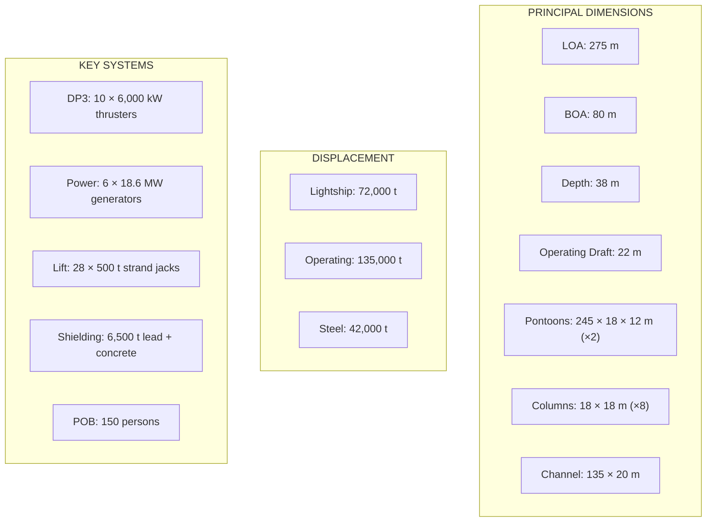
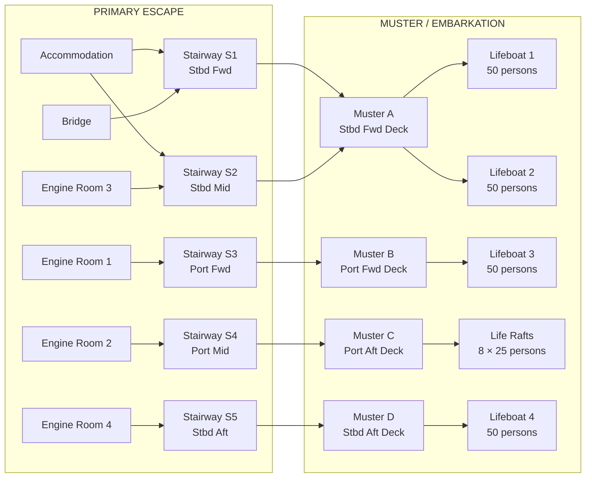

# 19 — General Arrangement Drawings

**Ocean Salvage Platform (OSP) — Pre-FEED Deliverable**
**Document:** 19-general-arrangement.md
**Date:** 12 February 2026

---

## 1. Profile View (Starboard Side Elevation)

```
                                                    ACCOMMODATION          BRIDGE
                                                    ┌─────────────┐     ┌───┐
                                                    │  D4: OFFICES│     │NAV│ +47 m
                                                    │  D3: CABINS │     │   │ +44 m
                                                    │  D2: CABINS │     │   │ +41 m
                                                    │  D1: GALLEY │     │   │ +38 m
    HELIDECK                                        └─────────────┘     └───┘
    ┌─────┐          GANTRY   GANTRY   GANTRY                                    +44 m
    │ 28m │           ║         ║         ║      REACTOR BAY
    │     │           ║         ║         ║      ┌───────────┐
    └──┬──┘           ║         ║         ║      │ SHIELDING │
═══════╧══════════════╩═════════╩═════════╩══════╧═══════════╧══════════════════  +38 m (MAIN DECK)
       │              │         │         │      │           │              │
       │   ER4        │  STORES │  CRANE  │      │  REACTOR  │   ER3       │      +32 m (EQUIP DECK)
       │   (G6)       │         │  MACH   │      │  HANDLING │   (G4,G5)   │
       │              │         │         │      │  BAY      │              │
────── │──────────────│─────────│─────────│──────│───────────│──────────────│────  WL (+22 m)
       │              │         │         │      │           │              │
       │   COLUMN     │ COLUMN  │ COLUMN  │      │  COLUMN   │   COLUMN    │
       │     S4       │   S3    │   S2    │      │    S1     │     S0      │
       │   ┌──┐       │  ┌──┐  │  ┌──┐   │      │   ┌──┐   │    ┌──┐     │      +12 m (PONTOON TOP)
       │   │  │       │  │  │  │  │  │   │      │   │  │   │    │  │     │
       │   │  │       │  │  │  │  │  │   │      │   │  │   │    │  │     │
═══════╧═══╧══╧═══════╧══╧══╧══╧══╧══╧═══╧══════╧═══╧══╧═══╧════╧══╧═════╧════  0 m (KEEL)
    STBD PONTOON (245 m × 18 m × 12 m)
    ◄── AFT                                                              FWD ──►
    ◄───────────────────────── 275 m ──────────────────────────────────────────►
```

---

## 2. Plan View — Main Deck (+38 m)

```
                                    ◄────── 80 m ──────►
    ┌───────────────────────────────────────────────────────────────────────────┐
    │                                PORT HULL                                 │
    │  ┌────────────┐  ┌──────────────────────────────────────┐  ┌──────────┐ │
    │  │ HELIDECK   │  │        ENGINE ROOMS 1 & 2            │  │  STORES  │ │
    │  │  28×28 m   │  │  ER1: G1, G2        ER2: G3          │  │          │ │
    │  │            │  │  (PORT FWD)         (PORT AFT)        │  │          │ │
    │  └────────────┘  └──────────────────────────────────────┘  └──────────┘ │
    │  THRUSTER T10    THRUSTER T8  T7  T6                T5  T4   THRUSTR T3│
    │═══════╤══════════════╤════╤════╤═══════════════════╤════╤════════╤══════│
    │       │              │    │    │                   │    │        │      │ ← PORT HULL EDGE
    │       │              │    │    │                   │    │        │      │
    ├───────┤              │    │    │                   │    │        ├──────┤
    │       │   SJ01-SJ07  ║   ║    ║    GANTRY BEAMS   ║    ║  SJ08-SJ14  │
    │       │              ║   ║    ║    (7 beams)       ║    ║        │      │
    │       │    ╔═════════╬═══╬════╬═══════════════════╬════╬════╗   │      │
    │       │    ║         ║   ║    ║                   ║    ║    ║   │      │
    │       │    ║         ║   ║    ║    O P E N        ║    ║    ║   │      │
    │  20 m │    ║  CHANNEL║   ║    ║                   ║    ║    ║   │ 20 m │
    │  CHAN- │    ║  135×20 ║   ║    ║  C H A N N E L   ║    ║    ║   │      │
    │  NEL  │    ║   m     ║   ║    ║                   ║    ║    ║   │      │
    │       │    ║         ║   ║    ║  (SUBMARINE LIFT  ║    ║    ║   │      │
    │       │    ║         ║   ║    ║   AREA)           ║    ║    ║   │      │
    │       │    ╚═════════╬═══╬════╬═══════════════════╬════╬════╝   │      │
    │       │   SJ15-SJ21  ║   ║    ║                   ║    ║ SJ22-SJ28   │
    ├───────┤              │    │    │                   │    │        ├──────┤
    │       │              │    │    │                   │    │        │      │ ← STBD HULL EDGE
    │═══════╧══════════════╧════╧════╧═══════════════════╧════╧════════╧══════│
    │  THRUSTER T9    THRUSTER T7                               THRUSTR T1,T2│
    │  ┌────────────┐  ┌───────────┐  ┌────────────────┐  ┌────────────────┐ │
    │  │ REACTOR    │  │ ER4: G6   │  │ ER3: G4, G5    │  │ ACCOMMODATION  │ │
    │  │ BAY        │  │(STBD AFT) │  │ (STBD FWD)     │  │ 50×18 m        │ │
    │  │ 30×18 m    │  │           │  │                │  │ 150 POB        │ │
    │  │ (SHIELDED) │  │           │  │                │  │                │ │
    │  └────────────┘  └───────────┘  └────────────────┘  └────────────────┘ │
    │                                STARBOARD HULL                           │
    └───────────────────────────────────────────────────────────────────────────┘
    ◄── AFT                                                            FWD ──►
```

---

## 3. Plan View — Pontoon Level (0–12 m)

```
    ┌───────────────────────────────────────────────────────────────────────────┐
    │                         PORT PONTOON (245 × 18 × 12 m)                   │
    │  ┌─────┬─────┬─────┬─────┬─────┬─────┬─────┬─────┐                     │
    │  │ BT1 │ BT2 │ BT3 │ BT4 │ BT5 │ BT6 │ BT7 │ BT8 │  8 W/T compartments│
    │  │FUEL │BALL │BALL │BALL │BALL │BALL │BALL │FUEL │  per pontoon        │
    │  └─────┴─────┴─────┴─────┴─────┴─────┴─────┴─────┘                     │
    │                                                                          │
    │  COL   COL                           COL   COL                          │
    │  P4    P3    ←── CROSS-FLOOD ───→    P2    P1      ← COLUMNS (18×18 m) │
    │  ┌──┐  ┌──┐         DUCTS            ┌──┐  ┌──┐                         │
    │  │  │  │  │    ═══════════════════    │  │  │  │                         │
    │  │  │  │  │    ═══════════════════    │  │  │  │                         │
    │  └──┘  └──┘    ═══════════════════    └──┘  └──┘                         │
    │                ═══════════════════                                        │
    │             ┌──────────────────────────┐                                 │
    │             │    CHANNEL (20 m wide)   │                                 │
    │             │  ┌──────────────────────┐│                                 │
    │             │  │ SUBMARINE CRADLE     ││ ← 125 × 14 m                   │
    │             │  │ (12 saddle pairs)    ││                                 │
    │             │  │ 12,000 t capacity    ││                                 │
    │             │  │                      ││                                 │
    │             │  │   DAMPING PLATES     ││ ← 6 perforated plates          │
    │             │  │   at bottom          ││   at pontoon keel level         │
    │             │  └──────────────────────┘│                                 │
    │             └──────────────────────────┘                                 │
    │  COL   COL                                COL   COL                     │
    │  S4    S3                                 S2    S1                      │
    │  ┌──┐  ┌──┐                               ┌──┐  ┌──┐                    │
    │  │  │  │  │                               │  │  │  │                    │
    │  └──┘  └──┘                               └──┘  └──┘                    │
    │  ┌─────┬─────┬─────┬─────┬─────┬─────┬─────┬─────┐                     │
    │  │ BT9 │BT10 │BT11 │BT12 │BT13 │BT14 │BT15 │BT16 │                     │
    │  │FUEL │BALL │BALL │BALL │BALL │BALL │BALL │FUEL │                     │
    │  └─────┴─────┴─────┴─────┴─────┴─────┴─────┴─────┘                     │
    │                       STARBOARD PONTOON (245 × 18 × 12 m)               │
    └───────────────────────────────────────────────────────────────────────────┘
    ◄── AFT                                                            FWD ──►
```

---

## 4. Midship Cross-Section (Looking Forward)

```
                            ◄────────── 80 m ──────────►
                                                          
    ┌────────────────────┐                    ┌────────────────────┐
    │  ACCOMMODATION     │                    │                    │  +47 m
    │  (STBD FWD ONLY)   │                    │                    │
    ├────────────────────┤                    │                    │  +44 m
    │                    │                    │                    │
    │                    │                    │                    │  +41 m
    │                    │                    │                    │
    │                    │                    │                    │  +38 m
════╪════════════════════╪═════════╤══════════╪════════════════════╪════ MAIN DECK
    │ GANTRY BEAM        │  SJ×4   │  SJ×4    │ GANTRY BEAM        │
    │ ┌────────────────┐ │    │    │    │     │ ┌────────────────┐ │  +35 m
    │ │ ENGINE ROOM    │ │    │    │    │     │ │ ENGINE ROOM    │ │
    │ │                │ │    ▼    │    ▼     │ │                │ │
    │ │ 2 × DIESEL     │ │ LIFTING│    CABLES│ │ 2 × DIESEL     │ │  +32 m
    │ │ GENERATORS     │ │  YOKE  │          │ │ GENERATORS     │ │
    │ │                │ │    │    │    │     │ │                │ │
    │ │   ██ G1 ██     │ │    ▼    │    ▼     │ │   ██ G4 ██     │ │
    │ │   ██ G2 ██     │ │        │          │ │   ██ G5 ██     │ │
    │ │                │ │        │          │ │                │ │
────╪─┤────────────────┤─╪────────│──────────╪─┤────────────────┤─╪──── WL (+22 m)
    │ │                │ │        │          │ │                │ │
    │ │  COLUMN P2     │ │        │          │ │  COLUMN S2     │ │
    │ │  18 × 18 m     │ │   OPEN │ WATER    │ │  18 × 18 m     │ │
    │ │  ┌──────────┐  │ │   CHAN-│ COLUMN   │ │  ┌──────────┐  │ │
    │ │  │ BALLAST  │  │ │   NEL │ 22 m     │ │  │ BALLAST  │  │ │
    │ │  │ TANKS    │  │ │       │ DEEP     │ │  │ TANKS    │  │ │
    │ │  │          │  │ │       │          │ │  │          │  │ │
    │ │  └──────────┘  │ │       │          │ │  └──────────┘  │ │  +12 m
════╪═╪════════════════╪═╪═══════╪══════════╪═╪════════════════╪═╪════ PONTOON TOP
    │ │ PONTOON        │ │  DAMP-│ ING      │ │ PONTOON        │ │
    │ │ 18 × 12 m      │ │  PLATE│ ████████ │ │ 18 × 12 m      │ │
    │ │ ┌──────────┐   │ │       │          │ │ ┌──────────┐   │ │
    │ │ │ BALLAST/ │   │ │       │          │ │ │ BALLAST/ │   │ │
    │ │ │ FUEL     │   │ │       │          │ │ │ FUEL     │   │ │
    │ │ │ TANKS    │   │ │       │          │ │ │ TANKS    │   │ │
    │ │ └──────────┘   │ │       │          │ │ └──────────┘   │ │
    └─┴────────────────┴─┘       │          └─┴────────────────┴─┘  0 m (KEEL)
    ◄───── 18 m ─────►◄────── 20 m ─────►◄───── 18 m ─────►
         PORT HULL        CHANNEL / MOON POOL    STBD HULL
    
    ◄────── 56 m (between hull outer edges) ──────►
    
    (Hull outer edges at 80 m BOA include transverse deck overhang of 12 m each side)
```

---

## 5. Thruster Arrangement (Bottom View)

```
    LOOKING UP AT KEEL (0 m level)
    
    ┌───────────────────────────────────────────────────────────────────────┐
    │  PORT PONTOON                                                        │
    │                                                                      │
    │    ○ T10       ○ T8          ○ T7          ○ T6          ○ T5       │
    │  (AFT P)    (MID-AFT P)  (MIDSHIP P)  (MID-FWD P)    (FWD P)      │
    │                                                                      │
    └──────────────────────────────┘    └───────────────────────────────────┘
                                   CHANNEL
    ┌──────────────────────────────┐    ┌───────────────────────────────────┐
    │                                                                      │
    │    ○ T9        ○ T7S         ○ T6S         ○ T4          ○ T3       │
    │  (AFT S)    (spare pos)   (spare pos)  (MID-FWD S)    (FWD S)      │
    │                                                                      │
    │            ○ T2                                    ○ T1              │
    │         (STBD AFT)                              (STBD FWD)           │
    │                                                                      │
    │  STARBOARD PONTOON                                                   │
    └───────────────────────────────────────────────────────────────────────┘
    
    ◄── AFT                                                        FWD ──►
    
    THRUSTER ASSIGNMENT (10 active units):
    Port:  T3(fwd), T5(mid-fwd), T6(midship), T8(mid-aft), T10(aft)  = 5
    Stbd:  T1(fwd), T2(fwd-mid), T4(mid-fwd), T7(midship), T9(aft)  = 5
    
    All thrusters: 360° azimuth, 6,000 kW, 450 t bollard pull
    Propeller: 5.0 m FP in nozzle; ICE-1A rated
```

---

## 6. Key Dimensions Summary Diagram



---

## 7. Fire Zone Plan

```
    ┌───────────────────────────────────────────────────────────────────────────┐
    │                              MAIN DECK PLAN                              │
    │                                                                          │
    │  ┌─── ZONE 5 ──┐  ┌── ZONE 4 ──┐  ┌── ZONE 3 ──┐  ┌── ZONE 2 ──────┐ │
    │  │ HELIDECK     │  │ ER 2 + ER 4│  │ LIFT AREA  │  │ ACCOMMODATION  │ │
    │  │ + AFT DECK   │  │ + STORES   │  │ + REACTOR  │  │ + BRIDGE       │ │
    │  │              │  │            │  │ BAY        │  │ + ER 1 + ER 3  │ │
    │  │              │A │         A  │  │ A     A    │  │ A              │ │
    │  │              │ 6│          60│  │  60    60  │  │  60            │ │
    │  │              │ 0│            │  │            │  │                │ │
    │  └──────────────┘  └────────────┘  └────────────┘  └────────────────┘ │
    │                                                                          │
    │  A-60 = A-60 fire-rated boundary (60 minutes structural fire protection)│
    │  All boundaries between zones are A-60 rated per MODU Code 2009         │
    │  Zone 1 = Reactor Bay (special fire zone — no CO2; foam/water only)     │
    └───────────────────────────────────────────────────────────────────────────┘
```

---

## 8. Escape Routes



---

*Cross-references: `01-hull-form-selection.md`, `04-dynamic-positioning.md`, `06-moon-pool-design.md`, `07-heavy-lift-system.md`, `08-nuclear-safety-containment.md`, `11-accommodation-systems.md`*
