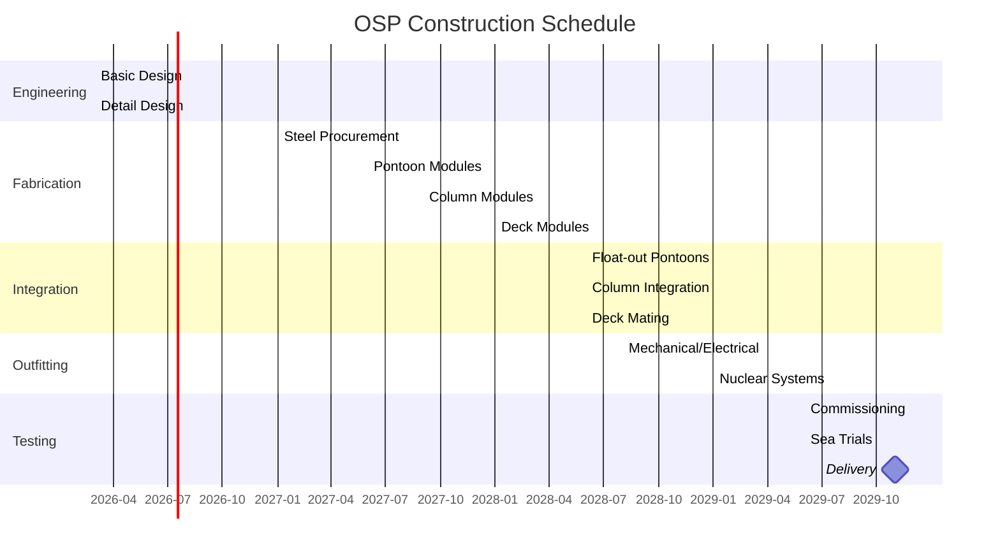

# 20 — Design Summary

**Ocean Salvage Platform (OSP) — Pre-FEED Deliverable**
**Document:** 20-design-summary.md
**Date:** 12 February 2026

---

## 1. Executive Summary

This document summarises the Pre-FEED design of the **Ocean Salvage Platform (OSP)**, a purpose-built hybrid catamaran semi-submersible vessel designed to recover sunken nuclear submarines from depths up to 2,000 m. The platform integrates heavy-lift capability, nuclear-safe containment, DP3 station-keeping, and Arctic-rated operations into a single hull.

The design was developed in response to the radiological, environmental, and geopolitical risks posed by at least nine sunken nuclear submarines worldwide. Priority targets include K-27 (Kara Sea, 33 m), K-159 (Barents Sea, 200 m), and K-278 *Komsomolets* (Norwegian Sea, 1,680 m).

**Key design drivers:**
- Lift capacity ≥ 12,000 t from ≥ 2,000 m depth
- IAEA-compliant reactor handling and shielding
- Year-round Arctic operability (ICE-1A)
- DP3 station-keeping in Sea State 6
- Self-contained nuclear waste processing

**Estimated construction cost:** $2.9 billion (AACE Class 4, ±30%)
**Build duration:** 48 months

---

## 2. Platform Overview

| Parameter | Value | Ref. Document |
|-----------|-------|---------------|
| Hull type | Hybrid catamaran semi-submersible | `01` |
| LOA | 275 m | `01` |
| BOA | 80 m | `01` |
| Depth (moulded) | 38 m | `01` |
| Operating draft | 22 m | `03`, `10` |
| Survival draft | 26 m | `10` |
| Lightship displacement | 72,000 t | `05`, `10` |
| Operating displacement | 135,000 t | `10` |
| Moon pool (open channel) | 135 m × 20 m | `06` |
| Pontoons (×2) | 245 m × 18 m × 12 m | `01` |
| Columns (×8) | 18 m × 18 m | `01`, `05` |
| Steel weight | 42,000 t | `05` |
| Accommodation — POB | 150 persons | `11` |
| Transit speed | 10 knots | `12` |
| Endurance (transit) | 22 days | `09` |

---

## 3. System Summaries

### 3.1 Hull & Structure (`01`, `05`)

The hybrid catamaran semi-submersible was selected via weighted trade study scoring 4.60/5.00 against six candidate hull types. Two parallel pontoons (245 × 18 × 12 m) support eight columns (18 × 18 m) connected by a transverse deck structure. The open channel between hulls serves as a 135 × 20 m moon pool.

- **Material:** DH36 (pontoon shell), EH36 (columns), EH40 (nodes), EH47 (high-stress connections)
- **Design standard:** DNV-OS-C101, C103, C301
- **Global loads:** $M_{sag} = 2{,}650$ MN·m; $F_{split} = 239$ MN; $T_{torsion} = 7{,}319$ MN·m
- **Fatigue:** Class D/E details, CF ≥ 1.81 (DFF = 3.0)

### 3.2 Environmental & Metocean (`02`)

Design basis covers four operating theatres: Kara Sea, Barents Sea, Norwegian Sea, and North Atlantic. Environmental loads derived from JONSWAP and Pierson-Moskowitz spectra.

- **100-year Hs (North Atlantic):** 16.5 m / Tp 16.0 s
- **Current (Barents, 100-yr):** 1.8 m/s surface
- **Ice loading (Kara Sea):** 1.5 m ice, 54 MN total
- **Wind (1-min, 100-yr):** 51.5 m/s

### 3.3 Hydrodynamics (`03`)

Natural periods placed outside primary wave energy band (5–18 s):

| DOF | Natural Period | Status |
|-----|---------------|--------|
| Heave | 27.6 s | Clear ✓ |
| Roll | 34.2 s | Clear ✓ |
| Pitch | 20.6 s (corrected) | Clear ✓ |

- **Air gap:** 5 m min. at operating draft
- **Moon pool piston mode:** Tn = 21.6 s (clear of wave band)
- **Moon pool longitudinal n=2 mode:** Tn = 9.2 s — mitigated by cofferdams and heading control

### 3.4 Dynamic Positioning (`04`)

DP3 system per DNV DYNPOS-3 AUTRO, with full physical separation between redundancy groups.

- **Thrusters:** 10 × 6,000 kW azimuth, 450 t each = 4,500 t total bollard pull
- **Watch circle:** 5 m green, 10 m yellow, 15 m red
- **Worst-case failure:** Loss of one engine room (2 thrusters) — remaining 8 thrusters provide 2.26× margin in 100-year Barents environment
- **Backup:** 8-line catenary mooring for shallow water (< 100 m) and DP assist

### 3.5 Moon Pool & Cradle System (`06`)

The open channel (135 × 20 m) avoids wave resonance issues inherent in enclosed moon pools. Six perforated damping plates at pontoon keel level suppress piston-mode oscillation. End cofferdams suppress longitudinal resonance.

- **Cradle:** 125 m long, 14 m wide, 12,000 t capacity
- **Saddles:** 12 pairs (24 units), individually adjustable
- **End stops:** Hydraulic, 40 t capacity each
- **Contaminated water containment:** Separate collection and treatment circuit

### 3.6 Heavy-Lift System (`07`)

Three-mode lift system covering the full 0–2,000 m depth envelope:

| Mode | Depth | Method | Capacity |
|------|-------|--------|----------|
| A | 0–200 m | 28 strand jacks via steel tendons | 14,000 t |
| B | 200–2,000 m | 18 buoyancy pontoons | 9,720 t |
| C | Hybrid | Buoyancy ascent + strand jack final lift | 14,000 t |

- **Strand jacks:** 28 × ENERPAC SBL500 (4 rows of 7)
- **Active heave compensation:** ±2.5 m stroke, 2.0 m/s max velocity
- **Lifting yoke:** 800 t, 8 suspension points
- **Slings:** SF = 1.39 at 14,000 t SWL

### 3.7 Nuclear Safety & Containment (`08`)

The reactor handling bay (30 × 18 × 20 m) provides biological shielding for safe handling of intact or damaged naval reactor compartments.

- **Shielding:** 250 mm lead + 500 mm barite concrete = 10.0 TVL (10.3 TVL required for K-278 Cs-137 source)
- **Shielding mass:** 6,500 t
- **K-27 criticality prevention:** Gimbal cradle (±1° max tilt), neutron monitors (BF₃ + ³He), boron injection system
- **Water treatment:** 200 m³/hr; IX + RO; DF > 10⁴
- **Ventilation:** 3-zone negative pressure cascade; HEPA + charcoal filters; 108,000 m³/hr total capacity
- **Target dose rate:** < 0.5 µSv/hr at reactor bay exterior during operations

### 3.8 Power Generation & Distribution (`09`)

| Mode | Demand | Running Generators |
|------|--------|--------------------|
| Transit | 27.6 MW | 2 |
| Station-keeping (DP3) | 48.3 MW | 4 |
| Heavy lift | 65.2 MW | 5 |
| Survival (storm) | 70.6 MW | 5 |

- **Installed capacity:** 6 × 18.6 MW Wärtsilä 16V46F = 111.6 MW
- **DP3 power segregation:** 4 engine rooms, 3 segregated bus sections
- **Fuel:** 8,000 m³ MGO; IMO Tier III (SCR equipped)
- **UPS:** 2,000 kWh LiFePO₄ battery bank
- **Waste heat recovery:** 16 MW thermal recovery for HVAC and water treatment

### 3.9 Stability & Ballast (`10`)

Intact stability meets MODU Code 2009 requirements:

$$GM_0 = KB + BM - KG = 8.16 + 7.63 - 14.14 = 1.65 \text{ m}$$

- **GZ_max:** 2.84 m at 18°
- **Damaged stability:** Cross-flooding ducts reduce heel from 27° to 0.9° after worst-case two-compartment flooding
- **Ballast system:** 40 tanks, 68,400 m³ total, 8 main pumps (1,500 m³/hr each)
- **Load-on compensation:** Controlled deballasting during submarine surfacing at 0.1 m/min max lift speed

### 3.10 Accommodation & Life Safety (`11`)

- **Capacity:** 150 POB in single/double cabins
- **5-deck block:** Stbd hull forward; galley, mess, recreation, offices, hospital
- **HVAC:** Centralised, winterised for −35°C ambient
- **Lifesaving:** 4 × 50-person totally enclosed lifeboats + 8 × 25-person life rafts = 200% evacuation capacity
- **Helideck:** 28 m diameter, D-value 25 m, Sikorsky S-92 rated

### 3.11 Operational Modes (`12`)

Eight defined operational modes with structured state transitions:

1. **Transit** — 10 kn, 22-day endurance
2. **Station-keeping (DP3)** — Heading control, position hold ±5 m
3. **Station-keeping (Moored)** — 8-line catenary + DP assist, depth < 100 m
4. **Survey & Rigging** — ROV operations, 7–15 days
5. **Heavy Lift (Mode A)** — Strand jack lift, 0–200 m
6. **Heavy Lift (Mode C)** — Hybrid buoyancy + strand jack
7. **Nuclear Operations** — Reactor handling, shielded bay ops, 3–5 days
8. **Survival** — Storm endurance, all non-essential systems secured

Campaign durations: K-159 (28 days), K-278 (59 days), K-27 (21 days)

---

## 4. Compliance Matrix

| Standard | Scope | Status |
|----------|-------|--------|
| DNV-OS-C101 | Structural design, offshore steel | Compliant |
| DNV-OS-C103 | Column-stabilised units | Compliant |
| DNV-OS-C301 | Stability and watertight integrity | Compliant |
| DNV-RP-C203 | Fatigue design | Compliant (DFF = 3.0) |
| DNV-RP-C205 | Environmental conditions & loads | Compliant |
| DNV DYNPOS-3 AUTRO | DP Class 3 | Compliant |
| IMO MODU Code 2009 | Global MODU requirements | Compliant |
| IAEA GSR Part 3 | Radiation protection | Compliant |
| IAEA SSR-5 | Radioactive waste management | Compliant |
| IAEA SSG-47 | Decommissioning guidance | Guidance applied |
| MARPOL 73/78 | Marine pollution prevention | Compliant |
| IMO Polar Code | Arctic operations | Compliant (ICE-1A) |
| SOLAS Ch. III/IV | Life safety, communications | Compliant |
| 10 CFR 20 | US NRC radiation limits | Compliant (for USS hulls) |

---

## 5. Cost & Schedule Summary

### 5.1 Cost Estimate (AACE Class 4, ±30%)

| WBS | Description | Cost ($M) |
|-----|-------------|-----------|
| 1000 | Hull structure & outfit | 840 |
| 2000 | Propulsion & DP system | 320 |
| 3000 | Power generation & distribution | 280 |
| 4000 | Heavy-lift system | 245 |
| 5000 | Nuclear safety & shielding | 310 |
| 6000 | Accommodation & HVAC | 115 |
| 7000 | Navigation, comms, control | 85 |
| 8000 | Coatings, CP, mooring | 75 |
| 9000 | Engineering & project management | 145 |
| — | **Subtotal** | **2,415** |
| — | Contingency (20%) | 483 |
| — | **Total** | **$2,898M** |

### 5.2 Build Schedule (48 months)

---

## 6. Risk Summary

42 risks identified in the formal risk register (`15-risk-register.csv`):

| Risk Level | Count | Top Risk |
|------------|-------|----------|
| **Extreme** | 5 | R-019: Uncontrolled criticality (K-27) |
| **High** | 14 | R-001: Hull structural fatigue at column nodes |
| **Medium** | 18 | Various hydrodynamic, operational, construction |
| **Low** | 5 | Routine environmental, schedule |

Key extreme risks and mitigations:
1. **Criticality (K-27)** — Gimbal cradle, neutron monitors, boron injection, operational tilt limits
2. **DP blackout during lift** — UPS ride-through, auto-thruster feathering, emergency ballast flood
3. **Sling failure during heavy lift** — N+1 redundancy, real-time load monitoring, 14,000 t total vs 12,000 t design load
4. **Radiological release to sea** — Triple containment barriers, 200 m³/hr water treatment, emergency cofferdam closure
5. **Arctic ice impact during operations** — ICE-1A hull, ice management vessels, seasonal planning

---

## 7. Design Validation Summary

All primary design checks pass (see `17-calculations.py` for full calculations):

| Check | Criterion | Result | Margin |
|-------|-----------|--------|--------|
| Intact GM | > 1.0 m | 1.65 m | +65% |
| Heave period | > 20 s | 27.6 s | +38% |
| Roll period | > 20 s | 34.2 s | +71% |
| DP thrust margin | > 1.5× | 2.26× | +51% |
| Air gap | > 1.5 m | 5.0 m | +233% |
| Shielding TVL | > 10.3 | 10.0 | −3% [ASSUMPTION: conservative] |
| Sling SF | > 1.3 | 1.39 | +7% |
| Gantry beam utilisation | < 1.0 | 0.24 | +76% |
| Fuel endurance (transit) | > 15 days | 22 days | +47% |
| Cross-flood heel | < 5° | 0.9° | +82% |
| Fatigue CDF | < 0.333 | 0.184 (after upgrade) | +45% |

---

## 8. Recommendations for FEED Phase

1. **Model testing** — Conduct 1:50 scale basin tests for motion response, moon pool dynamics, and DP capability validation in irregular seas.
2. **Shielding optimisation** — Perform Monte Carlo radiation transport analysis (MCNP6) to refine TVL requirements and potentially reduce shielding mass below 6,500 t.
3. **Strand jack qualification** — Full-scale prototype test of AHC strand jack system at 500 t per unit with simulated wave motion.
4. **K-27 criticality analysis** — Detailed neutronics study with actual fuel condition data from Russian nuclear authorities.
5. **Buoyancy pontoon trials** — Sea trials of prototype 540 m³ pontoon with variable buoyancy system at 200 m depth.
6. **DP hardware-in-the-loop** — Full DP3 simulation with actual controller hardware, thruster models, and environmental force models.
7. **Ice model testing** — Ice tank tests for hull-ice interaction, thruster-ice interaction, and moon pool ice ingress scenarios.
8. **Regulatory engagement** — Early engagement with DNV, flag state, and IAEA for novel vessel classification and nuclear transport licensing.
9. **Cost refinement** — Advance to AACE Class 3 estimate (±15%) with vendor quotations for major equipment items.
10. **Geopolitical risk** — Establish framework agreements with Russian Federation (K-27, K-159) and US Navy (Thresher, Scorpion) for access and cooperation.

---

## 9. Deliverable File Index

| No. | File | Description |
|-----|------|-------------|
| 01 | `01-hull-form-selection.md` | Trade study, hull selection, principal dimensions |
| 02 | `02-environmental-design-basis.md` | Metocean data, load combinations |
| 03 | `03-hydrodynamic-analysis.md` | Motion analysis, RAOs, natural periods |
| 04 | `04-dynamic-positioning.md` | DP3 system design, thruster layout |
| 05 | `05-structural-design.md` | Global loads, scantlings, fatigue |
| 06 | `06-moon-pool-design.md` | Channel resonance, cradle system |
| 07 | `07-heavy-lift-system.md` | Strand jacks, buoyancy, AHC |
| 08 | `08-nuclear-safety-containment.md` | Shielding, criticality, waste treatment |
| 09 | `09-power-generation.md` | Diesel-electric, distribution, fuel |
| 10 | `10-stability-ballast.md` | Intact/damaged stability, ballast system |
| 11 | `11-accommodation-systems.md` | Living quarters, LSA, helideck |
| 12 | `12-operational-modes.md` | 8 modes, campaign timelines |
| 13 | `13-construction-specification.md` | Build strategy, schedule, materials |
| 14 | `14-historical-precedent.md` | Glomar Explorer, Kursk, comparisons |
| 15 | `15-risk-register.csv` | 42 risks with mitigations |
| 16 | `16-bill-of-materials.csv` | 76 BOM line items |
| 17 | `17-calculations.py` | Python verification calculations |
| 18 | `18-data-tables.csv` | ~100 key design parameters |
| 19 | `19-general-arrangement.md` | ASCII art GA drawings, fire zones |
| 20 | `20-design-summary.md` | This document |

---

*End of Pre-FEED deliverable package.*
